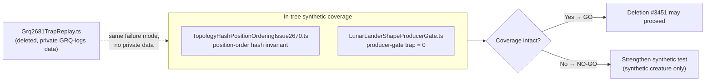

# Verify in-tree synthetic coverage before deleting the grq-2681 WASM trap replay test

## Summary

Go/no-go gate for the deletion sub-issue #3451: **confirm** that the regression
pinned by the private-`GRQ-logs`-derived replay test
`test/wasm/Grq2681TrapReplay.ts` remains covered by the two in-tree
**synthetic** reproducers, so its removal loses no coverage.

**Verdict: GO — coverage is intact.** Both synthetic tests still assert the two
behaviours the replay depended on, and both pass on the milestone branch
(`milestone/3451-delete-grq-logs-derived-wasm-compile-trap-fix`). This PR
records that verification and adds a short **coverage-lineage** note to each
synthetic test so future readers see the coverage relationship in-tree.

This is a verification/documentation change — no behaviour changes. Closes
#3461.

### What the deleted replay pinned vs. what the synthetic tests pin

The replay (`Grq2681TrapReplay.ts`, #2683/#2681) loaded nine large production
creature snapshots (~1670 neurons, 2461 inputs) to confirm PR #2678
(position-blind topology-hash collision fix) also resolved the larger
`unreachable` `CompiledNetwork::new` trap. The _failure mode_ it pinned — a
position-blind topology-hash collision serving a stale WASM template across two
valid orderings of the same UUID set — is reproduced synthetically, with no
private data, by:

| Behaviour the replay depended on                                       | In-tree synthetic anchor                           | Assertion                                                                                                                                                         |
| ---------------------------------------------------------------------- | -------------------------------------------------- | ----------------------------------------------------------------------------------------------------------------------------------------------------------------- |
| Position-order topology-hash invariant PR #2678 fixed                  | `TopologyHashPositionOrderingIssue2670.ts` (#2670) | `assertNotEquals(hash1, hash2)` for two creatures with the same UUID/synapse sets but swapped neuron positions; both compile cleanly from a freshly cleared cache |
| `unreachable` `CompiledNetwork::new` producer-gate trap driven to zero | `LunarLanderShapeProducerGate.ts` (#2668)          | `BASELINE_REJECT_ALLOWANCE = 0` — the mutate/breed loop must record zero producer-gate rejects on a synthetic lunar_lander shape                                  |

The only difference is scale (large captured shapes vs. tiny synthetic ones),
not failure mode. The size difference is not a distinct behaviour: the trap is a
cache-collision mechanism, exercised identically at any size.



## Evidence

Backend/test-only change — no web interface to screenshot. Verification is the
passing WASM test run on the milestone branch:

```
running 2 tests from ./test/wasm/TopologyHashPositionOrderingIssue2670.ts
Issue #2670: topology hash distinguishes valid topological orderings of the same UUID set ... ok (2ms)
Issue #2670: WASM compile gate succeeds for both orderings sharing a UUID-set ... ok (821µs)
running 2 tests from ./test/wasm/LunarLanderShapeProducerGate.ts
Issue #2668: lunar_lander-shape mutation/breed loop keeps producer-gate rejects under the baseline ... ok (66ms)
Issue #2668: reproducer is deterministic across three consecutive runs at the same seed ... ok (148ms)

ok | 4 passed | 0 failed (307ms)
```

`./quality.sh --lint-only` and `./quality.sh --check-only` both pass.

## Test Plan

- Re-ran the two synthetic WASM tests after the comment-only edits — 4 passed, 0
  failed. No assertions were weakened.
- Confirmed both tests still assert (a) the `unreachable` producer-gate trap is
  driven to zero (`BASELINE_REJECT_ALLOWANCE = 0`) and (b) the position-order
  topology-hash invariant (`assertNotEquals` + both compile cleanly from a
  cleared cache).
- No new private-derived data introduced; the coverage-lineage notes are code
  comments only.
