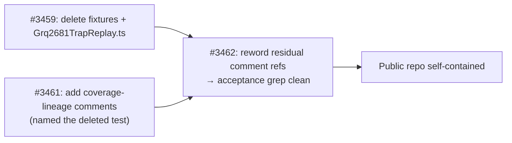

# PR Summary — Delete private GRQ-logs-derived WASM compile-trap fixtures and `Grq2681TrapReplay.ts`

## Summary

Completes the public-repo purge of private-repo-derived (`GRQ-logs`) content for
the WASM compile-trap regression. Closes #3462.

The bulk of the deletion — the nine `test/fixtures/wasm-compile-traps/grq-2681/`
production fixtures (~3.5 MB of offspring/mother/father/error quadruples), the
empty parent `test/fixtures/wasm-compile-traps/` directory, and the replay test
`test/wasm/Grq2681TrapReplay.ts` — already landed on the milestone branch via
the parent-issue work (#3459). What remained were **three residual literal
references** to the deleted test in the coverage-lineage docblocks that #3461
added to the two synthetic reproducers. Those literals still tripped this
issue's acceptance grep:

```
grep -rn "GRQ-logs\|grq-2681\|Grq2681" test/
```

This PR rewords those three comment lines to drop the literal `` `GRQ-logs` `` /
`` `Grq2681TrapReplay.ts` `` tokens while preserving the coverage-lineage
explanation and every issue anchor (`#2683/#2681`, `#3451`, `#3461`). After this
change the acceptance grep returns **no matches**, so the public repo no longer
names the private repository or the deleted replay test anywhere under `test/`.

Per the issue scope, the concept-level `GRQ-logs` mentions in
`docs/VERSION_VISIBILITY.md` / `docs/PROFILING_REPORT_3397.md` were **not**
touched.

### What changed

| File                                                 | Change                                                                                                                                                        |
| ---------------------------------------------------- | ------------------------------------------------------------------------------------------------------------------------------------------------------------- |
| `test/wasm/TopologyHashPositionOrderingIssue2670.ts` | Reworded coverage-lineage comment: `` private-`GRQ-logs`-derived replay test `Grq2681TrapReplay.ts` `` → `private-repo-derived WASM compile-trap replay test` |
| `test/wasm/LunarLanderShapeProducerGate.ts`          | Same reword of its coverage-lineage comment                                                                                                                   |



## Acceptance criteria

- ✅ Fixture directory, empty parent, and `Grq2681TrapReplay.ts` are gone
  (already removed via #3459; confirmed absent on this branch).
- ✅ `grep -rn "GRQ-logs\|grq-2681\|Grq2681" test/` returns **no matches**.
- ✅ No private-derived data remains committed.
- ✅ The coverage anchors that now solely own the regression still pass — no
  dangling import or fixture-path reference.

## Evidence

Backend/test-only change — no web interface to screenshot. Verification is the
acceptance grep plus the two synthetic coverage anchors:

```
$ grep -rn "GRQ-logs\|grq-2681\|Grq2681" test/
# (no output — clean)

$ deno test --allow-read --allow-write --allow-env --allow-ffi \
    test/wasm/TopologyHashPositionOrderingIssue2670.ts \
    test/wasm/LunarLanderShapeProducerGate.ts
ok | 4 passed | 0 failed (306ms)
```

## Test Plan

- No new tests: this is a documentation-comment reword within the two existing
  reproducers, plus verification that the prior deletion is complete.
- Re-ran the two in-tree synthetic coverage anchors that now solely own the WASM
  compile-trap regression — `test/wasm/TopologyHashPositionOrderingIssue2670.ts`
  (#2670/#2678) and `test/wasm/LunarLanderShapeProducerGate.ts` (#2668) — both
  green (4 passed).
- Ran the full `./quality.sh` gate.
