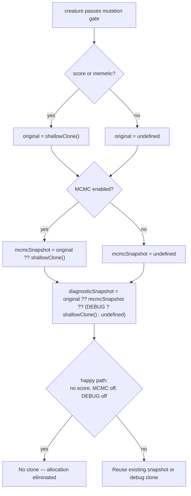

# Gate Mutator per-creature diagnostic `shallowClone` behind the debug flag

## Summary

`Mutator.mutate()` runs once per generation on the **main thread** over the
whole new population. It previously deep-cloned **every** creature that passed
the mutation gate via `creature.shallowClone()` purely to seed the producer-gate
diagnostic dump — an `O(neurons+synapses)` allocation per mutated creature, per
generation. That snapshot is consumed **only** on the rare compile-failure path
(`repairAfterMutation` reads it inside `if (!compileResult.ok)`); the
MCMC/repair revert path uses `mcmcSnapshot ?? original`, never this clone.

The fix reuses whichever pre-mutation snapshot was **already** allocated
(`score`/`memetic` → `original`; MCMC → `mcmcSnapshot`) and only clones
specifically for diagnostics when none exists **and** per-creature `DEBUG` is
on:

```ts
const diagnosticPreMutationSnapshot: Creature | undefined = original ??
  mcmcSnapshot ??
  (creature.DEBUG ? creature.shallowClone() : undefined);
```

For the common new-offspring case (no score, MCMC off, debug off) the clone is
**eliminated entirely**. The failure-path dump still receives a correct
pre-mutation snapshot when one exists or when `DEBUG` is on. `Closes #3472`.

### Decision flow



## Evidence

Backend-only change — no UI to screenshot. Evidence is benchmarks + tests.

### Production-scale cost of the eliminated clone (`bench/MutatorDiagnosticClone.ts`)

Isolates the per-creature diagnostic clone the happy path no longer performs, on
a sparse production-scale creature matching the issue (~1,500 neurons / ~20,000
synapses):

```
=== Production-scale creature ===
neurons=1485 synapses=19136
| benchmark                                                                | time/iter (avg) |  iter/s |     (min … max)     |
| diagnostic shallowClone (production scale ~1500 neurons / ~19k synapses)  |        951.2 µs |   1,051 | (695.9 µs … 3.8 ms) |
```

**~0.95 ms per mutated creature, per generation is removed from the main
thread**, along with ~1,485 fresh `Neuron` allocations + ~19,136 synapse copies
each time. For a 500-creature population that is roughly **475 ms/generation**
of main-thread work and ~750k neuron allocations avoided.

### End-to-end per-generation mutation timing (`bench/MutationTimingPerGeneration.ts`)

No regression — these creatures are on the happy path (no score, MCMC off,
`DEBUG` off), so the clone is removed. End-to-end time is dominated by `fix()`
plus the WASM compile probe, so the removal sits within measurement noise here;
the isolated bench above is where the saving is visible.

| population           | before (unconditional clone) | after (gated) |
| -------------------- | ---------------------------- | ------------- |
| 100 small (5→5→3)    | 34.2 ms                      | 34.1 ms       |
| 500 small (5→5→3)    | 158.3 ms                     | 157.1 ms      |
| 100 medium (10→20→5) | 181.9 ms                     | 186.0 ms      |
| 500 medium (10→20→5) | 921.4 ms                     | 930.1 ms      |
| 100 large (20→50→10) | 909.2 ms                     | 902.8 ms      |
| 500 large (20→50→10) | 4.6 s                        | 4.6 s         |

No evolution-quality regression: the happy path never read the eliminated clone,
and the revert/repair path (`mcmcSnapshot ?? original`) is unchanged.

## Test Plan

- **New** `test/NEAT/MutatorDiagnosticSnapshotGate.ts`:
  - Diagnostics **off** (no score/memetic, MCMC off, `DEBUG` off): spies on
    `Creature.prototype.shallowClone` and asserts it is **never called** by
    `mutator.mutate()` — a reintroduced unconditional clone fails immediately.
  - Diagnostics **on** (`creature.DEBUG = true`): forces a compile failure via
    the producer-gate test seam and asserts the diagnostic dump still contains a
    correct `preMutationCreature` snapshot.
- **Regression guards (unchanged, still green):**
  `test/wasm/ProducerGateDiagnosticDumps.ts` and
  `test/NEAT/MutatorBatchRepair.ts` cover the `repairAfterMutation` failure-path
  dump contents and revert/repair semantics;
  `test/NEAT/MutatorMCMCAcceptance.ts` covers the MCMC snapshot path.
- Full `test/NEAT/` + `test/wasm/` suites pass; `./quality.sh --lint-only` and
  `--check-only` pass clean.
