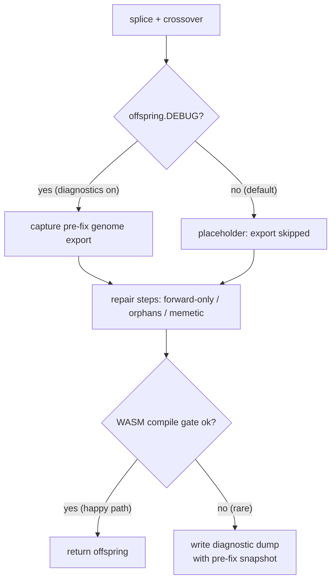

# Defer `Offspring.breed` pre-fix genome export to the compile-failure path

## Summary

`Offspring.breed` unconditionally serialised every offspring's full genome via
`exportJSONUnchecked(offspring)` (`src/architecture/Offspring.ts`). That export
allocates an object per neuron and per synapse, yet the result is consumed only
by the rare WASM-compile-failure diagnostic dump. `Offspring.breed` runs
~population-size times per generation, so the export was pure overhead on the
happy path.

This change defers the export: the pre-fix snapshot is now captured **only when
diagnostics are enabled** (`offspring.DEBUG`, inherited from the global debug
flag). The capture stays at its original pre-repair site, so the snapshot still
reflects the genuine pre-fix genome. When diagnostics are off, the export is
skipped entirely and a short placeholder records why, so the deferral is
self-documenting and cannot silently fail.

Part of the memory-efficiency milestone #3470. Closes #3473.

## Evidence

Backend/library change — no UI to screenshot. Verified via unit tests plus a new
allocation harness.

### Before/after allocation (memory efficiency)

Measured with `bench/BreedPreFixExportAllocation.ts` (per-breed heap delta,
`--v8-flags=--expose-gc`, N=30). "Before" numbers come from the original
unconditional-export code via `git stash`:

| Case                  | Before (KB/breed) | After (KB/breed) | Saved          |
| --------------------- | ----------------- | ---------------- | -------------- |
| Small (~20 neurons)   | 435.3             | 399.0            | ~36 KB (~8%)   |
| Medium (~200 neurons) | 2422.8            | 2388.3           | ~35 KB (~1%)   |
| Large (~520 neurons)  | 13118.0           | 8715.1           | ~4.4 MB (~34%) |

The isolated pre-fix export removed from every happy-path breed is ~15 KB
(small), ~873 KB (medium) and ~5.5 MB (large) — scaling with genome size, so the
saving grows with the large production creatures the milestone targets.

Wall-clock (`bench/BreedCrossoverAllocation.ts`) is unchanged within noise — the
export is a small fraction of total breed time; the win is allocation / GC
pressure, which is exactly the memory-efficiency goal of parent #3470. No
evolution-quality change: the happy path produces identical offspring; only a
discarded diagnostic export is skipped.

## Test Plan

- **Happy-path regression guard** —
  `test/architecture/Offspring.ts::"Offspring.breed - skips the pre-fix genome
  export on the happy path when diagnostics are off (Issue #3473)"`:
  spies the exporter via the new `__setPreFixOffspringExporterForTesting` seam
  and asserts **zero** calls during a successful breed with diagnostics off.
  Confirmed to **fail** against the old unconditional export (TDD).
- **Diagnostics-on capture** —
  `test/architecture/Offspring.ts::"Offspring.breed - captures the pre-fix
  genome once when diagnostics are on (Issue #3473)"`:
  with the compile gate forced to reject and diagnostics on, asserts the
  exporter is invoked exactly once and captures a real (non-empty) genome.
- **Pre-fix correctness (extended existing dump test)** —
  `test/wasm/ProducerGateDiagnosticDumps.ts::"Issue #2672: Offspring.breed dump
  uses standardised prefix and embeds replay metadata"`:
  now enables diagnostics and asserts `context.preFixOffspring` is a structured
  export with populated `neurons`/`synapses` arrays (not a placeholder string,
  and not a post-repair snapshot) — guarding the main correctness risk of lazily
  capturing state after repair.
- Full `./quality.sh` passes (fmt, lint, type-check, WASM sync, all tests).

## Deno regression avoided

Implemented entirely with Deno-native tooling (`deno test`, `deno bench`,
`deno.json` bench glob). No Node tooling introduced.
