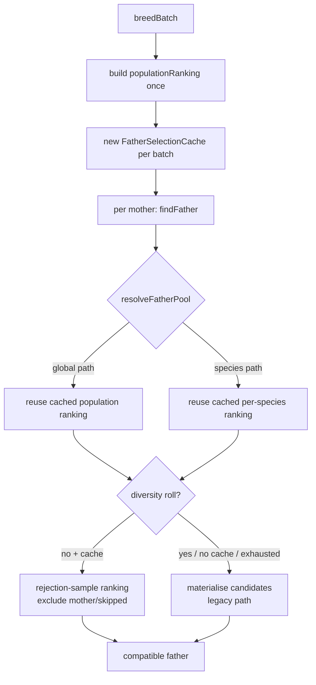

# Reduce O(n²) allocation & re-ranking in `ParentSelection.findFather`

## Summary

`findFather` runs once per parent pair — roughly population-size times per
generation — and previously rebuilt a `FitnessRanking` (a full score `Map` plus
a sort) on **every** call, plus allocated a near-full copy of the population on
the global-breeding path and re-filtered the candidate array on every attempt.
Net effect: O(n²) allocation and O(n² log n) ranking work per generation.

This PR introduces a per-generation `FatherSelectionCache` that builds each
raw-fitness ranking **at most once per generation** (one for the whole
population, one per species) and reuses it across every `findFather` call in a
batch. The mother and any skipped (corrupt) candidates are excluded at selection
time via rejection sampling, with an exact filtered fallback that guarantees the
mother is never returned. When no cache is supplied (e.g. the single-offspring
`Breed` path and direct callers) the behaviour is byte-for-byte identical to
before.

Father selection ranks by **raw** fitness, so the adjusted/override batch
ranking (fitness sharing, group-relative advantage) is **not** reused for
fathers — a raw ranking is built lazily instead, keeping father-selection
distribution unchanged.

Closes #3474.

### Changes

- **New `src/breed/FatherSelectionCache.ts`** — caches one raw-fitness
  `FitnessRanking` per generation for the whole population and per species.
- **`src/breed/ParentSelection.ts`**
  - `findFather` accepts an optional `FatherSelectionCache`.
  - New `resolveFatherPool` mirrors the historical fallback order (global →
    mother's species → closest species → global) without copying the
    mother-excluded array on the hot paths.
  - `selectFatherFromCandidates` → `selectFatherFromPool`: fitness path
    rejection-samples the cached ranking (skipping the mother/skipped
    candidates); the exact filtered path is the fallback and the no-cache
    behaviour. The line-330 `remaining` copy is skipped when `skipped` is empty.
- **`src/breed/ParallelBreeding.ts`** — `breedBatch` builds one
  `FatherSelectionCache` per batch and threads it through `selectParentPairs`,
  `selectParentPair` and the quota loop. The quota-path mother ranking now
  reuses the same per-species cached ranking.

### Acceptance criteria

- ✅ No full-population copy on the happy path when `skipped` is empty (the fast
  fitness path never materialises the candidate array).
- ✅ Father ranking reuses a per-generation / per-species cached ranking rather
  than rebuilding per call.
- ✅ Father-selection distribution unchanged — raw-fitness ranking preserved for
  fathers; existing breeding/selection tests pass (7900 tests, 0 failed).
- ✅ Before/after benchmark evidence at production population size (below).

## Evidence

Backend/algorithmic change — no web interface to screenshot. Evidence is the
benchmark and the test suite.

### Selection flow

### Benchmark (`bench/FatherSelectionRanking.ts`)

One whole "generation" of father selection — one `findFather` per mother across
a 500-creature population, global-breeding path forced (worst case for per-call
rebuilds), Apple M2 Ultra, Deno 2.9.3:

| benchmark                                                | time/iter (avg) | iter/s |
| -------------------------------------------------------- | --------------: | -----: |
| `findFather` × population — no cache (rebuild per call)  |        167.9 ms |    6.0 |
| `findFather` × population — cached ranking (Issue #3474) |         11.1 ms |   90.1 |

**≈15.1× faster** per generation (167.9 ms → 11.1 ms), and the per-call
`FitnessRanking` `Map` build + sort is eliminated from the hot path.

## Test Plan

- **New `test/breed/FatherSelectionCache.ts`**
  - `populationRanking` reuses the supplied ranking and caches the lazy build.
  - `speciesRanking` caches one ranking per key.
  - `findFather` with a cache finds a father on the global path (200 iters).
  - `findFather` cached rejection fallback returns the sole father on a tiny
    pool where the mother is the fittest (100 iters).
  - `findFather` cached returns `undefined` when only the mother exists.
  - Cache and no-cache paths both find a father (no regression).
- **Existing suites (unchanged, all passing)** —
  `test/breed/ParentSelection.ts`, `test/breed/ParallelBreeding.ts`,
  `test/breed/InterSpeciesBreedingQuality.ts`,
  `test/breed/DiversityBreeding.ts`, `test/breed/CompatibilityGating.ts`,
  `test/breed/ParentSelectionTolerantLoad.ts` guard father-selection correctness
  and distribution across the batch/within-species/corrupt-parent paths.
- **Full quality gate**: `./quality.sh` → 7900 passed, 0 failed.
