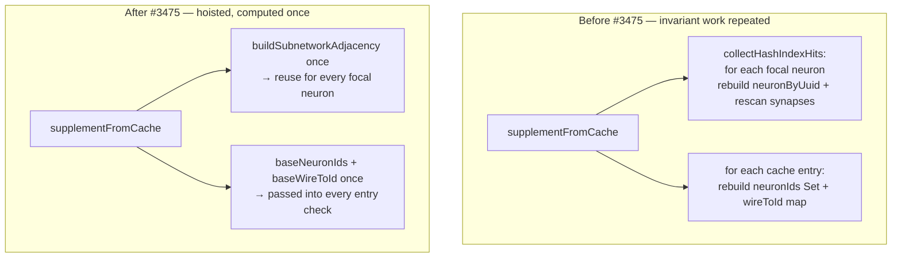

# Hoist invariant work out of discovery supplement-from-cache loops

## Summary

The discovery cache-supplement path (`supplementFromCache`, invoked from
`DiscoveryRunner.ts:416`) repeated topology-invariant work inside per-neuron and
per-entry loops. This PR hoists that work so it runs **once per supplement
call** instead of once per neuron / once per cache entry, with no change to
discovery output. Closes #3475.

Two hotspots were addressed:

- **(a) O(neurons × synapses) degree recompute.** `collectHashIndexHits` called
  `computeSubnetworkHash` for every hidden/output neuron, and each call rebuilt
  a `neuronByUuid` map over all neurons and rescanned the **entire** synapse
  list for the focal neuron and each 1-hop neighbour (`computeDegrees`). At
  ~1,500 neurons / ~20,000 synapses this is tens of millions of comparisons per
  discovery run.

  Fix: added `buildSubnetworkAdjacency(exported)` which makes a **single** pass
  over the synapse list to build, keyed by wire UUID, the in/out degree + weight
  lists, the 1-hop neighbour sets, and one `neuronByUuid` map.
  `computeSubnetworkHash` now takes an optional precomputed
  `SubnetworkAdjacency` and resolves every focal/neighbour lookup in O(1).
  `collectHashIndexHits` builds the adjacency once and reuses it for all focal
  neurons. Net cost drops from O(neurons × synapses) to O(neurons + synapses).

- **(b) Per-entry set/map rebuild.** `isEntryRelevantToCreature` rebuilt, for
  **every** cache entry, a `Set` of neuron ids and a wire→id map over the
  invariant base creature; `isAlreadyApplied` rebuilt the same wire→id map per
  entry too.

  Fix: `supplementFromCache` now computes `baseNeuronIds` and `baseWireToId`
  **once** before the entry loop and passes them into both
  `isEntryRelevantToCreature` and `isAlreadyApplied` (the latter gained an
  optional `precomputedWireToId` parameter; standalone callers such as
  `DiscoveryReplayRunner` are unaffected).

### Data flow (before → after)

## Evidence

Backend/CLI change — no web interface to screenshot. Verified via a benchmark
and unit tests.

### Benchmark (`bench/DiscoverySupplementAdjacency.ts`)

Production-scale synthetic creature (**1,500 neurons / 20,000 synapses**), Deno
2.9.3 on Apple M2 Ultra. Both shapes produce an identical set of hashes; the
only difference is whether the invariant adjacency is rebuilt per focal neuron
(before) or built once and reused (after):

| benchmark                                              | time/iter (avg) |
| ------------------------------------------------------ | --------------- |
| `collectHashIndexHits` — per-neuron adjacency (before) | **5.0 s**       |
| `collectHashIndexHits` — shared adjacency (after)      | **19.5 ms**     |

≈ **256× faster** per supplement call at production scale — the expected
O(neurons × synapses) → O(neurons + synapses) reduction. The true prior cost was
even higher: the removed `computeDegrees` rescanned the whole synapse list
separately for the focal neuron _and each neighbour_, so this benchmark
understates the win.

## Test Plan

- `test/discovery/SubnetworkHashIndex.ts` (new tests):
  - `buildSubnetworkAdjacency - precomputed adjacency yields byte-identical
    hashes`
    — asserts a precomputed adjacency produces the exact same hash as the
    internal per-call rebuild for every focal neuron (proves the hoist is a
    pure, output-preserving refactor).
  - `buildSubnetworkAdjacency - captures degrees, weights and neighbours in one
    pass`
    — asserts in/out degrees, incident weights, and 1-hop neighbour sets.
  - `buildSubnetworkAdjacency - focal neuron with no incident synapses hashes as
    isolated`
    — degree-0 fallback behaviour preserved.
- Existing suites pass unchanged, confirming discovery output is unchanged:
  - `test/discovery/SupplementFromCache.ts` (9 tests) — relevance /
    already-applied / dedup / sort / limit paths.
  - `test/discovery/DiscoveryReplayRunner*.ts` — `isAlreadyApplied` standalone
    callers.

## Files changed

- `src/discovery/SubnetworkHashIndex.ts` — added `SubnetworkAdjacency`,
  `SubnetworkDegrees`, `buildSubnetworkAdjacency()`; `computeSubnetworkHash()`
  accepts an optional precomputed adjacency; removed now-superseded
  `computeDegrees` / `collectNeighbours`.
- `src/discovery/SupplementFromCache.ts` — build adjacency once in
  `collectHashIndexHits`; hoist `baseNeuronIds` / `baseWireToId` out of the
  entry loop and pass them into the per-entry checks.
- `src/discovery/ReplayEntryApplication.ts` — `isAlreadyApplied()` accepts an
  optional `precomputedWireToId`; internal `resolveSynapseDetailsEndpoints`
  takes the map instead of rebuilding it.
- `bench/DiscoverySupplementAdjacency.ts` — new before/after benchmark.
- `test/discovery/SubnetworkHashIndex.ts` — new adjacency tests.
