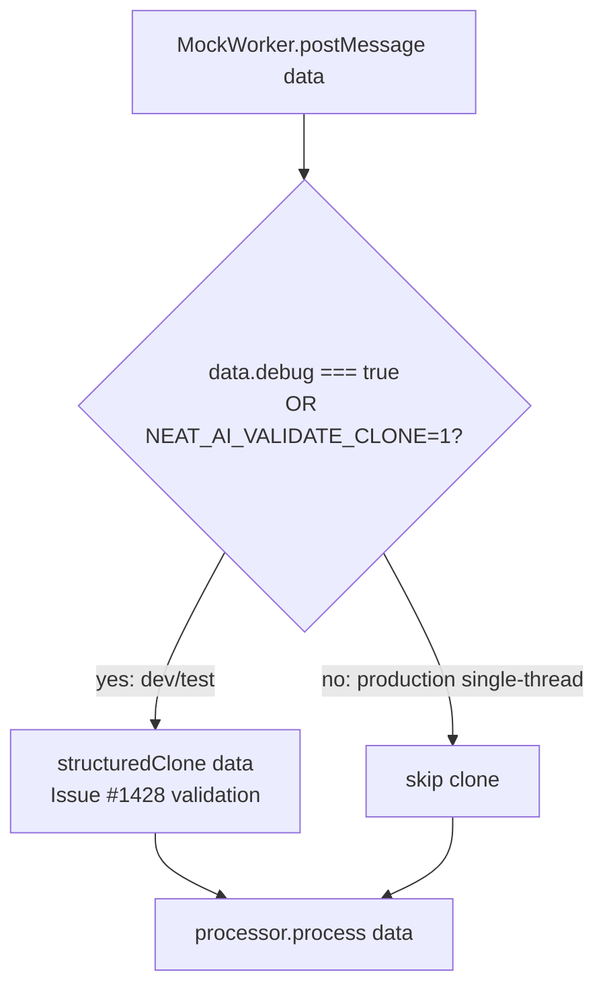

# Skip MockWorker validation `structuredClone` on the single-thread path

## Summary

`MockWorker.postMessage` (`src/multithreading/workers/MockWorker.ts`)
deep-cloned the entire task payload via `structuredClone(data)` on **every**
task purely to validate structured-clone safety (Issue #1428), then discarded
the copy. Because `MockWorker` is used only on the single-thread path
(`threads === 1`) and the init-failure fallback, there is **no** cross-thread
boundary — the clone could never prevent a real `DataCloneError`, so it was pure
overhead: a full `CreatureExport` (all neurons + synapses) deep-copied and
thrown away once per `evaluate`/`train`/`discover`/`breed`.

The fix gates that validation clone behind an explicit debug opt-in:

- `data.debug === true` on the request, or
- the `NEAT_AI_VALIDATE_CLONE=1` environment variable (read once and cached, so
  the happy path pays no per-message env read).

Production single-thread runs (debug off) now skip the wasted copy entirely,
while dev/test runs can still opt into the Issue #1428 non-cloneable-payload
detection. Multi-thread runs (`threads > 1`) are unaffected — the real
`Worker.postMessage` still throws `DataCloneError` on a non-cloneable payload,
and `test/Multithreading/WorkerPayloadCloneability.ts` continues to guard that
invariant for all `RequestData` variants.

Closes #3476.

## Evidence

### Benchmark (before/after) — `bench/MockWorkerValidationClone.ts`

Measures the cost the fix removes: `structuredClone` of a production-scale
`evaluate` RequestData payload (validation **ON** — the old unconditional
behaviour) versus the debug-**OFF** happy path which skips it.

Apple M2 Ultra, Deno 2.9.3:

| payload                       | validation ON (old) | validation OFF (#3476) | speed-up    |
| ----------------------------- | ------------------- | ---------------------- | ----------- |
| medium creature (~80 neurons) | 1.9 ms/iter         | 5.0 ns/iter            | ~387,100×   |
| large creature (~520 neurons) | 49.8 ms/iter        | 5.4 ns/iter            | ~9,293,000× |

Each avoided clone eliminates a full-creature deep copy (and its allocations)
per fitness evaluation, once per creature per generation, on the single-thread
path.

### Flow

## Test Plan

`test/Multithreading/MockWorker.ts`:

- **Updated** `MockWorker: validates structured clone safety on postMessage` —
  retained happy-path assertion.
- **Added**
  `MockWorker: rejects non-cloneable payload when debug validation is
  on` —
  asserts a payload containing a function throws synchronously (the Issue #1428
  detection still fires under the flag).
- **Added**
  `MockWorker: skips structuredClone on the single-thread happy path
  (debug off)`
  — spies on `globalThis.structuredClone` and passes a payload containing a
  function; asserts the clone is **not** invoked (`cloneCalls === 0`) and the
  message is processed without throwing.

Companion coverage `test/Multithreading/WorkerPayloadCloneability.ts` (5 tests)
continues to guard the #1428 invariant that all `RequestData` variants remain
structured-clone safe.

All `test/Multithreading/*.ts` tests pass (101 passed / 0 failed).

This is a backend change with no web interface; verified via the tests above and
the benchmark output.
