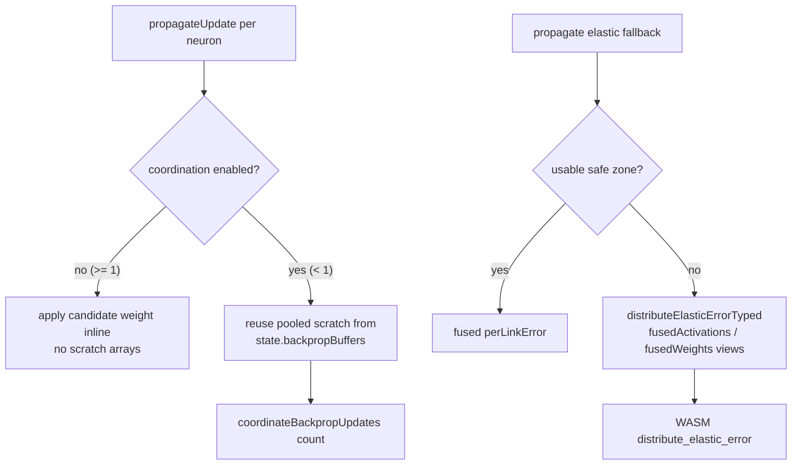

# Pool/skip per-neuron & per-link allocations in NeuronPropagation (#3477)

## Summary

`src/neuron/NeuronPropagation.ts` allocated fresh growable arrays and per-link
objects on the hot training-update path. Issue #3477 removes both allocation
sites without changing numerical output. Closes #3477.

**(a) `propagateUpdate` — per-neuron weight-accumulation arrays.** The old code
built three growable `number[]` arrays (`currentWeights`, `candidateWeights`,
`sourceActivations`) per neuron, every training iteration, via `push()`.

- **Coordination disabled** (`biasWeightCoordinationFactor >= 1`): candidate
  weights are now applied **inline** — zero scratch arrays. `calculateBias`
  reads only accumulated neuron state (not connection weights), so applying the
  weights before the bias is order-independent.
- **Coordination enabled** (`< 1`, the production default `0.2`): the three
  arrays are reused from the shared `state.backpropBuffers` pool (sized to the
  maximum fan-in) instead of being reallocated per neuron.
  `coordinateBackpropUpdates` gained an optional `count` parameter so it works
  correctly with over-sized pooled buffers.

**(b) elastic fallback — per-link objects.** The weight-based fallback repacked
its pre-populated typed scratch buffers into `listLength`
`{ activation, safeZoneFactor, weight }` objects (plus a backing array) only for
the WASM shim to immediately unpack them back into typed arrays. A new typed
entry point `distributeElasticErrorTyped` feeds the already-populated
`fusedActivations` / `fusedWeights` buffers straight into the WASM ABI with a
uniform scalar `safeZoneFactor = 1`, allocating nothing per link. The result is
numerically identical because `distributeElasticError` already truncated those
values to `float32` before the WASM call.

### Data flow

## Evidence

Backend/library change — no web UI to screenshot. Verified via tests (below) and
benchmarks. The training-update path is WASM-bound end-to-end, so the eliminated
JS allocations are best shown by isolated, same-process head-to-heads whose
ratios are independent of machine load (parent #3470's stated production signal
is GC pressure / heap growth, not wall-clock).

**Part (a) — `propagateUpdate` accumulation**
(`bench/PropagateUpdatePooling.ts`, group `propagate-update-accumulation`, 240
neurons × 52 fan-in):

| Pattern                         | time/iter | throughput    |
| ------------------------------- | --------- | ------------- |
| 3 arrays/neuron (old, `push()`) | 126.0 µs  | 7,936 iter/s  |
| inline, no arrays (new)         | 15.0 µs   | 66,470 iter/s |

**≈ 8.4× faster** in isolation; three per-neuron arrays eliminated.

**Part (b) — elastic fallback** (`bench/ElasticFallbackTyped.ts`, real
`distributeElasticError` vs `distributeElasticErrorTyped`; both call the same
WASM `distribute_elastic_error`):

| Fan-in | object array | typed buffers | speed-up |
| ------ | ------------ | ------------- | -------- |
| 8      | 1.4 µs       | 548 ns        | 2.64×    |
| 32     | 1.8 µs       | 647 ns        | 2.80×    |
| 128    | 3.4 µs       | 1.0 µs        | 3.24×    |

Per-link objects + backing array eliminated; the gap widens with fan-in.

**End-to-end training step** (`bench/PropagateUpdatePooling.ts`, group
`training-step`, 236N/12,400S dense): both coordination-disabled and
coordination-enabled steps are unchanged within run-to-run noise (≈ ±40% on a
loaded host) — **no regression**; the WASM forward/backward pass over 12,400
synapses dominates wall-clock, so the win here is reduced allocation / GC
pressure rather than step latency.

## Test Plan

- **`test/propagate/ElasticDistributionTyped.ts`** (new) — asserts
  `distributeElasticErrorTyped` matches `distributeElasticError` for non-zero
  activations, the weight-based zero-activation fallback, the `plankConstant`
  option, over-sized `subarray` views, and empty input.
- **`test/propagate/PropagateUpdatePooling.ts`** (new) — for both coordination
  modes, asserts training output is finite, weights change, and two back-to-back
  creatures with mixed fan-in through the shared `state.backpropBuffers` pool
  produce bit-identical output (the earliest deterministic detector for a
  stale-buffer leak, per the issue's failure-detection notes).
- **Regression suites re-run green:** `test/propagate/BackPropagation.ts`,
  `TopologicalBackpropagation.ts`, `ElasticDistribution.ts`,
  `WeightBasedElasticFallback.ts`, `ifPropagation.ts`,
  `test/wasm/ElasticDistribution.ts`, `test/wasm/WasmBackpropagation.ts`,
  `test/wasm/FusedErrorDistribution.ts`,
  `test/propagate/BackpropCoordination.ts`,
  `test/propagate/RecordElasticity.ts`,
  `test/architecture/NoChangePropagate.ts`.
- Full `./quality.sh` gate (lint, fmt, type-check, WASM sync, all tests).

## Acceptance criteria

- [x] No per-neuron array allocation on the coordination-disabled update path;
      scratch buffers reused (pooled) on the coordination-enabled path.
- [x] Elastic fallback feeds typed arrays directly with no per-link object
      allocation.
- [x] Numerical output unchanged (existing propagate suites pass).
- [x] Before/after benchmark evidence via the `bench/` harness (#3398).
