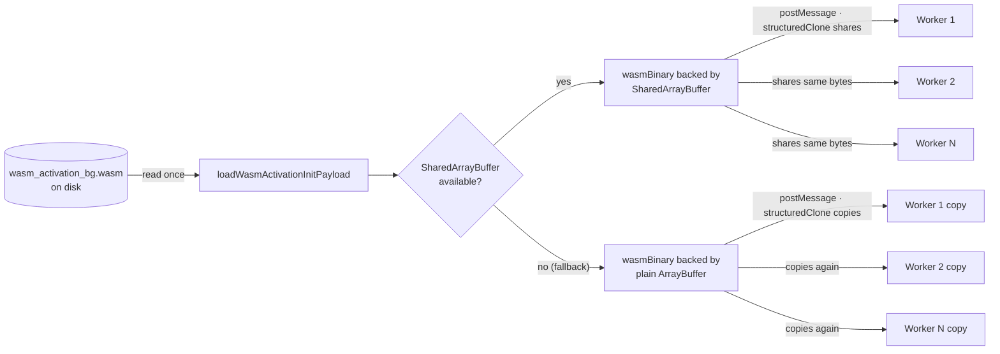

# Share WASM binary via SharedArrayBuffer across worker init messages

## Summary

Each `WorkerHandler` embeds the multi-MB WASM binary in its init message
(`wasmActivation: wasmPayload`, payload shape `wasmBinary: Uint8Array`).
`postMessage` structured-clones a plain `ArrayBuffer`-backed `Uint8Array` into
every worker, so an N-worker pool creates **N transient full copies** of the
WASM binary at startup — a real transient RSS spike and copy cost that scales
linearly with pool size.

This change backs `wasmBinary` with a `SharedArrayBuffer` at load time (in
`loadWasmActivationInitPayload` / `loadWasmActivationInitPayloadAsync`). The
structured-clone algorithm — exactly what `postMessage` uses — **shares** a
`SharedArrayBuffer` (one physical copy) instead of deep-copying it, so all
workers reference the same bytes. When `SharedArrayBuffer` is unavailable (or
the runtime rejects its construction), the helper falls back to the existing
copy-per-worker path, so behaviour is unchanged there.

A plain `Transferable` cannot be used here: transferring **detaches** the buffer
after the first `postMessage`, but the same bytes must reach _every_ worker.
`SharedArrayBuffer` is the correct primitive.

Closes #3478.

### Change flow



## Evidence

Backend/worker-infrastructure change — no web interface to screenshot.

### Peak-RSS-at-startup benchmark

`bench/WasmBinaryShareRss.ts` reproduces the per-worker structured-clone
retention (copy path, the _before_ behaviour) and the SAB-backed retention
(shared path, the _after_ behaviour) for a large simulated pool, then reports
the live-retention RSS delta of each.

```
$ deno run --allow-read bench/WasmBinaryShareRss.ts 16
WASM binary: 0.37 MB, simulated pool: 16 workers

copy-per-worker (before)     ΔRSS = 7.0 MB (retained 16 refs)
shared SAB (after)           ΔRSS = 0.0 MB (retained 16 refs)

$ deno run --allow-read bench/WasmBinaryShareRss.ts 8
WASM binary: 0.37 MB, simulated pool: 8 workers

copy-per-worker (before)     ΔRSS = 3.6 MB (retained 8 refs)
shared SAB (after)           ΔRSS = 0.2 MB (retained 8 refs)
```

The copy path's retained RSS scales linearly with worker count (≈
`binarySize × workers`); the shared path stays flat at ≈ one binary, regardless
of pool size. The absolute win grows with both the WASM binary size and the
worker count — for a 16-worker pool it already saves ~7 MB of transient startup
RSS with the current 0.37 MB binary, and proportionally more as the binary
grows.

WASM still compiles from the SAB-backed view: `new WebAssembly.Module(sabView)`
(the operation `initSync` performs inside each worker) succeeds against the real
binary.

## Test Plan

- **`test/workers/WasmBinarySharing.ts`** (new):
  - `toShareableWasmBinary` backs bytes with a `SharedArrayBuffer` when
    available, preserving contents and length.
  - SAB view is _shared_ (not copied) by `structuredClone` — proven by
    mutation-visibility across clones (structuredClone returns a fresh SAB
    wrapper over the same shared memory, so `===` identity does not apply).
  - N (=16) simulated worker init messages share one physical copy.
  - **Fallback:** with `SharedArrayBuffer` deleted from the global, the helper
    returns a plain `Uint8Array` with identical bytes, and `structuredClone`
    deep-copies it (existing behaviour).
  - Idempotent on an already-SAB-backed view; handles an empty binary.
- **`test/workers/WasmActivationPayload.ts`** (extended): the loaded payload's
  `wasmBinary` is SAB-backed and stays SAB-backed through `structuredClone` (no
  per-worker copy) when `SharedArrayBuffer` is available.
- **Regression / integration (unchanged, still green):**
  `test/multithreading/WorkerPayloadCloneability.ts`,
  `test/multithreading/WasmActivationPayloadMissing.ts`,
  `test/wasm/WasmPayloadAvailability.ts`,
  `test/multithreading/WorkerHandler.ts`, `test/multithreading/WorkerPool.ts`,
  `test/creature/evolveRL_parallel_test.ts` — workers still initialise and
  activate correctly.

## Files changed

- `src/workers/WasmActivationPayload.ts` — add `toShareableWasmBinary`; apply it
  in both loaders; document the SAB backing on
  `WasmActivationInitPayload.wasmBinary`.
- `src/workers/mod.ts` — export `toShareableWasmBinary`.
- `test/workers/WasmBinarySharing.ts` — new tests.
- `test/workers/WasmActivationPayload.ts` — extended coverage.
- `bench/WasmBinaryShareRss.ts` — peak-RSS-at-startup benchmark.
