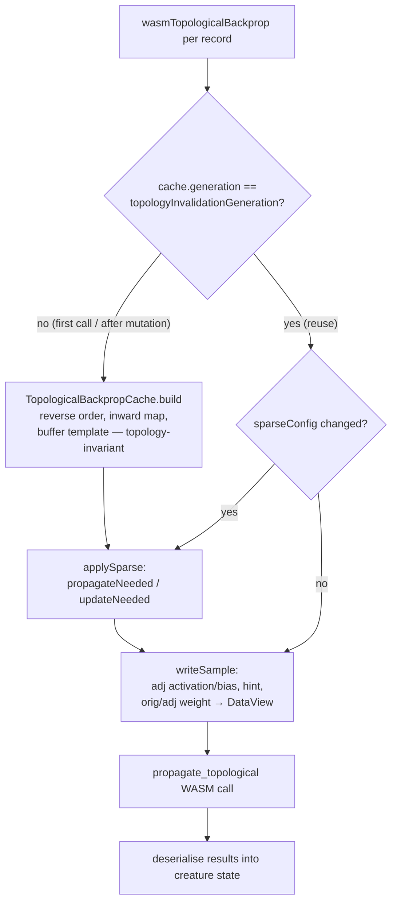

# PR Summary — Issue #3479

## Summary

Cache the topology-invariant structures and drop the intermediate typed arrays
in `wasmTopologicalBackprop`. Closes #3479.

`wasmTopologicalBackprop` is the single backprop entry point, invoked **once per
training record** — millions of times across a training pass. Every call
previously rebuilt structures that depend **only on topology** (which does not
change during a training pass):

- `TypedTopology.fromCreature(...).computeReverseTopologicalOrder()` — a full
  typed-array snapshot plus a WASM call to recompute the reverse topological
  `order`.
- A nested `Map<number, Map<number, number>>` synapse lookup.
- The inward-connection mapping (`inwardStarts` / `inwardCounts` /
  `inwardIndicesList`), calling `inwardConnections(i)` for every neuron.
- Per-neuron `squashTypes` / `neuronTypes` / `rangeLows` / `rangeHighs` and
  per-synapse `synFrom` / `synTo` / `isSelfLoop`.

It then filled ~10 intermediate typed arrays in one pass and re-read them
element-by-element into a `DataView` in a second pass.

### What changed

1. **New `TopologicalBackpropCache`** (`src/propagate/TopologicalBackpropCache.ts`)
   holds all topology-invariant artefacts and a **reusable serialisation buffer**
   with every topology-invariant field pre-written (header counts, per-neuron
   type/range/squash, per-synapse endpoints/self-loop, inward mapping, inward
   indices, reverse order).
2. **Generation-keyed invalidation.** A new
   `Creature.topologyInvalidationGeneration` counter is bumped by
   `invalidateScoreCache()` — the single chokepoint every structural change
   (`clearCache` / `clearConnectionCaches`) and every squash change
   (`Neuron.setSquash`) already routes through. The cache stores the generation
   it was built for and rebuilds in O(1) when it differs. The cache lives on
   `creature.state.backpropTopologyCache`, mirroring the existing
   `stateGeneration` invalidation pattern.
3. **Sparse-selection flags** (`propagateNeeded` / `updateNeeded`) depend on the
   `SparseConfig`, not pure topology, so they are re-patched only when the active
   sparse config reference changes (stable within a training pass).
4. **Direct-to-`DataView` per-sample writes.** Each sample recomputes only the
   five genuinely value-dependent regions (adjusted activation, adjusted bias,
   hint value, original weight, adjusted weight) and writes them straight into
   the reused buffer — the ~10 intermediate typed arrays and the redundant
   second read/write pass are gone. The dead `hasCustomPropagate` array was also
   removed (custom-propagate fallback is driven by the WASM `Infinity` sentinel).

Numerical behaviour is unchanged: the buffer bytes handed to
`propagate_topological` are identical to the previous implementation for a given
topology + sample.

## Evidence

This is a backend/CLI performance change — no web interface to screenshot.

### Before / after benchmark (`bench/ProductionScaleBackprop.ts`)

Production-scale creature: **1176 neurons (1164 hidden), 19500 synapses**.
Apple M2 Ultra, Deno 2.9.3. Lower time is better.

| Benchmark (production 1176N/19500S) | Before | After | Speed-up |
| ----------------------------------- | ------ | ----- | -------- |
| Propagate only                      | 7.2 ms | 3.7 ms | **1.95× faster** |
| Full backprop (activate + propagate)| 8.4 ms | 4.7 ms | **1.79× faster** |
| Propagate (error only)              | 6.4 ms | 2.9 ms | **2.21× faster** |
| Propagate (full)                    | 6.8 ms | 3.7 ms | **1.84× faster** |

The topology-invariant work (reverse topo-sort WASM call, inward-mapping
construction, buffer template) now runs once per topology instead of once per
record, and the intermediate arrays plus the second serialisation pass are
eliminated — roughly halving the per-record propagate cost.

### Data flow

## Test Plan

Added to `test/propagate/WasmTopologicalBackprop.ts`:

- **`topology cache reused across records, not rebuilt per sample`** — asserts
  the same `backpropTopologyCache` object and unchanged
  `topologyInvalidationGeneration` across multiple records on a fixed topology
  (verifies the invariant structures are computed once per topology, not per
  record).
- **`cache invalidated after structural mutation matches uncached rebuild`** —
  trains, applies a structural mutation (adds a synapse), trains again, and
  asserts the output exactly matches a fresh control creature that received the
  same mutation without a pre-existing cache. This is the earliest detector of
  the stale-cache failure mode; it was confirmed to **fail** against a
  deliberately broken invalidation and **pass** with the fix.

Existing suites all pass unchanged (numerical output preserved):
`test/propagate/WasmTopologicalBackprop.ts`,
`test/propagate/TopologicalBackpropagation.ts`,
`test/wasm/WasmBackpropagation.ts`, `test/propagate/BackpropConvergence.ts`,
`test/propagate/BackpropBuffers.ts`,
`test/propagate/BackpropBufferIntegration.ts`,
`test/wasm/WasmPropagateTopologicalTrapGuard.ts`.
