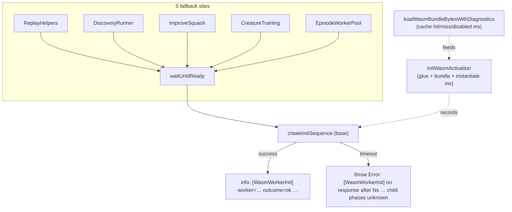

# Add init-phase timing diagnostics to WASM/worker startup

## Summary

On GRQ-23 a discovery-replay worker once failed to initialise and logged
`Worker init: no response after 60s. Worker may have crashed or be stuck
loading WASM.`
— a **guess**, not a measurement. From the log alone it was impossible to tell
whether the 60s went on the bundle cache read, the wasm-bindgen glue `import()`,
`WebAssembly.instantiate`, or the worker handshake itself. This change
instruments the three init phases so the _next_ occurrence is root-causable,
while leaving the self-healing direct-execution fallback exactly as it was.
Closes #3494.

What changed:

- **`src/wasm/WasmInitDiagnostics.ts` (new)** — single source of truth for the
  greppable `[WasmWorkerInit]` log-line contract: the info-line and
  timeout-breakdown formatters, plus a per-thread store for the recorded WASM
  phase timings. The contract is documented in the module doc comment.
- **`src/wasm/WasmBundleCache.ts`** — `loadWasmBundleBytesWithDiagnostics`
  reports the cache `hit` / `miss` / `disabled` / `local` outcome, the resolved
  cache directory (or an explicit _caching disabled_ reason when
  `resolveCacheDir()` returns `null`), the bundle byte length, and elapsed ms.
  Injectable `now` and `cacheDir: null` make every branch deterministically
  testable; `loadWasmBundleBytes` is unchanged for existing callers.
- **`src/wasm/WasmModuleLoader.ts`** — `initWasmActivation` measures the glue
  `import()`, the bundle load, and `module.default()` (compile + instantiate)
  and records them for the worker init sequence to fold in.
- **`src/workers/WorkerHandlerBase.ts`** — `createInitSequence` emits **one**
  always-on `info` line per successful init and, on timeout, embeds the
  parent-observed phase breakdown in the _thrown error message_ so it lands
  after the trailing `Error:` token of the fallback log line (straight into
  GRQ's `firstError=` field). Because the worker never answered, the child's
  internal phases are flagged **unknown** rather than reported as zeros.

### Why one choke point covers all five fallback sites

Every worker-init fallback listed in the issue (`ReplayHelpers.ts`,
`DiscoveryRunner.ts`, `ImproveSquash.ts`, `CreatureTraining.ts`,
`EpisodeWorkerPool.ts`) reaches init through `waitUntilReady()` →
`createInitSequence`. Instrumenting that shared base method covers all of them
without per-site changes; each handler now just passes its worker label
(`worker-N` / `id-worker-N` / `episode-worker-N`).



### Deno regression avoided

Implemented entirely with Deno-native tooling and elapsed timing via
`performance.now()` (per the project's Temporal-vs-Date policy) — no Node-only
dependency or config was introduced.

## Evidence

Backend/CLI change with no web interface, so no screenshot. Verified via the new
unit tests and the full quality gate (`./quality.sh`):
`ok | 7936 passed (5 steps) | 0 failed | 4 ignored`.

Example info line produced (contract shape):

```text
[WasmWorkerInit] worker=worker-3 outcome=ok handshakeMs=42 cache=hit cacheDir=/home/u/.cache/neat-ai/wasm bundleBytes=1234567 bundleLoadMs=3 glueImportMs=12 instantiateMs=27 wasmTotalMs=42 workerError=none
```

Example timeout message (embedded in the thrown `Error`):

```text
[WasmWorkerInit] Worker init: no response after 60s (worker=worker-3). Parent-observed: handshakeMs=60001 workerError=none wasm[cache=hit cacheDir=… bundleBytes=1234567 bundleLoadMs=3 glueImportMs=12 instantiateMs=27 wasmTotalMs=42]. Child WASM phase timings unknown — the worker never answered the init handshake (may be stuck loading WASM, CPU-starved, or OOM).
```

## Test Plan

- `test/wasm/WasmInitDiagnostics.ts` — bundle diagnostics for the **cache-hit**,
  **cache-miss** (fetch + persist), **caching-disabled** (`cacheDir: null`), and
  **local `file:`** branches driven through the injectable
  `fetchFn`/`sleepFn`/`cacheDir`/`now` options; format-contract assertions for
  the info line and the timeout breakdown (including the `wasm=null`
  "unmeasured" cases); and `record`/`get`/`reset` round-trip.
- `test/workers/WorkerInitDiagnostics.ts` — `createInitSequence` emits exactly
  one `[WasmWorkerInit]` info line on success, and throws a timeout error
  carrying the parent-observed phase breakdown and the "child phases unknown"
  marker.
- Existing `test/wasm/WasmBundleCache.ts`, `test/wasm/WasmModuleLoader.ts`, and
  `test/workers/WorkerHandlerBase*.ts` suites still pass unchanged.
