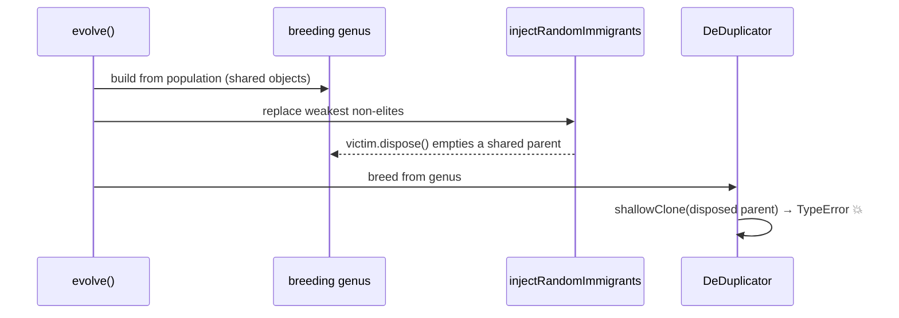

# PR #3497 — CI fix: flaky evolve crash from disposed breeding parent

## Failing check

`Merge coverage & results` failed: coverage **shard 7** recorded a genuine
test failure (shards always exit 0 and let the merge gate report), so
`Fail build if tests failed` exited 1.

The failing test was
`test/NEAT/RandomImmigrantsStagnationEscape.ts::"RandomImmigrants - evolveDataSet runs end-to-end with injection enabled"`,
crashing with an **uncaught** `TypeError: Cannot read properties of undefined (reading 'id')`
in `CreatureSerialization.shallowClone`.

## Root cause

`injectRandomImmigrants` (`src/NEAT/RandomImmigrants.ts`) called
`victim.dispose()` on each replaced weakest non-elite. `Creature.dispose()`
empties `neurons`/`synapses` **but leaves `input` non-zero**.

The breeding genus is built from the population *before* the random-immigrant
injection runs, and elites/trained survivors are the **same creature objects**
shared between `neat.population` and that genus. Disposing a victim therefore
corrupted a genome still referenced as a breeding parent. When the subsequent
de-duplication pass bred from the genus, `shallowClone` iterated
`for (i < creature.input)` over an emptied `neurons` array and dereferenced
`undefined.id`. The error was a raw `TypeError` (not a `TopologyError` /
`ValidationError`), so `safelyPrepareParent`'s guard did not catch it and the
whole `evolveDataSet` run aborted.

RNG-dependent: reproduced locally ~1 in 27 runs.

## Fix

Remove the `victim.dispose()` call. The helper operates on a population array
via a factory and does **not** own the victims exclusively, so it must not free
them. Replaced victims are simply dropped from the population; they remain valid,
breedable genomes for any other holder (the genus), and become GC-eligible once
unreferenced. WASM activation memory is already bounded by the
`WasmCreatureActivationLRU` cache (which calls `.free()` on eviction), so no
memory regression results.

## Tests

- Added `test/NEAT/RandomImmigrants.ts::"injectRandomImmigrants - replaced victim is not disposed (shared ownership)"`,
  a regression test that fails against the unfixed code (disposed victim →
  `shallowClone` throws) and passes with the fix.
- Stress-ran the previously-flaky end-to-end test **200×** with zero failures
  (was ~1/27 before).
- `deno fmt`, `deno lint`, `deno check` clean on the changed files;
  `test/NEAT/RandomImmigrants.ts` 10/10 pass.

## Files

- `src/NEAT/RandomImmigrants.ts` — drop unsafe `dispose()` of shared victims.
- `test/NEAT/RandomImmigrants.ts` — regression test.
