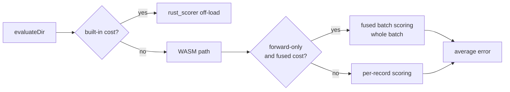

# chore: remove unused `fitnessSampleRate` option (#3502)

## Summary

Removes the `fitnessSampleRate` NeatOptions knob added by #3257, together with
all of its plumbing, benchmark, tests, and documentation. Closes #3502.

The option was never adopted. A fresh clone of GRQ has zero references to
`fitnessSampleRate` (its `trainingSampleRate` / `discoverySampleRate` are
unrelated data-subsampling knobs), and an org-wide `gh search code` for
`fitnessSampleRate` across `stSoftwareAU` returns hits **only inside this
repository**. The option defaulted to `1` — the full corpus — so it was inert in
every production run and removing it changes no observable behaviour.

Removed:

- Public option surface — `NeatArguments.fitnessSampleRate`, the `NeatOptions`
  `NumericOptionKeys` entry, and the `NeatConfig` parse block.
- Implementation and plumbing — `src/creature/FitnessSubsample.ts`, the
  subsample branches in `CreatureActivation.evaluateDir` (both the fused-WASM
  compaction path and the per-record stride), and the `fitnessSampleRate`
  parameters threaded through `Creature.ts`, `CreatureTraining.ts`,
  `WorkerHandler.ts`, and `WorkerProcessor.ts`.
- `bench/FitnessSampleRate.ts` and its `deno.json` entry.
- The **Fitness Corpus Subsampling** section (and its table-of-contents entry)
  from `docs/PERFORMANCE_TUNING.md`.

`docs/archive/pr-summaries/pr-summary-3257.md` is left untouched as historical
record.

Follow-on issues #3487 (wire `--sample-rate` through `RustScorerBridge`) and
#3488 (batch rust scorer ignores `fitnessSampleRate`) exist only to finish
wiring this option into the Rust scorers; both are superseded and are closed as
**not planned** alongside this PR.

### Scoring path after removal

The `subsampling` branch that previously sat in front of the `rust_scorer`
off-load, the fused batch call, and the per-record loop is gone — every record
is scored, unconditionally.

## Evidence

Backend/library change with no web interface, so there is no screenshot to
capture. Evidence is the quality gate:

- `deno fmt` — clean (2242 files).
- `deno lint` — clean (1903 files).
- `deno check mod.ts src bench test` — clean; the removal leaves no dangling
  references. This is the substantive check: `fitnessSampleRate` was a typed
  parameter threaded through six modules, so any missed call site is a compile
  error.
- `./quality.sh` — full suite run; see Test Plan.

Post-removal grep (excluding `docs/archive/`, which keeps the historical
`pr-summary-3257.md` / `pr-summary-3286.md` records) returns no matches for
`fitnessSampleRate`, `FitnessSubsample`, or `FitnessSampleRate`.

## Test Plan

Deleted — these tested the removed feature and have no behaviour left to cover:

- `test/creature/FitnessSubsample.ts` — stride maths for
  `resolveFitnessSampleRate` / `shouldScoreRecord` / `expectedSampledCount`.
- `test/creature/FitnessSubsampleEvaluateDir.ts` — `evaluateDir` integration
  tests for the subsample path.
- The five `fitnessSampleRate` cases in `test/config/NeatConfigParseOptions.ts`
  (default, number, string, range error, invalid-string error).

Added:

- `test/config/NeatConfigParseOptions.ts::"NeatConfigParseOptions -
  fitnessSampleRate is not a config key"`
  — asserts the parsed config no longer carries the key, guarding against
  accidental reintroduction.

Unchanged and still passing: the existing `evaluateDir` scoring tests, which
cover the full-corpus path that was always the production default.
