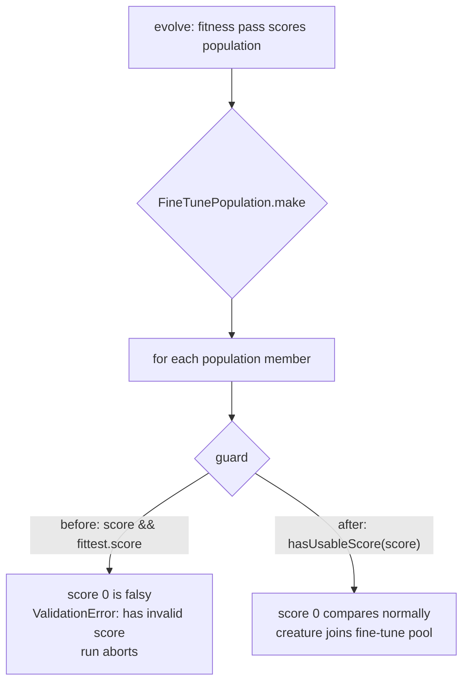

# Accept a score of 0 in FineTunePopulation

## Summary

`FindTunePopulation.make` guarded both of its score comparisons with a
**truthiness** test:

```ts
if (creature.score && fittest.score) { ... }
else throw new ValidationError(`Creature ${creatureUUID} has invalid score`, "OTHER");
```

`0` is falsy, but it is a legitimate score. With `costOfGrowth: 0` the score is
`1 - error`, so an error of exactly `1` yields exactly `0` — and any population
member that landed on `0` aborted the entire evolution run. This is the same
falsy-zero class of bug already fixed in `FineTune.ts` under #2295
(`test/blackbox/FineTuneZeroScore.ts`); `FineTunePopulation.ts` was missed.
Closes #3506.

The guards are now an explicit real-number predicate, `hasUsableScore`:

- `0` and `-0` are accepted — the bug.
- `undefined` / `null` / `NaN` still throw — unchanged.
- `-Infinity` is still accepted — unchanged. Creatures that suffered a WASM
  panic are scored `-Infinity` (#2214) and are deliberately retained in the
  population, so tightening the guard to `Number.isFinite` would have been a
  regression.

## Evidence

No web interface to screenshot — this is a library-internal fix. Evidence is the
downstream reproduction plus the new unit tests.

Reported by `stSoftwareAU/NEAT-AI-Examples#699`: `./adaptive_mutation/run.sh`
failed deterministically against `@stsoftware/neat-ai@5.9.43`.



Instrumenting the throw site in the failing downstream run identified the exact
value:

```
has invalid score DEBUG cs=0 typeof=number isNaN=false fs=0.9374880961923722 objectIs0=true
```

Running that same demo against a locally-patched `5.9.43` carrying this fix
completes cleanly:

```
🏁 Final: error=0.004773  score=0.9952  neurons=10  synapses=26
🕒 Completed in 21s 39ms
```

## Test Plan

New `test/blackbox/FineTunePopulationZeroScore.ts` drives
`FindTunePopulation.make` directly against a real `Neat` and `Genus`:

- `a population member scored exactly 0 is valid` — fails on the unfixed code
  with `ValidationError: ... has invalid score`.
- `a population member scored -0 is valid` — fails on the unfixed code the same
  way.
- `a previous fittest scored exactly 0 is valid` — fails on the unfixed code
  with `Previous fittest has no score, excluded from fine tune population`.
- `a -Infinity score stays acceptable (issue #2214)` — pins the WASM-panic
  behaviour so the guard is not over-tightened to `Number.isFinite`.
- `a missing or NaN score still throws` — pins the genuinely-invalid cases.

All five pass after the fix; three fail before it.
