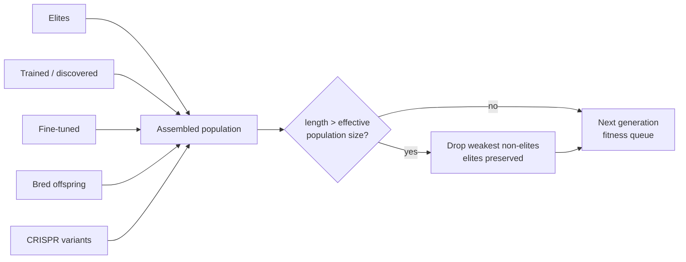

# Cap the assembled population at the effective population size (Issue #3508)

## Summary

The population could grow to several times the configured `populationSize` when
a burst of heavy-pool results landed in one generation. `evolve()` assembles the
next population by concatenating elites, completed training / discovery results,
fine-tuned creatures, freshly bred offspring and CRISPR (Clustered Regularly
Interspaced Short Palindromic Repeats) variants, but **only the bred slice was
budgeted** (`newPopSize`, floored at zero). Every other slice was concatenated
uncapped, so a slow or contended runner that completed several training /
fine-tuning / discovery tasks in the same generation blew past the configured
size — CI shard 6 reported a fitness queue depth of **48** for
`populationSize: 15`, against ~18 locally. Memory and CPU per generation then
scale above what the operator configured.

Exceeding the configured size is **not** intended, so the assembled population
is now trimmed back to the effective population size:

- New `src/NEAT/PopulationCap.ts` exposes `trimPopulationToSize()`, applied in
  `NeatEvolution.evolve()` immediately after assembly (before random-immigrant
  injection, so its count is computed against the capped size).
- **Elites are never dropped.** If elitism alone meets the cap the population
  stays at the elite count.
- **The weakest non-elites go first.** Unevaluated creatures have no score to
  rank by and are treated as the weakest; ties fall back to assembly order, so
  the over-represented heavy-pool results — the slice that overflows the budget
  — are dropped ahead of the freshly bred offspring that drive exploration.
- **Survivors keep their order** (elites first), and dropped creatures are
  **not** disposed: those objects are still shared with the breeding genus, and
  `dispose()` would leave a corrupt genome behind (the same ownership rule as
  `injectRandomImmigrants`).

Closes #3508.

## Evidence

Backend/CLI change — there is no web interface to screenshot. Verified by tests
(below) plus the full `./quality.sh` gate.

The regression test was confirmed to genuinely depend on the fix: with the
`NeatEvolution.ts` change stashed it fails —

```
generation 1: population grew to 29, above the effective population size of 12
FAILED | 0 passed | 1 failed
```

— and passes with the fix applied (`ok | 1 passed | 0 failed`).



## Test Plan

- **`test/NEAT/PopulationCap.ts`** (new, 12 unit tests) — `trimPopulationToSize`
  happy path (trims exactly to the cap), error/edge paths (cap of zero, empty
  population, elite count beyond the population, non-finite cap), elites never
  dropped, elites exceeding the cap still kept, unscored dropped before scored,
  lowest scores dropped first, survivor order preserved, dropped creatures not
  disposed.
- **`test/NEAT/PopulationCapEvolve.ts`** (new, regression test) — runs
  `evolveDir` over a multi-generation run with fine-tuning active and a stubbed
  burst of heavy-pool completions (6 training results × 4 creatures each on a
  budget of 12), asserting the `populationSize` reported on every
  `generation_complete` event stays within `neat.effectivePopulationSize`.
  Completions are stubbed rather than raced so the overflow reproduces
  deterministically on any runner.
- **`test/config/ThroughputMetrics.ts`** — comment only: the note claiming the
  population is uncapped is now stale. The assertion is unchanged, because
  `fastQueueMaxDepth` also maxes over the breeding queue, which this cap does
  not bound.
- `./quality.sh` (lint, format, type-check, WASM sync, full test suite) passes.

## Documentation

- `docs/config/POPULATION.md` — new "Population cap (hard bound)" section with a
  Mermaid diagram of assembly → trim.
- `CHANGELOG.md` — entry under Unreleased → Fixed.

## Security self-check

- No new external input, no new dependency, no new SQL / shell / filesystem /
  HTTP call, no rendering sink, no endpoint or privileged operation. The change
  is an in-memory bound on an internal array; inputs are clamped (`eliteCount`,
  `maxSize`) rather than trusted.
- No secrets or hidden files staged.
