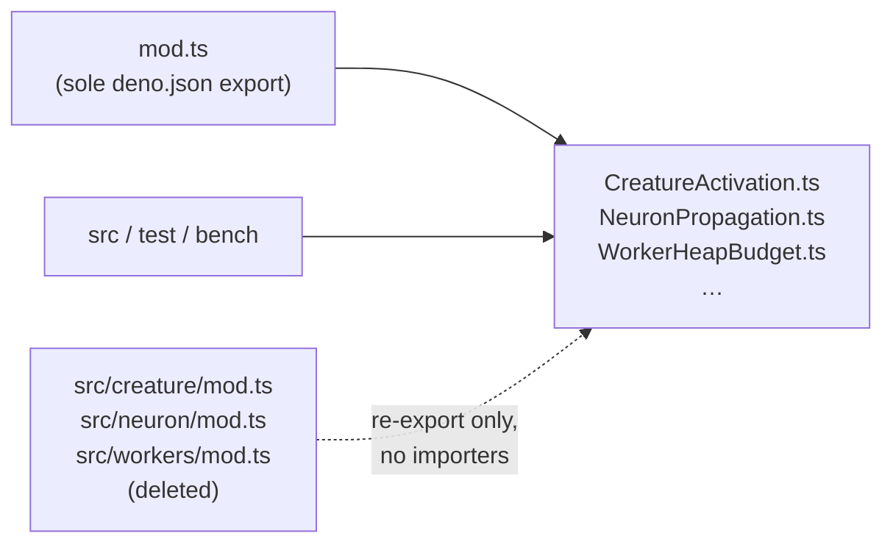

# Remove three orphan barrel modules

## Summary

Deleted three pure re-export barrel modules that had zero importers and sat
outside the `mod.ts` module graph. Closes #3509.

| File                  | Lines removed |
| --------------------- | ------------- |
| `src/creature/mod.ts` | 68            |
| `src/neuron/mod.ts`   | 38            |
| `src/workers/mod.ts`  | 44            |

All three contained only `export … from` lines, so no implementation was
removed. `deno.json` declares a single export path (`./mod.ts`), so the barrels
were not part of the published API surface either — every symbol they
re-exported is still reached directly by its real importers.

## Evidence

This is a backend/library change with no web interface, so there is no
screenshot. Verification is the module graph plus the quality gate.

```
$ grep -rn 'creature/mod\|neuron/mod\|workers/mod' \
    --include='*.ts' --include='*.json' --include='*.md' \
    --include='*.sh' --include='*.yml' --include='*.yaml' .
docs/archive/pr-summaries/pr-summary-3478.md:107:- `src/workers/mod.ts` — export `toShareableWasmBinary`.
```

The single hit is prose in an archived PR summary, not an import.



`./quality.sh` — `deno fmt`, `deno lint`, bash syntax, `deno check`, WASM sync
and the full suite — runs clean through lint and type-check with the files gone:
**7,984 tests pass**.

### Pre-existing failures, not caused by this change

Four tests fail on the milestone branch with a clean working tree:

```
test/ErrorGuidedStructuralEvolution/DiscoveryRobustness.ts:178
test/ErrorGuidedStructuralEvolution/InvalidDataDetection.ts:61
test/ErrorGuidedStructuralEvolution/InvalidDataDetection.ts:134
test/ErrorGuidedStructuralEvolution/MinimalCreature.ts:197
```

Confirmed pre-existing by stashing this branch's deletions and re-running: the
same four fail identically on unmodified `milestone/dead-code-29-jul`
(`087c3f18`). Raised separately as #3531 rather than masked here.

## Test Plan

No new tests were added. Removing a barrel with no importers changes no
behaviour, and the project's testing policy (`AGENTS.md` — "what" tests, not
"how" tests) rules out a test that greps the source tree or inspects the module
graph. The verification that matters is the existing suite continuing to pass
with the modules gone:

- `deno check` — resolves the full `mod.ts` graph with no unresolved specifier.
- `deno lint` — clean.
- Full `deno test` suite — 7,984 pass; only the four pre-existing
  `ErrorGuidedStructuralEvolution` failures tracked in #3531 remain.
