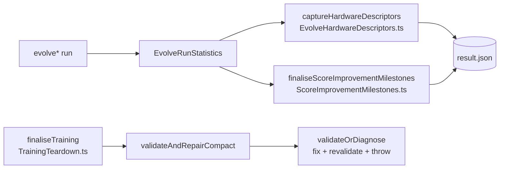

# Remove three superseded dead modules and their tests

## Summary

Deletes three source modules whose only importer was their own test file, and
whose behaviour is already provided by a live successor that production code
actually calls. Each source/test pair is a closed loop, so both halves go
together and no other module loses an import. Closes #3510.

| Removed (lines)                                     | Superseded by                                                                                                                                             |
| --------------------------------------------------- | --------------------------------------------------------------------------------------------------------------------------------------------------------- |
| `src/creature/EvolveHardware.ts` (70)               | `src/creature/EvolveHardwareDescriptors.ts` — `captureHardwareDescriptors`, called at `EvolveRunStatistics.ts:106`                                        |
| `src/creature/EvolveImprovementMilestones.ts` (127) | `src/creature/ScoreImprovementMilestones.ts` — `finaliseScoreImprovementMilestones`, called at `EvolveRunStatistics.ts:107` and re-exported from `mod.ts` |
| `src/compact/SanitiseCompactVariant.ts` (66)        | `validateAndRepairCompact` in `src/architecture/training/TrainingTeardown.ts:232`                                                                         |

### `SanitiseCompactVariant` — adopt or remove?

The issue asked for a decision rather than a reflexive delete. **Removed**,
because the producer-side gap it was written for (#3383) is already closed on
the live path: `finaliseTraining` calls `validateAndRepairCompact`, which
delegates to `validateOrDiagnose` — validate, write diagnostics, `fix()`,
re-validate, and rethrow loudly when the creature is unrecoverable. Adopting
`sanitiseCompactVariant` would mean two competing repair implementations at the
same boundary, and the one already wired in fails louder: it throws on an
unrepairable creature instead of silently returning `undefined` and dropping the
compact variant.

Also updated the mermaid diagram in `docs/event-driven-evolution.md`, which
still named the two removed evolve helpers, to the successors that actually run.

## Evidence

Backend/library change with no web interface, so no screenshot applies.

Live call graph after the removal:

Verification:

- `deno check mod.ts`, `deno lint` (1897 files), `deno fmt --check` (2237 files)
  — all clean after the deletion, confirming nothing referenced the removed
  symbols.
- `deno test -A test/compact/ test/creature/` — 58 passed, 0 failed.
- `./quality.sh` full run — 7952 passed, 5 failed. All five failures are
  **pre-existing and unrelated**: the four
  `test/ErrorGuidedStructuralEvolution/*` Discovery-selection failures reproduce
  identically on a stashed (clean) tree — they need the optional Rust Discovery
  FFI library, which is not built in this environment — and
  `test/breed/SyntheticLocationE2E.ts` passes in isolation on both the clean and
  changed trees (flaky only under the full parallel run).

## Test Plan

No new tests: this change removes code and adds none. The successors retain
their own existing coverage (`test/creature/EvolveHardwareDescriptors.ts`,
`test/creature/ScoreImprovementMilestones.ts`, and the compact/training suites
that exercise `validateAndRepairCompact`).

**Documented test removals** — three test files were deleted because the modules
they exercised no longer exist. No behaviour lost coverage; each successor is
independently tested:

- `test/creature/EvolveHardware.ts` — covered `readHardwareDescriptor`.
- `test/creature/EvolveImprovementMilestones.ts` — covered
  `summariseImprovement`.
- `test/compact/SanitiseCompactVariant.ts` — covered `sanitiseCompactVariant`.
