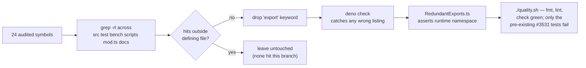

# Drop redundant `export` on 24 file-local symbols (Issue #3511)

## Summary

The dead-code audit found 24 value-level symbols (functions and consts) in
`src/` carrying an `export` keyword despite having **zero** references outside
their defining file. The keyword was dropped so each module boundary reflects
its real consumers. Closes #3511.

No runtime behaviour changes and no import site changes — by definition there
was no other importer, and none of the 24 is re-exported from `mod.ts`.

Every symbol was re-verified in this run before editing:

```
grep -rl '\b<SYMBOL>\b' src test bench scripts mod.ts docs
```

All 24 returned the definition file only. Two also appeared in archived PR
summaries (`resolveCacheDir`, `moveNeuronToIndex`) — prose in
`docs/archive/pr-summaries/`, not code, so they remain file-local.

The 114 `interface` / `type` exports from the same audit are **out of scope**
per the issue's scope note: several are cited in `docs/api/*.md` as the
documented shape of a public API, and separating the documented ones from the
incidental ones is a separate exercise.

### Symbols changed

| File                                                                         | Symbol                                                                                                       |
| ---------------------------------------------------------------------------- | ------------------------------------------------------------------------------------------------------------ |
| `src/upgrade/SemanticVersionValidation.ts`                                   | `VALID_WRITEABLE_SEMANTIC_VERSION_RE`                                                                        |
| `src/optimize/Simplify.ts`                                                   | `removeKnownSign`                                                                                            |
| `src/config/parsers/MutationParsers.ts`                                      | `parseDiversityAwareMCMC`                                                                                    |
| `src/wasm/WasmBundleCache.ts`                                                | `DEFAULT_MAX_ATTEMPTS`, `DEFAULT_BASE_DELAY_MS`, `resolveCacheDir`                                           |
| `src/discovery/BatchValidatorTypes.ts`                                       | `STRUCTURAL_CHANGE_TYPES`, `WEIGHT_ONLY_CHANGE_TYPES`                                                        |
| `src/discovery/DiscoveryEvaluationSummary.ts`                                | `logSingleSummary`                                                                                           |
| `src/creature/MemeticWireExport.ts`                                          | `buildNeuronIdToWireUuidMap`, `convertMemeticSnapshotToWireJson`                                             |
| `src/architecture/NormaliseComputationalNeuronOrder.ts`                      | `moveNeuronToIndex`                                                                                          |
| `src/architecture/ErrorGuidedStructuralEvolution/DataRecorderRecording.ts`   | `processDiscoveryFile`                                                                                       |
| `src/architecture/ErrorGuidedStructuralEvolution/NeuronImpact.ts`            | `computeSquashDerivative`                                                                                    |
| `src/architecture/ErrorGuidedStructuralEvolution/DiscoverDataLoading.ts`     | `openFileWithRetry`, `loadInputNeuronFromBinary`                                                             |
| `src/architecture/ErrorGuidedStructuralEvolution/AnalysisDegradeDecision.ts` | `DEGRADED_MAX_NEURONS_FACTOR`                                                                                |
| `src/architecture/ErrorGuidedStructuralEvolution/DiscoverAnalysis.ts`        | `candidateKey`, `neuronCandidateKey`, `filterTopSynapseCandidates`, `tryRustCoordinatedStructuralCandidates` |
| `src/architecture/ErrorGuidedStructuralEvolution/DiscoveryAnalysisMemory.ts` | `DEFAULT_DISCOVERY_ANALYSIS_MEMORY_DEPS`                                                                     |
| `src/breed/Father.ts`                                                        | `DEFAULT_SYNTHETIC_ALIGNMENT_THRESHOLD`                                                                      |
| `src/workers/WorkerHandlerBase.ts`                                           | `readV8HeapLimitMb`                                                                                          |

## Evidence

This is a library-internal change with no web interface, so there is no
screenshot to capture. The evidence is the test suite and the type checker.

The verification flow:



The change is self-verifying in two independent ways:

1. **`deno check`** — any test or module that actually imported one of the 24
   would fail to resolve the symbol. It passes across all 520 source and test
   files, proving no listing was wrong.
2. **`test/deadcode/RedundantExports.ts`** — imports each of the 16 touched
   modules for real and inspects the runtime module namespace object, asserting
   each stripped symbol is genuinely absent from the module's public shape.

The new test was confirmed to be a genuine regression test: with the `src/`
changes stashed it fails, and with them applied it passes.

```
$ git stash push src/ && deno test test/deadcode/RedundantExports.ts
Issue #3511 - file-local symbols are absent from the module namespace ... FAILED
FAILED | 1 passed | 1 failed

$ git stash pop && deno test test/deadcode/RedundantExports.ts
Issue #3511 - file-local symbols are absent from the module namespace ... ok
Issue #3511 - modules keep the exports their consumers rely on ... ok
ok | 2 passed | 0 failed
```

## Test Plan

Added `test/deadcode/RedundantExports.ts` with two tests:

- `Issue #3511 - file-local symbols are absent from the module namespace` —
  dynamically imports all 16 touched modules and asserts none of the 24 symbols
  is present on the module namespace, while each module still exports at least
  one symbol (so an over-eager sweep that stripped a module bare is caught here
  rather than at a downstream import). Asserts the covered count is exactly 24.
- `Issue #3511 - modules keep the exports their consumers rely on` — spot-checks
  that `src/breed/Father.ts` still exports `createCompatibleFather` and
  `src/optimize/Simplify.ts` still exports `simplify`, so a mis-targeted line
  number surfaces here.

Both tests assert on runtime module shape rather than source text, so they stay
valid if a symbol is later renamed, relocated, or deleted outright.

No existing tests were modified or removed.

### Pre-existing failures on the base branch

`./quality.sh` reports **7986 passed, 4 failed**. All four failures are
pre-existing on `milestone/dead-code-29-jul` and already tracked by **#3531**
("4 ErrorGuidedStructuralEvolution discovery-selection tests fail on
milestone/dead-code-29-jul"):

- `test/ErrorGuidedStructuralEvolution/DiscoveryRobustness.ts` — "Discovery
  weighted selection completes within max iterations"
- `test/ErrorGuidedStructuralEvolution/InvalidDataDetection.ts` — "Discovery
  validates all neurons have finite error values"
- `test/ErrorGuidedStructuralEvolution/InvalidDataDetection.ts` — "Discovery
  selection falls back gracefully on invalid totalErrorSum"
- `test/ErrorGuidedStructuralEvolution/MinimalCreature.ts` — "Discovery
  selection respects neuron count limit"

They were confirmed unrelated by stashing the `src/` changes and re-running the
same files against the untouched base — the counts are identical either way:

```
$ git stash push src/ && deno test test/ErrorGuidedStructuralEvolution/DiscoveryRobustness.ts \
    test/ErrorGuidedStructuralEvolution/InvalidDataDetection.ts
FAILED | 5 passed | 3 failed          # base, without this PR

$ git stash pop && deno test <same files>
FAILED | 5 passed | 3 failed          # with this PR — unchanged
```

`MinimalCreature.ts` likewise fails identically with and without the change.
Fixing them belongs to #3531, not to this dead-code sweep. Every other step of
`./quality.sh` (dependency check, `deno fmt`, `deno lint`, `deno check` across
520 source files) is green.
