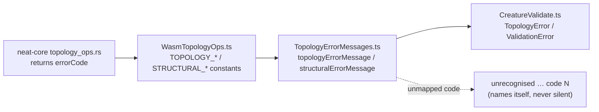

# PR Summary — Issue #3512

## Summary

`TOPOLOGY_MALFORMED_BUFFER` and `STRUCTURAL_MALFORMED_BUFFER` in
`src/wasm/WasmTopologyOps.ts` had no reference anywhere in the repository. The
dead-code audit offered two options — keep them with an explanatory comment, or
delete them. Investigating showed a third, better answer: the codes were dead
**because a real gap existed downstream**. `creatureValidate` maps error codes
to human-readable labels, and neither malformed-buffer code was in those maps —
so a Rust-side `MALFORMED_BUFFER` return surfaced to users as
`WASM topology validation failed: unknown at synapse N`. That is a quiet
failure: the fault happened, but the diagnostic hid its cause.

This PR **keeps** both constants and gives them a real caller:

- New `src/wasm/TopologyErrorMessages.ts` holds the single source of truth for
  code → label, including `Malformed input buffers` and
  `Malformed structural input buffers`.
- `src/architecture/CreatureValidate.ts` now calls `topologyErrorMessage()` /
  `structuralErrorMessage()` instead of rebuilding two inline
  `Record<number, string>` maps at every validation failure (DRY).
- Unrecognised codes fall back to `unrecognised topology error code N` rather
  than a bare `unknown`, so a future core code that outruns the TypeScript side
  is still loud and self-identifying.
- A short comment on the constants block records that it deliberately mirrors
  the complete Rust code set, so the next audit does not re-flag it.

No public API changed; the constants keep their existing exports and values.

Closes #3512.

## Evidence

Backend/library change — no web interface to screenshot. Evidence is the test
run plus the reference check.

Before: the constants had no caller outside their own file.

```
$ grep -rn 'TOPOLOGY_MALFORMED_BUFFER\|STRUCTURAL_MALFORMED_BUFFER' src test bench scripts mod.ts
src/wasm/WasmTopologyOps.ts:48:export const TOPOLOGY_MALFORMED_BUFFER = 6;
src/wasm/WasmTopologyOps.ts:81:export const STRUCTURAL_MALFORMED_BUFFER = 10;
```

After: both are referenced by the label lookup and its tests.

```
src/wasm/TopologyErrorMessages.ts:37:  [TOPOLOGY_MALFORMED_BUFFER]: "Malformed input buffers",
src/wasm/TopologyErrorMessages.ts:50:  [STRUCTURAL_MALFORMED_BUFFER]: "Malformed structural input buffers",
test/wasm/TopologyErrorMessages.ts: (8 assertions across both families)
```

New tests:

```
$ deno test --allow-all test/wasm/TopologyErrorMessages.ts < /dev/null
ok | 8 passed | 0 failed (4ms)
```

Error-code flow after the change:



### Quality gate

`./quality.sh < /dev/null` — lint, format, bash syntax, `deno check`, WASM sync
and parity gate all pass. The suite finished `7994 passed | 4 failed`; the four
failures are pre-existing Discovery-selection tests
(`test/ErrorGuidedStructuralEvolution/*`) that fail identically on the branch
point with these changes stashed, and are unrelated to this PR.

## Test Plan

Added `test/wasm/TopologyErrorMessages.ts` (8 tests, all calling the real
functions and asserting on returned values):

- `topologyErrorMessage`/`structuralErrorMessage` return a specific label for
  the malformed-buffer codes — the regression test for the "unknown" gap.
- Every code in each family maps to a non-empty, distinct, non-fallback label.
- Code `6` resolves differently per family (topology `MALFORMED_BUFFER` vs
  structural `IF_TOO_FEW_INWARD`), so the two lookups are not interchangeable.
- Unrecognised codes (`99`, `-1`) name the code in the fallback message.
- Non-finite codes (`NaN`, `Infinity`) fall back without throwing.

No existing tests were removed or modified.
