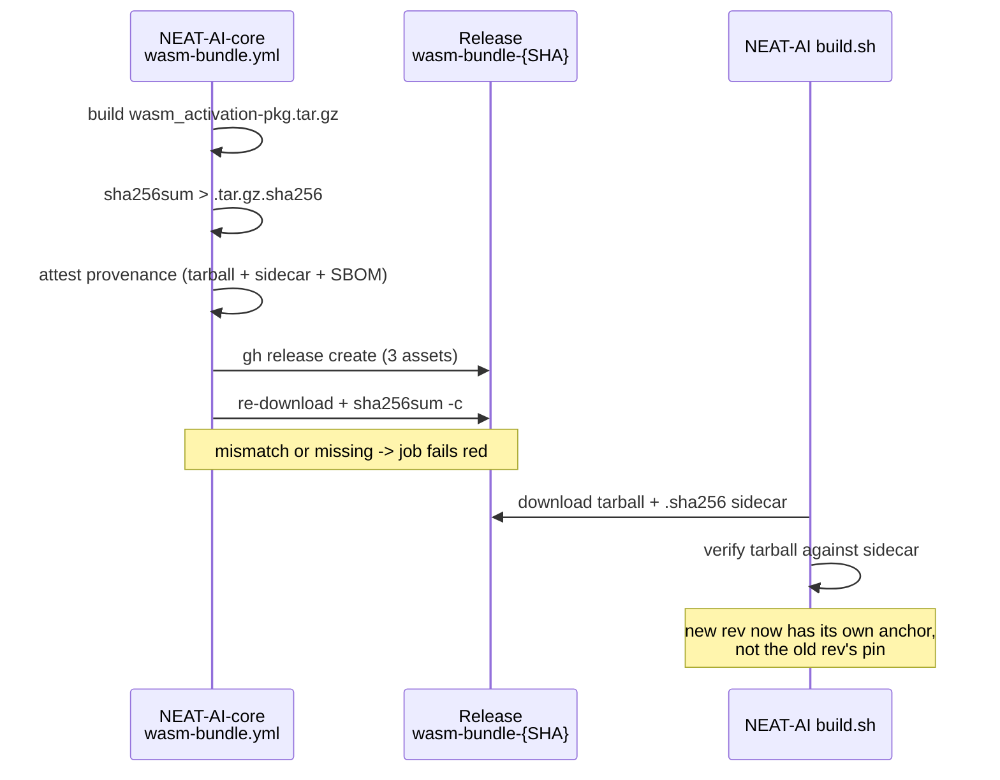

# Publish the `wasm_activation-pkg.tar.gz.sha256` sidecar on every bundle Release

## Summary

`build.sh` already verifies the downloaded WASM tarball against a release-side
sidecar `wasm_activation-pkg.tar.gz.sha256`, but NEAT-AI-core CI never published
one — every `wasm-bundle-<SHA>` Release carried just the tarball and the
CycloneDX Software Bill of Materials (SBOM). Without the sidecar the only
SHA-256 anchor available for a **new** revision is the `deno.json`
`neatCore.assetSha256` pin recorded for the **old** revision, which is exactly
what makes every internal `neatCore.rev` bump fail closed (#3504).

The root cause lives in the internal `stSoftwareAU/*` dependency, so per the
cross-repo rule it was fixed there rather than deferred:
**[stSoftwareAU/NEAT-AI-core#439](https://github.com/stSoftwareAU/NEAT-AI-core/pull/439)**
(tracking issue
[NEAT-AI-core#438](https://github.com/stSoftwareAU/NEAT-AI-core/issues/438))
adds the sidecar to `.github/workflows/wasm-bundle.yml`:

- a new **Generate tarball SHA-256 sidecar** step emits
  `wasm_activation-pkg.tar.gz.sha256` in standard `shasum -a 256` format
  (`<64-hex><two spaces><filename>`) and re-checks it immediately with
  `sha256sum -c`, so a failure is loud rather than an empty file;
- the sidecar joins the `actions/attest-build-provenance` `subject-path` list,
  so the anchor itself is covered by the Sigstore attestation;
- the sidecar joins the `gh release create` asset list — every Release now
  carries three assets;
- **Verify published bundle** re-downloads `wasm_activation-pkg.tar.gz*` and
  runs `sha256sum -c`, so a missing or mismatched sidecar reddens the run that
  produced the bundle rather than a downstream NEAT-AI bump.

In this repo the change is documentation only: `build.sh` is deliberately
untouched (out of scope per #3513; the consumer side is covered by #3504's other
sub-issues), and `docs/CORE_DEPENDENCY_POLICY.md` is updated from "if
NEAT-AI-core publishes a sidecar" to the now-guaranteed contract, including the
cut-over point and the pre-existing releases that will still fail loud.

No auto-release or auto-bump behaviour is introduced (standing decision #2944):
the NEAT-AI-core PR is left for a human to merge, and `neatCore.rev` is not
advanced here.

Closes #3513.

## Evidence

Backend/CI change — there is no web interface to screenshot. Evidence is the new
bats suite in NEAT-AI-core, which executes the workflow's **real** step scripts
under the same shell GitHub uses (`bash -e`) with a stubbed `gh`:

```text
$ bats tests/scripts/wasm_bundle_sha256_sidecar.bats
1..10
ok 1 publish job generates the tarball SHA-256 sidecar
ok 2 sidecar is published as a Release asset
ok 3 sidecar is generated before the Release is published
ok 4 provenance attestation covers the sidecar
ok 5 verify step re-downloads the sidecar and checks it
ok 6 generate step emits a sidecar build.sh can parse and verify
ok 7 generate step fails loud when the tarball is missing
ok 8 verify step passes when the published sidecar matches the tarball
ok 9 verify step fails when the published sidecar hash is wrong
ok 10 verify step fails when the sidecar is missing from the Release
```

Nine of the ten failed before the workflow edit (TDD red → green); the tenth
passed vacuously beforehand because the old verify step ran no checksum check.
The full NEAT-AI-core suite is green (`bats tests/scripts` → 299 passing), as
are `actionlint`, `markdownlint-cli2`, the Mermaid gate and the TypeScript
validity gate.

NEAT-AI's own `./quality.sh` is clean through formatting, linting, the
bash-script gate, type-checking and `build.sh`. The test stage reports four
**pre-existing** `ErrorGuidedStructuralEvolution` Discovery failures
(`DiscoveryRobustness.ts`, `InvalidDataDetection.ts`, `MinimalCreature.ts`);
they reproduce unchanged on the milestone branch with this branch's changes
stashed, and this PR touches only Markdown, so they are untouched by it.

Test 6 asserts the interop contract precisely: it parses the generated sidecar
the way `build.sh:557` does (`awk '{print $1}' | head -n1`) and compares it to
the tarball's real `sha256sum`.



## Test Plan

Added in NEAT-AI-core (`tests/scripts/wasm_bundle_sha256_sidecar.bats`, new):

- **Wiring**, parsed from `wasm-bundle.yml`: a step generates the sidecar; it is
  attached to `gh release create`; it is generated before both the attestation
  and the publish; the attestation `subject-path` covers it; the verify step's
  `--pattern` glob-matches the sidecar and it runs `sha256sum -c`.
- **Behaviour**, executing the extracted step scripts:
  - the generate step emits `<64-hex><two spaces><filename>` and the hash parsed
    the way `build.sh` parses it equals the tarball's real `sha256sum`;
  - the generate step exits non-zero and leaves no usable sidecar when the
    tarball is absent;
  - the verify step exits 0 on a matching sidecar, non-zero on a tampered
    tarball (the swapped-upload regression), and non-zero when the Release has
    no sidecar at all.

No test changes in this repo — `build.sh` and its tests are unchanged, and
`./quality.sh` was run to confirm the documentation edit breaks nothing.
