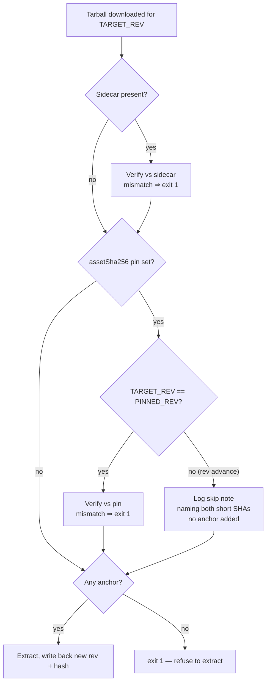

# build.sh: scope the `neatCore.assetSha256` pin to the rev it was recorded for

## Summary

`build.sh` enforced the `deno.json` `neatCore.assetSha256` pin against **every**
download, including downloads for a revision the pin was never recorded against.
Because the pin lives next to `neatCore.rev` and is by construction the hash of
_that_ rev's tarball, every revision advance compared the old rev's hash to the
new rev's bundle and always failed — rejecting every automated internal bump
(`bump-deps.sh` → `./build.sh`).

The pin check now lives in a new `verify_pinned_asset_sha256` helper that is
enforced only when the target rev equals the pinned rev:

- **Same rev** (re-download, `--clean`, `--rev <pinned SHA>`): unchanged — a
  mismatch is a hard `exit 1` carrying the `deno.json neatCore.assetSha256`
  source label.
- **Rev advance**: the pin is not applicable, is not compared, and a one-line
  note naming both short SHAs is printed so the skip is visible in bump logs.
- A skipped pin contributes **no** anchor, so the existing no-anchor guard
  (`guard_unverified_extract`) still refuses to extract when no sidecar is
  present. No trust-on-first-use fallback is introduced.

Closes #3514.

## Evidence

Backend/CLI change — no web interface to screenshot. Verified by the unit tests
below driving the real bash helper with test data (`bash -n` + `shellcheck`
clean, full `./quality.sh` green).

## Test Plan

New `test/scripts/BuildScriptPinScope.ts` sources the real `build.sh` helpers
into a sub-shell and drives them with real tarball files:

- `pin is enforced when the target rev equals the pinned rev` — matching pin on
  the pinned rev verifies (rc 0).
- `pin mismatch on the pinned rev is a hard failure` — rc 1 with the
  `deno.json neatCore.assetSha256` label and a `SHA-256 mismatch` error (the
  tamper check is retained).
- `pin is skipped, and the skip logged, when the target rev differs` — rc 2 (no
  anchor) with a skip note naming both short SHAs.
- `an unset pin is silently inapplicable` — rc 2 with no output.

Existing `test/scripts/BuildScriptContentHash.ts` (sidecar / no-anchor /
manifest guards) and the rest of `./quality.sh` continue to pass unchanged. The
end-to-end bump-to-new-rev regression test is the companion sub-issue #3516.

Docs: `docs/CORE_DEPENDENCY_POLICY.md` now records that the pin is scoped to its
recorded rev and that a skipped pin is not an anchor.
