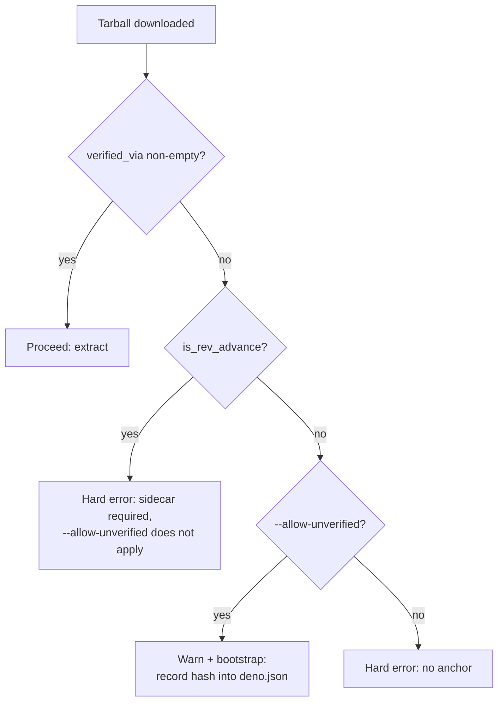

# build.sh: require the release sidecar on a revision advance

## Summary

Once #3514 scoped the `deno.json` `neatCore.assetSha256` pin to the rev it was
recorded against, the release sidecar `wasm_activation-pkg.tar.gz.sha256` is the
_only_ anchor a revision advance can use — but `--allow-unverified` still let an
advance proceed with **no** anchor at all, then wrote the unattested download's
own hash back into `deno.json` as if it were verified (trust-on-first-use). An
advance is exactly the moment a substituted release asset would be adopted, so
that pin attested nothing.

`guard_unverified_extract` now takes a third argument, `is_rev_advance`
(`neatCore.rev != target rev`, with an empty/unset pin treated as fresh setup,
not an advance):

- **Rev advance, no anchor** → hard error, **regardless of
  `--allow-unverified`**. The message names the sidecar filename, the
  `wasm-bundle-<rev>` release tag, states `--allow-unverified` does not apply,
  and links the upstream `wasm-bundle.yml` workflow that publishes the sidecar.
- **Rev advance, sidecar present and matching** → proceeds unchanged (a mismatch
  already hard-errors via the existing `verify_tarball_sha256`).
- **Same rev, no pin, no sidecar** → `--allow-unverified` still bootstraps as
  documented today.

`./build.sh --help` now states the narrowed scope of `--allow-unverified`.

Closes #3515.

## Evidence

Backend/CLI change — no web interface to screenshot. `bash -n build.sh` and
`shellcheck build.sh` are clean; full `./quality.sh` passes (the 4 unrelated
`ErrorGuidedStructuralEvolution` Discovery-selection failures are pre-existing
on the unmodified milestone branch HEAD, confirmed by re-running them after
`git stash`).

## Test Plan

- `test/scripts/BuildScriptContentHash.ts`:
  - Updated `guard_unverified_extract` unit test for the new 3-arg signature.
  - Added
    `guard_unverified_extract blocks a revision advance even with
    --allow-unverified (issue #3515)`:
    no-anchor + rev-advance aborts with and without `--allow-unverified`; a
    matching sidecar anchor still proceeds.
  - Extended the `--help` test to assert the narrowed `--allow-unverified`
    wording mentions "revision advance".
- `test/scripts/BuildScriptRetry.ts`:
  - The 404-retry-succeeds fixture is a revision advance (`FAKE_REV_A` →
    `FAKE_REV_B`); the fake `gh` shim now publishes a real matching sidecar so
    the test continues to exercise retry behaviour under the new anchor rule.
  - Rewrote the unattested-download test as
    `build.sh refuses a revision advance with no sidecar, with and without
    --allow-unverified (issue #3515)`:
    asserts non-zero exit in both cases, the actionable error text (sidecar
    name, release tag, `--allow-unverified` note, workflow link), nothing
    extracted, and `deno.json` left unmutated.
