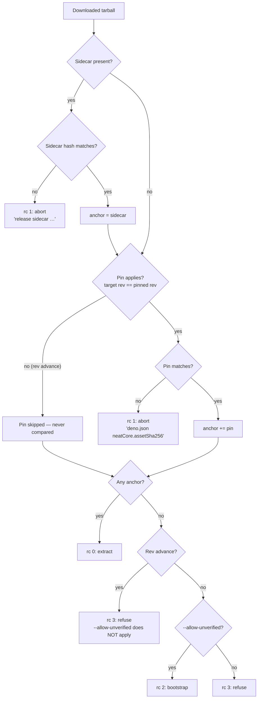

# Regression test: build.sh bump-to-new-rev path

## Summary

`test/scripts/BuildScriptContentHash.ts` only ever exercised **same-rev**
downloads, which is why #3504 shipped: a stale `deno.json`
`neatCore.assetSha256` pin was compared against a _different_ revision's tarball
and blocked every internal bump. This PR adds the missing regression coverage
for the rev-advance decision. Closes #3516.

The anchor decision was inline in the download flow, so it could not be
exercised without a network fetch. It is now extracted into two pure shell
functions in `build.sh` — behaviour is unchanged, only its shape:

- **`select_tarball_anchor`** — composes the release sidecar check, the
  rev-scoped `deno.json` pin (#3514) and `guard_unverified_extract` (#3515) into
  one extract-or-refuse decision. Reuses the existing `guard_unverified_extract`
  signature rather than inventing a second one.
- **`update_core_pin`** — the `deno.json` `neatCore` write-back, now taking the
  config path as an argument so it can run against a temp copy.

One supporting change: the "Skipping deno.json neatCore.assetSha256 check…" note
moved from stdout to stderr, because `select_tarball_anchor` returns the anchor
label on stdout. It is a diagnostic, so stderr is the correct sink; users still
see it and the #3514 tests (which assert on `stdout + stderr`) are unaffected.

### Anchor decision



## Evidence

Backend/CLI change — no web interface to screenshot.

**Acceptance criterion spot-check.** The criterion is "fails if the
`TARGET_REV == PINNED_REV` condition on the pin check is reverted". Reverting
that guard locally (`if [[ "$pinned_rev" != "$target_rev" ]]` → `if false`)
turns the suite red exactly as intended:

```
FAILURES

revision advance: a stale pin is not compared when the sidecar anchors the new rev (issue #3504)
revision advance: no sidecar refuses to extract, even with --allow-unverified

FAILED | 5 passed | 2 failed
```

With the guard in place:

```
running 7 tests from ./test/scripts/BuildScriptRevAdvance.ts
revision advance: a stale pin is not compared when the sidecar anchors the new rev (issue #3504) ... ok
same rev: the pin still bites when the tarball hash differs ... ok
revision advance: no sidecar refuses to extract, even with --allow-unverified ... ok
revision advance: a mismatching sidecar fails loud ... ok
same rev with no anchor keeps its --allow-unverified bootstrap (issue #2744) ... ok
write-back on a successful advance records the new rev and hash ... ok
write-back is a no-op when the rev and hash are already current ... ok

ok | 7 passed | 0 failed
```

**No network, no repo mutation.** The sidecar is a local file, the tarball a
stand-in blob, both under a `makeTempDir` scratch dir; the write-back runs
against a temp copy of `deno.json`. `git status` is clean of `deno.json` and
`wasm_activation/pkg` after the run.

### Pre-existing failures on this milestone branch (not caused by this PR)

`./quality.sh` reports 13 unrelated failures on the branch point, all of which
reproduce without this PR's files and were already red on #3539's own
`Test Results` check:

| Failing tests                                              | Root cause                                                                                                   |
| ---------------------------------------------------------- | ------------------------------------------------------------------------------------------------------------ |
| 4 × `ErrorGuidedStructuralEvolution/*` discovery-selection | Already tracked by #3531                                                                                     |
| 2 × `BuildFingerprint` / `WasmPublishIncluded`             | `wasm_activation/pkg/.gitignore` was clobbered to a bare `*` by the bundle refresh in #3539 — filed as #3544 |
| 6 × `WasmActivationTrapGuardIssue2658`                     | The core rev bump to `7eaa3322` moved synapse-index validation to construction — filed as #3545              |

#3544 is the more urgent of the two new ones: a bare `*` excludes the whole
vendored bundle from `deno publish`, so JSR consumers would 404 on
`wasm_activation.js`.

## Test Plan

New `test/scripts/BuildScriptRevAdvance.ts` (picked up automatically by the
`test/**/*.ts` include in `deno.json` — no registration change needed), covering
the five cases from the issue plus two guard-rails:

| # | Test                                         | Asserts                                                                            |
| - | -------------------------------------------- | ---------------------------------------------------------------------------------- |
| 1 | stale pin not compared on an advance (#3504) | rc 0, sidecar label on stdout, pin **not** reported as an anchor                   |
| 2 | pin still bites on the pinned rev            | rc 1, `deno.json neatCore.assetSha256` source label                                |
| 3 | advance with no sidecar fails loud           | rc 3 with **and** without `--allow-unverified` (#3515)                             |
| 4 | advance with a mismatching sidecar fails     | rc 1, `release sidecar …` source label                                             |
| 5 | write-back on a successful advance           | temp `deno.json` ends with the new `rev` + `assetSha256`, unrelated keys preserved |
| + | same-rev bootstrap preserved (#2744)         | rc 2 under `--allow-unverified`, rc 3 without — guards against over-tightening     |
| + | write-back is a no-op when already current   | `deno.json` left byte-identical                                                    |

WHAT-tests only: exit codes, error source labels and resulting `deno.json`
contents. No grepping of `build.sh` source text — the header comment in
`BuildScriptContentHash.ts` records that those HOW-tests were deliberately
removed under #2886.

Supporting change: the sourced-function harness duplicated between
`BuildScriptContentHash.ts` and `BuildScriptPinScope.ts` is now
`test/scripts/_buildShHarness.ts`. `BuildScriptPinScope.ts` imports it instead
of carrying an identical copy; its expectations are unchanged.

### Deno regression avoided

The write-back helper keeps using `deno eval` with values passed through the
environment; no Node tooling was introduced to make it testable.

## Pre-PR Security Self-Check

- **Input validation** — `select_tarball_anchor` re-uses
  `verify_tarball_sha256`, which rejects anything that is not a 64-char hex
  digest before comparing.
- **Injection surface** — `update_core_pin` passes the rev and hash via the
  environment, never interpolated into the `deno eval` source, so a hostile
  rev/hash cannot inject code. This is the pre-existing property, preserved.
- **Fail loud** — every refusal path returns non-zero and names the source that
  caught it; no fault is reconciled as success.
- **Secrets** — none staged; the tests touch only temp directories.
