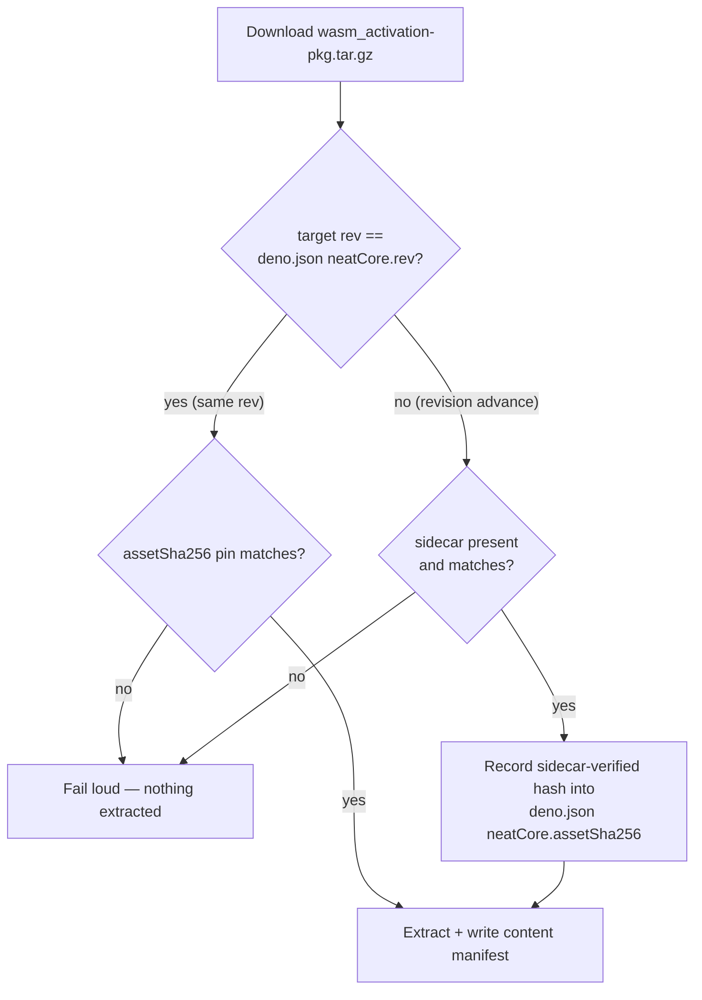

# Docs: rev-scoped `assetSha256` pin and sidecar anchor

## Summary

The core-dependency docs still described the pre-#3504 semantics — that
`neatCore.assetSha256` is verified on **every** download and that
`--allow-unverified` can bootstrap any unattested download. Both are wrong now
that the pin is scoped to its recorded rev (#3514) and a revision advance
requires the release sidecar (#3515). Closes #3517.

- **`docs/CORE_DEPENDENCY_POLICY.md`**
  - Guard table: `neatCore.assetSha256` runs on **same-rev downloads only**; the
    release sidecar is named as the required anchor on a revision advance.
  - New "Same rev vs revision advance" section states the two-case model
    explicitly — same rev ⇒ the committed pin is the tamper check; advance ⇒ the
    sidecar is required, verified, and its hash rewritten into `deno.json` as
    the new pin, with missing/mismatching sidecars failing loud and **no**
    trust-on-first-use.
  - `--allow-unverified` narrowed in both the modes table and the prose to the
    same-rev, no-pin bootstrap case; it explicitly does not cover an advance.
  - Records that NEAT-AI-core CI publishes `wasm_activation-pkg.tar.gz.sha256`
    on every `wasm-bundle-<SHA>` release, and that historical sidecar-less
    releases legitimately fail loud when targeted by an advance (with the two
    ways out).
  - `bump-deps.sh` section now explains why the internal bump succeeds:
    `./build.sh` rewrites the pin after the sidecar verifies the new tarball.
- **`CONTRIBUTING.md`** — the pin is described as per-revision and rewritten by
  `./build.sh` on an advance, not a value contributors hand-maintain across
  bumps.

## Evidence

Documentation-only change plus doc-sync tests — no web interface to screenshot.

Verification run:

- `deno test --allow-read test/scripts/ContributingCorePin.ts test/scripts/CoreDependencyPolicy.ts`
  → 11 passed. Both new assertions failed against the old wording before the
  docs were edited (per-revision pin description absent; `--allow-unverified`
  row silent on a revision advance).
- `markdownlint-cli2` → 0 errors; `deno fmt --check` clean.
- `./quality.sh` → passes.

## Test Plan

Doc-sync tests (the same category as the existing `ContributingCorePin.ts`
checks) that fail if the stale wording returns:

- `test/scripts/ContributingCorePin.ts`
  - `CONTRIBUTING.md describes assetSha256 as a per-revision pin rewritten by ./build.sh`
  - `CONTRIBUTING.md does not claim assetSha256 is verified on every download`
- `test/scripts/CoreDependencyPolicy.ts`
  - `policy guard table scopes assetSha256 to same-rev downloads` — parses the
    guard-table row and rejects an "every download" scope.
  - `policy doc narrows --allow-unverified to the bootstrap case` — requires
    both the modes-table row and the prose to state the revision-advance
    carve-out.
