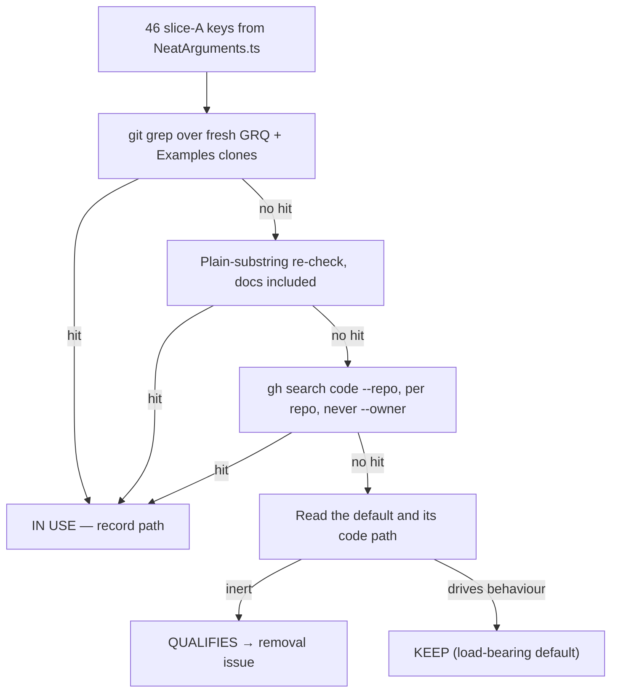

# Slice A of the #3505 option audit — core evolution & training top-level options

## Summary

Classified all **46** non-`discovery*` top-level scalar and flag options
declared in `src/config/NeatArguments.ts` against real consumer usage in
`stSoftwareAU/GRQ` and `stSoftwareAU/NEAT-AI-Examples`, and filed a removal
issue for every qualifying key. Closes #3519.

| Verdict                       | Count |
| ----------------------------- | ----: |
| `IN USE`                      |    24 |
| `KEEP (load-bearing default)` |    18 |
| `QUALIFIES`                   |     4 |

Four options qualify, filed as three removal issues:

| Key                        | Default                            | Issue |
| -------------------------- | ---------------------------------- | ----- |
| `maxConns`                 | `Number.MAX_SAFE_INTEGER` (no cap) | #3552 |
| `maximumNumberOfNodes`     | `Number.MAX_SAFE_INTEGER` (no cap) | #3552 |
| `enableRepetitiveTraining` | `false` (flag off)                 | #3553 |
| `dnaSharingMode`           | `"default"` preset                 | #3554 |

None is a pure dead-knob deletion, so each issue carries an explicit reviewer
caveat rather than presenting the removal as mechanical.

This PR is **documentation only** — no `src/` change. The audit's deliverable is
the classification; the code deletions ride the three removal issues.

### Files changed

- `docs/OPTION_AUDIT_SLICE_A.md` — new: the full per-key evidence table.
- `docs/README.md` — index entry for the new doc.
- `docs/archive/pr-summaries/pr-summary-3519.md` — this file.

## Evidence

No UI and no runtime surface to screenshot — the issue itself notes the audit
has no runtime surface. The evidence is the search itself, run twice per key
against fresh consumer clones and against the code-search index.

### Controls

`populationSize` is the positive control: a sweep that reports it unused is a
broken sweep, not a finding. It was verified through **both** search paths after
the fault below was fixed:

- `git grep` — `GRQ/src/Learn.ts:436` and
  `NEAT-AI-Examples/adaptive_mutation/adaptive_mutation.ts:408`.
- `gh search code --repo` — 20 hits in each consumer.
- `scripts/audit-option-usage.ts --controls-only` — passed, which also
  re-confirms the `dnaSharingMode` negative control.

### A search fault the control caught

Worth recording, because it is the exact failure mode #3519 warned about:
`ripgrep` is **not on the non-interactive `PATH`** on the worker — it resolves
only as a shell function. The first sweep paired `rg` with `2>/dev/null`, so the
exit-127 "command not found" was swallowed and **all 46 keys read as unused,
`populationSize` included**. Every verdict in that pass was invalid.

Fixed by switching to `git grep` (the tool `scripts/audit-option-usage.ts`
itself auto-detects) and never suppressing stderr; the corrected sweep also
fails loud if the positive control returns zero. This is the never-fail-silently
rule in miniature — absence of a hit is not evidence of absence when the search
never ran.

The second trap, a bare `gh search code --owner stSoftwareAU` saturating its
result window with NEAT-AI's own hits, was avoided from the start: every query
is `--repo`-scoped.

## Test Plan

No tests added or modified. The change is documentation only, and the honest
test for a classification would have to grep the doc for its own contents — an
explicitly forbidden "how" test under `AGENTS.md`. The existing
`test/scripts/AuditOptionUsage.ts` already pins the harness behaviour this slice
relied on, including the `--owner`-never-used assertion and the pinned key
count.

Verification performed instead:

- `./quality.sh < /dev/null` — lint, format and type-check clean; **8066 tests
  passed, 4 failed**.
- The 4 failures are all in `test/ErrorGuidedStructuralEvolution/`
  (`DiscoveryRobustness.ts`, `InvalidDataDetection.ts` ×2, `MinimalCreature.ts`)
  and are **pre-existing on this branch's HEAD**, not caused by this PR.
  Confirmed by stashing the change and re-running `MinimalCreature.ts` on the
  clean tree — it fails identically. This PR touches only `docs/`, so it cannot
  reach the discovery selection path.
- `deno test test/docs/ApiConfigurationDefaults.ts test/scripts/AuditOptionUsage.ts`
  — 61 passed, 0 failed. These are the tests that cover the option-defaults
  documentation and the audit harness this slice relied on.
- `deno fmt --check` on all three changed files — clean.
- `deno run --allow-read --allow-write --allow-run --allow-env scripts/audit-option-usage.ts --clone-root "$HOME/auto-issue-work" --controls-only`
  — both controls pass.
- Per-repo `gh search code` sweep over the 21 keys with no local hit — exit 0,
  no unresolved probes, all zero.

## Definition of done

- [x] Every key in this slice classified — 24 + 18 + 4 = 46, none skipped.
- [x] Classification table posted as a comment on #3505.
- [x] A removal issue filed for every `QUALIFIES` key (#3552, #3553, #3554),
      linked from that comment.
- [x] Dedup checked against #3446–#3449 and #3509–#3512 — none touches a slice-A
      key; no prior removal issue exists for any qualifying key.
