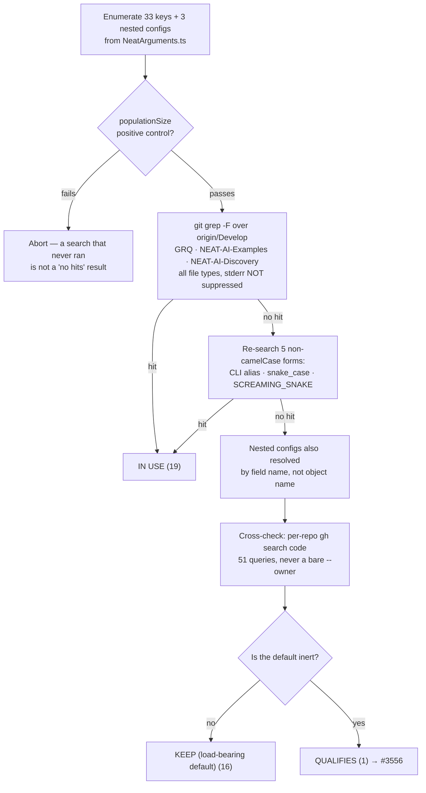

# Audit: classify slice-B `discovery*` top-level options (Issue #3520)

## Summary

Classified all **33 `discovery*` / discovery-adjacent top-level options** in
`src/config/NeatArguments.ts` plus the **3 discovery-scoped nested configs** (36
keys total, none skipped) against real consumer usage in `stSoftwareAU/GRQ`,
`stSoftwareAU/NEAT-AI-Examples`, and — as this slice specifically requires — the
Rust crate `stSoftwareAU/NEAT-AI-Discovery`.

**Result: 19 `IN USE`, 16 `KEEP (load-bearing default)`, 1 `QUALIFIES`.**

Slice B is near-clean. One removal issue filed: **#3556**
(`discoveryReplayDiagnostics`). The classification table is posted on
[#3505](https://github.com/stSoftwareAU/NEAT-AI/issues/3505#issuecomment-5126409875).

Closes #3520.

This is documentation only — no source, test, or behaviour change. The audit's
deliverable is the classification and the filed removal issue; the actual
deletion rides #3556 as a separate PR.

That near-clean shape is the expected one: GRQ drives discovery through a
dedicated CLI (`GRQ/src/Discovery/Scan.ts` + `GRQ/worker/Discovery/run.sh`) that
exposes almost the whole `discovery*` surface as operator flags, so most of
these keys are set on every discovery run.

### The one `QUALIFIES` key

| Key                          | Default | Issue | Why the default is inert                                                                                             |
| ---------------------------- | ------- | ----- | -------------------------------------------------------------------------------------------------------------------- |
| `discoveryReplayDiagnostics` | `false` | #3556 | Pure timing instrumentation — flag off ⇒ all 15 `performance.now()` sites short-circuit, `result.diagnostics` unset. |

Nothing in `src/` reads that payload. **Reviewer caveat carried into #3556:** it
is still reachable from public API (`Creature.discoveryReplayDir()` returns
`DiscoveryReplayDirResult` with the optional `diagnostics` field, and
`NeatOptions` inherits the key via `Partial<NeatArguments>`), so removal
withdraws an opt-in observability surface rather than deleting a dead knob. If
the timings are wanted for a future replay-performance investigation, #3556
should be closed as `KEEP`.

### Two corrections to the slice brief

1. **`discoveryFocusNeuronUUIDs` is not internal-only.** The brief predicted it
   and `discoveryHardDeadlineTS` were both set only by NEAT-AI's own
   orchestration and should be classified `KEEP`. GRQ sets
   `discoveryFocusNeuronUUIDs` directly from its `--focusNeurons` operator flag
   (`GRQ/src/Discovery/Scan.ts:654`), so it is `IN USE` on consumer evidence.
   `discoveryHardDeadlineTS` is the only genuinely internal-only key.
2. **No slice-B key crosses the Rust envelope.**
   `src/config/DiscoveryWorkerEnvelope.ts` carries only worker thread-cap and
   heap fields, so the "NEAT-AI-Discovery deserialization test fails on a
   missing envelope field" detection path named in the brief does not apply to
   any key here.

## Evidence

No UI and no runtime surface — this PR adds two documentation files. The
evidence is the search transcript, reproduced in full in
`docs/OPTION_AUDIT_SLICE_B.md`.

### Search faults this slice had to guard against

Four, each of which silently manufactures a false `QUALIFIES` verdict:

1. **`rg` is not on the non-interactive `PATH`** — the fault that invalidated
   slice A's first sweep. Every search here is `git grep` with stderr **not**
   suppressed and an explicit exit-code check; `rc > 1` is reported as
   `SEARCH FAILED`, never folded into "no hits".
2. **A bare `gh search code --owner stSoftwareAU` saturates its result window**
   with NEAT-AI's own hits. All 51 cross-check queries are `--repo`-scoped. The
   one org-wide query used is `--filename deno.json`, which is safe because it
   is filename-scoped — it confirmed the consumer set is exactly GRQ +
   NEAT-AI-Examples.
3. **A camelCase-only grep misses GRQ's shell plumbing.** GRQ drives discovery
   from `.sh` wrappers and `worker/Discovery/run.sh` accepts a short alias for
   most keys (`--batchSize=*|--discoveryBatchSize=*`). Every key with no
   camelCase hit was re-searched as short CLI alias, `snake_case`, alias
   `snake_case`, `SCREAMING_SNAKE`, and alias env form. All empty.
4. **A nested config hides behind a substring.** `git grep -F discoveryCache`
   returns 6 hits in GRQ — every one of them `discoveryCacheDir`, a _different_
   option that **is** set. Resolving the nested config by object name alone
   would have wrongly marked it `IN USE`. Each nested config was therefore also
   resolved by its own field names (`successMaxEntries`, `minFreeDiskMB`,
   `addSynapses`, …), all empty.

The 17 not-set verdicts were independently corroborated against the #3518
baseline probe cache, which reached the same miss result for all 17 from a
separate run.

### Definition-of-done check

- [x] Every key classified — the tables contain exactly the 33 top-level keys
      plus the 3 nested configs named in the issue's **Scope**, 36 total.
- [x] Classification table posted as a comment on #3505.
- [x] A removal issue filed for the single `QUALIFIES` key (#3556), linked from
      that comment.
- [x] The slice is explicitly reported as near-clean; no removals were
      manufactured to fill the table.

## Test Plan

No tests added or modified — this PR changes no source. That matches the
precedent set by slice A (#3519 / PR #3555), which likewise landed as
documentation only.

`./quality.sh` was run to completion. One pre-existing flake surfaced and is
**not** related to this change:

- `test/wasm/ProducerGateDiagnosticDumps.ts` → "Issue #2672:
  `Mutator.repairAfterMutation` dump …" intermittently fails with `prngSeed` =
  `"n/a (unseeded RNG)"` instead of `20260516`. The test calls
  `setRandomNumberGenerator()` on the **global** RNG, and any parallel test
  running `createNeatConfig()` replaces that global with an unseeded one — a
  cross-test race, not a regression. The file passes in isolation
  (`deno test -A --no-check test/wasm/ProducerGateDiagnosticDumps.ts` → 2
  passed), both with and without this branch's changes. Out of scope for an
  audit issue that touches no source; it needs its own issue against the test's
  use of global RNG state.

## Files

- `docs/OPTION_AUDIT_SLICE_B.md` — new: the full classification with per-key
  evidence, the search-fault notes, and the reviewer caveat on #3556.
- `docs/README.md` — index entry for the new doc, beside the slice-A entry.
