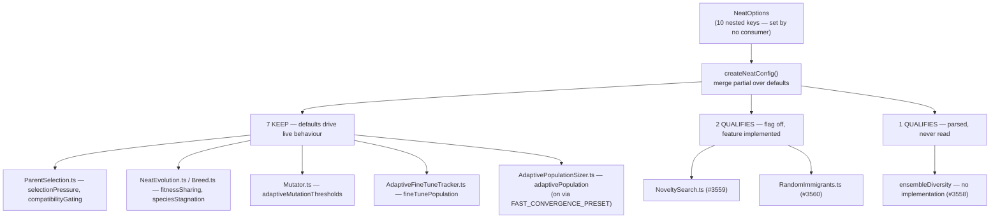

# Audit: classify slice-C population & selection nested configs (Issue #3521)

## Summary

Slice C of the #3505 option-removal audit. Classifies the **10 nested config
objects governing population and selection dynamics** — both the top-level
`NeatOptions` key and every field inside each interface, **59 classifications**
in total — against real consumer usage in `stSoftwareAU/GRQ` and
`stSoftwareAU/NEAT-AI-Examples`. Closes #3521.

| Verdict                       | Parent keys | Fields | Total |
| ----------------------------- | ----------: | -----: | ----: |
| `IN USE`                      |           0 |      0 |     0 |
| `KEEP (load-bearing default)` |           7 |     29 |    36 |
| `QUALIFIES`                   |           3 |     20 |    23 |
| **Total**                     |      **10** | **49** |    59 |

Three removal issues filed — #3558 (`ensembleDiversity`), #3559 (`novelty`),
#3560 (`randomImmigrants`) — and the classification table posted on
[#3505](https://github.com/stSoftwareAU/NEAT-AI/issues/3505#issuecomment-5126956234).

This is a documentation-only PR: it adds the audit record and files the issues.
No source, config or test behaviour changes.

### Zero `IN USE` is a real result, not a search fault

The definition of done requires saying so explicitly. The positive control
(`populationSize`) returned **509 hits in GRQ and 231 in NEAT-AI-Examples in the
same run** that returned zero for all ten slice-C keys, and the #3518 probe
cache independently reached the same not-set result for all ten.

The structural reason is that slice C is the first slice made entirely of
**internal evolution-dynamics knobs**. Slice B was 19/36 `IN USE` because GRQ
exposes the `discovery*` surface as operator flags through `Scan.ts` and
`run.sh`; nothing equivalent exists for selection pressure or speciation. So the
slice's real work was the second question — is the default inert, or quietly
running the show? For 7 of 10 configs, it is running the show.

### Two findings worth a reviewer's attention

**`ensembleDiversity` is not a knob with an inert default — it is a config with
no feature behind it.** All 10 fields have zero read sites anywhere in `src/`;
the only reference to the parsed object is the parse call at
`src/config/NeatConfig.ts:700`. Unlike its siblings
(`AdaptivePopulationSizer.ts`, `NoveltySearch.ts`, `RandomImmigrants.ts`, all
wired in) there is no implementation module. Worse, `LARGE_NETWORK_PRESET` sets
`enabled: true` advertising _"Encourage species diversity"_ and five docs
describe it as working, so a user following `docs/troubleshooting/TRAINING.md`
to fix a diversity problem gets a silent no-op.

**#3558 unbundles a stalled predecessor.** #1942 ("Remove unused config-only
modules: AdaptivePopulation, EnsembleDiversity, StabilityAdaptation") was closed
`NOT_PLANNED` with no comment in March 2026. Its premise was only partly true
and is now stale — it claimed `computeAdaptivePopulationSize()` "is never called
anywhere", but `src/NEAT/NeatEvolution.ts:534` calls it today. Bundling one dead
config with one live one is the likely reason it stalled; #3558 takes only the
`ensembleDiversity` third, whose premise was re-verified and still holds
exactly.

### Caveat carried into #3559 / #3560

`novelty` and `randomImmigrants` meet the mechanical `QUALIFIES` test (flag off,
no consumer) and the slice brief requires one issue per qualifying config — but
both are complete, tested, benchmarked and documented features shipped 7 weeks
ago by #2932 / #2933 in the _Improve evolution_ milestone (#2942). Removing them
withdraws real opt-in capability rather than deleting dead weight, so both are
filed as explicit decisions with an **audit recommendation to lean KEEP**,
following the reviewer-caveat precedent slice B set with #3556. If both are
kept, the slice's effective yield is the single unambiguous removal, #3558. Per
the definition of done, no removals were manufactured to fill the table.

## Evidence

Documentation and audit work — no web interface to screenshot. The evidence is
the per-key code and consumer references recorded in
`docs/OPTION_AUDIT_SLICE_C.md`, reproducible with the commands quoted there.

### Method guards this slice needed beyond slice B's

**A word-splitting fault, caught by the control.** The first sweep reported all
ten keys unused _in one line of output_ — the key list had failed to word-split,
so a single `git grep` for the concatenated string ran once and missed. The
per-key verdicts would have been right by accident, which is exactly what makes
this class dangerous: a broken loop and a clean slice produce the same table. It
was caught by the per-key headers, and every search was re-run with **stderr not
suppressed** and explicit exit-code checking (`rc > 1` → `SEARCH FAILED`, never
folded into "no hits"). Recorded on #3505 for the shared recipe alongside slice
A's `rg` fault.

**Fields resolve through the parent, never by a name grep.** A nested field can
only reach `NeatOptions` through its parent object, so with all ten parents
unset no field is consumer-set. This ordering is essential because slice-C field
names collide with common identifiers — a raw `git grep` over `src/` returns
1580 hits for `weight`, 200 for `large` and 29 for `power`, essentially none of
them the config field. Every field verdict was established by reading the
specific implementation file that destructures the resolved config.

**Presets are an in-repo setter.** `src/presets/Presets.ts` is exported public
API and sets two slice-C keys. `FAST_CONVERGENCE_PRESET` enabling
`adaptivePopulation` is why that key is `KEEP` despite a `false` default — the
one borderline call in the slice, flagged as such. `LARGE_NETWORK_PRESET`
enabling `ensembleDiversity` is itself a defect, since nothing reads it.

**Substring false positives run down.** All three apparent consumer hits are
unrelated: `noveltyEscalationActive` (the #3072 Discovery drought signal) plus
GRQ roadmap prose; NEAT-AI-Examples' own unrelated `AdaptiveMutationConfig`
(`timeoutMinutes`/`targetError`); and a pr-summary naming the internal
`FineTunePopulation.make` class.

## Test Plan

No new tests — this PR adds documentation and files issues; it changes no
source, config or test behaviour.

- `./quality.sh < /dev/null` passes: **8078 passed, 0 failed, 4 ignored** (fmt,
  lint, type-check, full suite).
- `deno fmt` applied to the new `docs/OPTION_AUDIT_SLICE_C.md` and the
  `docs/README.md` index entry.
- The existing doc-consistency gates
  (`test/config/ComparisonDocumentedFeatures.ts`,
  `test/config/ConfigurationGuideDefaults.ts`) still pass, confirming no
  documented option surface was altered by this slice.
