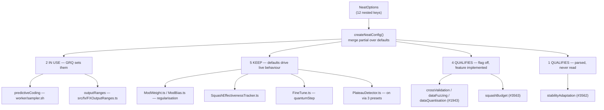

# Audit: classify slice-D training, regularisation & data-shaping nested configs

## Summary

Slice D of the #3505 option-removal audit. Classifies the **12 nested config
objects governing training, regularisation and data shaping** — the top-level
`NeatOptions` key _and_ every field inside each interface — against consumer
usage in `stSoftwareAU/GRQ` and `stSoftwareAU/NEAT-AI-Examples`. **69
classifications, none skipped.** Closes #3522.

| Verdict                       | Parent keys | Fields |  Total |
| ----------------------------- | ----------: | -----: | -----: |
| `IN USE`                      |           2 |      4 |      6 |
| `KEEP (load-bearing default)` |           5 |     32 |     37 |
| `QUALIFIES`                   |           5 |     21 |     26 |
| **Total**                     |      **12** | **57** | **69** |

This is a documentation-only change: the audit output is
`docs/OPTION_AUDIT_SLICE_D.md`, indexed from `docs/README.md`. No source, option
surface or behaviour is touched — removals ride their own issues.

**Actions taken outside the diff**

- **#3562** filed — remove `stabilityAdaptation`, a 10-field config that is
  parsed and then never read. Supersedes the `StabilityAdaptation` third of
  #1942, exactly as #3558 unbundled its `ensembleDiversity` third.
- **#3563** filed — decision on `squashBudget`, recommending **KEEP**.
- **#1943 commented on** — it already covers `crossValidation`, `dataFuzzing`
  and `dataQuantisation` and was closed `NOT_PLANNED`; the premise re-verified
  unchanged, so the audit recorded its verdict there rather than filing a
  duplicate.
- **Classification table posted on #3505.**

## Findings worth a reviewer's attention

**Slice D breaks slice C's zero-`IN USE` result.** GRQ genuinely drives two
keys: `predictiveCoding` (a `worker/sampler.sh` variant emitting
`--predictiveCoding.enabled=true`, consumed at `src/Learn.ts:526`) and
`outputRanges` (all three fields, via `src/fx/FXOutputRanges.ts`, with
`penaltyWeight: 10` deliberately 10× the library default).

**The code-search index can produce a false _used_, not just a false _unused_.**
`OPTION_USAGE_AUDIT.md` documents `--owner` saturation hiding a set key. Slice D
hit the mirror image: `gh search code squashBudget --repo stSoftwareAU/GRQ`
returns 2 hits that `git grep -F` does not, because GitHub splits camelCase and
matched GRQ's own **ImproveSquash** wall-clock **budget**. Resting on the index
alone would have recorded `squashBudget` as `IN USE`.

**The `squashBudget` `CoerceNumeric` asymmetry the brief flagged is intentional,
not a bug.** `CoerceNumeric<T>` returns arrays unchanged, and
`SquashBudgetConfig`'s only field is `string[]`, so wrapping it would be a
strict no-op — the in-code comment says so. Removal blast radius is one line
_smaller_ than a sibling's, and no CLI-coercion behaviour changes either way.

**`stabilityAdaptation` is the second lying preset entry in a row.**
`LARGE_NETWORK_PRESET` sets `enabled: true` and advertises "Adapt mutation to
stability"; nothing reads the config. `docs/config/MUTATION_ADAPTATION.md` and
`docs/troubleshooting/TRAINING.md` both tell users to enable it. They get a
silent no-op. Same preset, same defect as #3558's `ensembleDiversity`.

**One `QUALIFIES` group was deliberately _not_ re-filed.** #1943 covers
`crossValidation` / `dataFuzzing` / `dataQuantisation` and a human closed it
`NOT_PLANNED`. Unlike #1942 — whose premise had gone stale — #1943's premise is
still exactly correct, so re-filing would be churn. The comment adds the two
scope corrections a future implementer needs (call sites moved out of
`Training.ts`; `DataFuzzingConfig` is exported from `mod.ts`, making that
removal a breaking API change).

## Evidence

Backend/library audit — no web interface, so no screenshot applies. The evidence
is the consumer sweep, reproduced in full in `docs/OPTION_AUDIT_SLICE_D.md`.

**Positive control, run in the same sweep as every verdict:**

```
KEY=populationSize REPO=GRQ              RC=0 HITS=388
KEY=populationSize REPO=NEAT-AI-Examples RC=0 HITS=231
KEY=dnaSharingMode REPO=GRQ              RC=1 HITS=0     (negative control)
KEY=dnaSharingMode REPO=NEAT-AI-Examples RC=1 HITS=0
```

The #3518 harness ran its own copy of both controls in this session and reported
`✅ controls passed` before being stopped, and independently rediscovered the
consumer set via its org backstop:
`🔎 consumers declaring @stsoftware/neat-ai: stSoftwareAU/GRQ, stSoftwareAU/NEAT-AI-Examples`.

**Per-key sweep** — fresh clones, GRQ `origin/Develop` at `bc622f5`, 30 Jul
2026. `rc 0` hit, `rc 1` miss, `rc > 1` would have been reported as
`SEARCH FAILED` and never folded into "no hits":

| Key                    | GRQ local / index | Examples local / index | Verdict             |
| ---------------------- | ----------------- | ---------------------- | ------------------- |
| `predictiveCoding`     | 18 / 5            | 0 / 0                  | `IN USE`            |
| `outputRanges`         | 17 / 14           | 0 / 0                  | `IN USE`            |
| `weightRegularisation` | 0 / 0             | 0 / 0                  | `KEEP`              |
| `biasRegularisation`   | 0 / 0             | 0 / 0                  | `KEEP`              |
| `squashEffectiveness`  | 0 / 0             | 0 / 0                  | `KEEP`              |
| `quantumStep`          | 0 / 0             | 0 / 0                  | `KEEP`              |
| `plateauDetection`     | 0 / 0             | 0 / 0                  | `KEEP`              |
| `stabilityAdaptation`  | 0 / 0             | 0 / 0                  | `QUALIFIES` → #3562 |
| `crossValidation`      | 0 / 0             | 0 / 0                  | `QUALIFIES` → #1943 |
| `dataFuzzing`          | 0 / 0             | 0 / 0                  | `QUALIFIES` → #1943 |
| `dataQuantisation`     | 0 / 0             | 0 / 0                  | `QUALIFIES` → #1943 |
| `squashBudget`         | 0 / **2 false +** | 0 / 0                  | `QUALIFIES` → #3563 |



## Test Plan

No tests added or modified — this PR adds no code and changes no behaviour, so
there is nothing to assert on beyond the existing gates.

- `./quality.sh < /dev/null` — full gate (fmt, lint, bash syntax, `deno check`,
  WASM sync, all tests) passes on the branch.
- `test/config/ComparisonDocumentedFeatures.ts` and
  `test/config/ConfigurationGuideDefaults.ts` are the doc-consistency gates that
  will constrain the removal PRs filed from this audit; they stay green here
  because no documented option was changed.
- Verification of each `KEEP` verdict is a read of the implementation file named
  in the audit table, not a new test; the removal issues carry the
  detection-if-wrong analysis (`deno check` in NEAT-AI CI, then the consumers'
  `quality` stage on their next `@stsoftware/neat-ai` bump).
