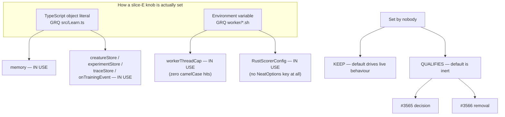

# Audit: classify slice-E runtime & infrastructure configs and injection points

## Summary

Slice E of the #3505 option-removal audit. Classifies the four runtime/
infrastructure nested configs (`memory`, `wasmCache`, `workerThreadCap`,
`parallelEvaluation`), the internal `RustScorerConfig`, and the six injection
points (`logger`, `rng`, `onTrainingEvent`, `creatureStore`, `experimentStore`,
`traceStore`) — the top-level key and every field — against consumer usage in
`stSoftwareAU/GRQ` and `stSoftwareAU/NEAT-AI-Examples`. **Closes #3523.**

**33 classifications: 15 `IN USE`, 15 `KEEP (load-bearing default)`, 3
`QUALIFIES`.** Follow-ups #3565 (decision) and #3566 (removal) filed;
classification table posted on #3505.

Documentation-only change: `docs/OPTION_AUDIT_SLICE_E.md`, a `docs/README.md`
index entry, and this summary. No source or test file is touched — the audit's
deliverables are the classification and the follow-up issues.

### The finding that matters

Slice E is the first slice where **the deciding evidence is not TypeScript**.
Two of its configs are load-bearing in production with _zero_ camelCase hits in
either consumer repo, because they are set entirely from environment variables:

- **`workerThreadCap`** — `git grep` returns nothing and `gh search code`
  returns 0/0 in both repos, and `maxMemoryMB` defaults to `0` (cap disabled).
  It is applied on every GRQ Discovery run:
  `src/config/DiscoveryWorkerEnvelope.ts` reads `DISCOVERY_WORKER_ENVELOPE_MB` /
  `DISCOVERY_HEAP_SIZE_MB` / `DISCOVERY_PER_WORKER_HEAP_CAP_MB` — all exported
  by GRQ `worker/Discovery/run.sh:212-229` — and merges them into
  `workerThreadCap` automatically, capping `config.threads`. A camelCase-only
  sweep would have proposed deleting the GRQ-22 worker-OOM guard.
- **`RustScorerConfig`** — has no `NeatOptions` key at all; resolved lazily from
  `NEAT_AI_RUST_SCORER_*`, which GRQ names in 121 places.

The index lies in the other direction too. `wasmCache` returns 50 local / 20
index hits in GRQ, and **not one is NEAT-AI's option** — every hit is GRQ's own
`src/train/wasmCacheCap.ts`. Same for `warningThreshold` (47) and
`criticalThreshold` (48), which are GRQ's own `SystemMemoryMonitor.ts` fields.
And `NEAT_AI_WASM_CACHE_DIR`, the brief's positive control, is live and
load-bearing but drives `src/wasm/WasmBundleCache.ts`, not `WasmCacheConfig` —
counting it as evidence for `wasmCache` would be as wrong as ignoring it.

### What qualifies

| Field                                         | Default | Follow-up        |
| --------------------------------------------- | ------- | ---------------- |
| `memory.proactiveGc`                          | `false` | #3565 (decision) |
| `memory.maxAnalysisMemoryMb`                  | `0`     | #3565 (decision) |
| `parallelEvaluation.maxConcurrentEvaluations` | `0`     | #3566 (removal)  |

All three are reachable **only** from a TypeScript object literal — no env var,
no CLI flag, no shell wrapper. That distinction is what makes a `QUALIFIES`
verdict safe for them and unsafe for `workerThreadCap`.

#3565 is a _decision recommending wire-up, not removal_: #3432 built
`maxAnalysisMemoryMb` as the only in-flight brake on Discovery's blocking FFI
allocation, and GRQ already computes a Rust budget (`RUST_MEMORY_BUDGET_MB`,
`worker/Discovery/run.sh:215`) that it never passes to NEAT-AI. #3566 is a plain
#3502-pattern removal — the `Fitness.ts:392-395` ternary is a no-op at the
default, and the option's purpose was superseded by #2245's fast/heavy
worker-pool split.

## Evidence

No web interface to screenshot — this is a documentation-only audit deliverable.
The verifiable artefacts are the classification comment on #3505, the two
follow-up issues, and `docs/OPTION_AUDIT_SLICE_E.md`, which records the exact
command, exit code and hit count behind every verdict.

**Search method.** Fresh clones fetched 30 Jul 2026 (GRQ `origin/Develop`
`5199cb241`, NEAT-AI-Examples `2405d1b`). Local `git grep -F` against the remote
ref is the primary evidence in both directions, with explicit exit-code checks —
`rc 0` hit, `rc 1` miss, `rc > 1` reported as a failed search and never folded
into "no hits". Per the slice brief, every key additionally got a
SCREAMING_SNAKE sweep over `*.sh`, `*.yml`, `*.yaml`, `*.json`, `*.jsonc`,
`Dockerfile*` and `*.env`, and the env surface was enumerated from the
**library** side (every var NEAT-AI reads) rather than guessed.

**Controls.** `populationSize` 388 GRQ / 231 Examples (positive),
`dnaSharingMode` 0/0 (negative), `NEAT_AI_WASM_CACHE_DIR` 29 GRQ (the brief's
env positive control — the sweep surfaced it, so the method is sound). The
`gh search code` cross-check hit `HTTP 403: API rate limit exceeded` after ten
queries; those probes were re-run after the window reset rather than recorded as
misses.

## Test Plan

No source change, so no test change. The audit was verified by:

- `./quality.sh < /dev/null` — full gate green (markdown lint, spell check,
  format, lint, type check, tests) on the docs-only diff.
- Re-running each verdict's search command with exit-code checking, including
  the three controls above.
- Reading the implementation file behind every `KEEP` verdict to confirm the
  default is actually read at runtime, and behind every `QUALIFIES` verdict to
  confirm the default's branch is a no-op — `MemoryMonitor.ts:171-638`,
  `CreatureTraining.ts:439-440`, `Fitness.ts:374-395`,
  `EvaluationScheduling.ts:77`, `NeatConfig.ts:208-217, 245-275, 831-840`,
  `AnalysisHeapGuard.ts:136`, `RustAnalysisCache.ts:190`.
