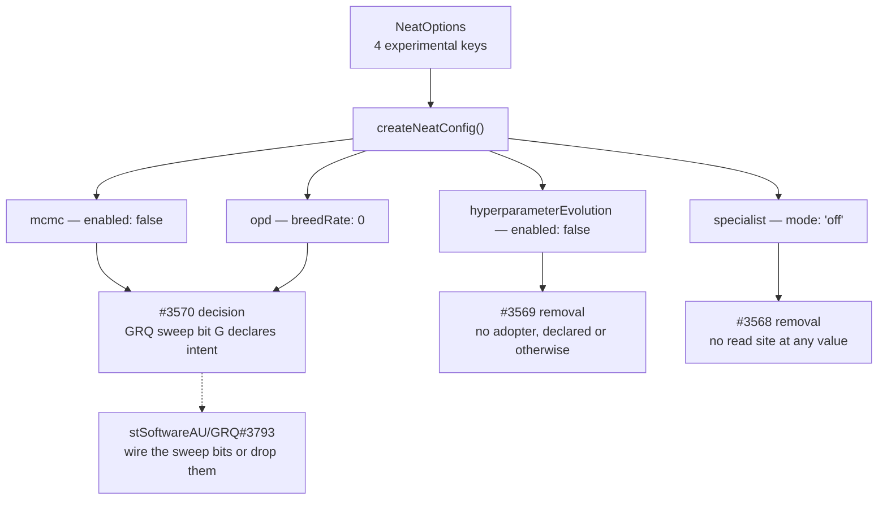

# PR summary — slice F of the #3505 option audit

## Summary

Classifies the four experimental / research nested configs — `mcmc`,
`hyperparameterEvolution`, `opd` and `specialist` — plus every field inside
each, against consumer usage in `stSoftwareAU/GRQ` and
`stSoftwareAU/NEAT-AI-Examples`. **43 classifications, none skipped: 0 `IN USE`,
0 `KEEP (load-bearing default)`, 43 `QUALIFIES`.** Closes #3524.

Documentation only — no source, test or bench file changes. The deliverable is
the classification, the filed removal/decision issues, and the table posted on
#3505.

Slice F is the first slice where every key qualifies, and the first with zero
`KEEP (load-bearing default)` rows. All four features are gated behind an
off-by-default flag (`mcmc.enabled: false`,
`hyperparameterEvolution.enabled: false`, `opd.breedRate: 0`,
`specialist.mode: "off"`) and no consumer sets any of them.

### Three findings worth the reviewer's time

**1. `specialist` is not merely unused — it is unreadable.** `config.specialist`
is declared on `NeatOptions`, parsed by `parseSpecialist`, stored on
`NeatArguments`, and then never consulted anywhere in `src/`.
`SpecialistPipeline` takes its own `Partial<RequiredSpecialistConfig>` and is
only ever constructed by `mod.ts` consumers, a bench and a test — never by
`Neat` or `NeatEvolution`. Setting `specialist: { mode: "auto", … }` today
silently does nothing, at any value, not just at the default. Filed as **#3568**
(remove the option surface, keep the class).

**2. GRQ declares intent it never wires.** `worker/shared/evolution_mode.sh`
emits `--grpoAdvantage` (#2527 → `mcmc.mcmcAdvantageMode`),
`--onPolicyDistillation` (#2528 → `opd`) and `--specialistSubpopulations` (#2530
→ `specialist`) into the `src/Learn.ts` argv and exports the mode label for
`performance.csv`. `Learn.ts` accepts all three via `parseArgs` and never reads
them — its `NeatOptions` literal has no such block. Three of the six sweep bits
toggle nothing while the leaderboard records them as though they did.

That does not make the keys `IN USE` — a flag parsed and dropped is not a
consumer setting an option — but it is the only adoption signal anywhere, so
`mcmc` + `opd` are filed as a **decision** issue (**#3570**, the #3563 pattern)
rather than a deletion. `hyperparameterEvolution` has no such signal and is
filed as a straight **removal** (**#3569**). The GRQ-side half-wiring is a
separate root cause in a separate repo: **stSoftwareAU/GRQ#3793**.

**3. A default-on flag nested inside a default-off feature.**
`mcmc.diversityAwareMCMC.enabled` defaults to `true`. Read on its own that looks
load-bearing; it is unreachable, because every path to it runs through
`mcmc.enabled: false`. Nested-field verdicts have to resolve through the parent
gate, not the field's own default.

### Method fault — recorded because it silently manufactures removals

The first sweep of this slice returned **zero hits for every key, including the
`populationSize` positive control**. Cause: the worker's non-interactive shell
is **zsh**, which does not word-split an unquoted `$KEYS`, so `for k in $KEYS`
ran once with all 38 keys concatenated into a single search term.

Nothing crashed and nothing wrote to stderr — the run looked like a clean slice
with 43 free removals. The positive control was the only thing standing between
that and a corrupt result, exactly where #3524's failure-detection section
predicted. Fixed by running the sweep under `bash -c`.

Running tally across the audit: slice A — `rg` not on the non-interactive
`PATH`; slice D — camelCase-split code-search false positive; slice F — zsh
word-splitting. All three produce _silent_ wrong verdicts, which is why the
control is mandatory rather than advisory.

### Overlap with slice A

`src/config/DnaSharingPreset.ts` appears in the slice-F brief only as the
backing type for `dnaSharingMode`, which slice A classified and filed as
**#3554**. Slice F files nothing against it and no slice-F removal issue touches
that file. An open-issue search for `DnaSharingPreset` returned only #3554.

## Evidence

No web interface to screenshot — this is a documentation and issue-filing
change. The evidence is the search transcript and the code-path reading behind
each verdict, both reproduced in
[`docs/OPTION_AUDIT_SLICE_F.md`](../../OPTION_AUDIT_SLICE_F.md).

### Controls (same session as the sweep)

| Control                     | GRQ                         | NEAT-AI-Examples            |
| --------------------------- | --------------------------- | --------------------------- |
| `populationSize` (positive) | 389 local hits, 20/20 index | 231 local hits, 20/20 index |
| `dnaSharingMode` (negative) | 0                           | 0                           |

Fresh clones fetched 30 Jul 2026 — GRQ `origin/Develop` `312370d`,
NEAT-AI-Examples `origin/Develop` `2405d1b`. `Develop` is the default branch of
both repositories, so the local pass and the code-search index look at the same
tree. Every local search checked its exit code explicitly; no `rc > 1` was
folded into "no hits".

### Verdict flow

### Issues filed

| Feature                   | Issue                 | Shape                                               |
| ------------------------- | --------------------- | --------------------------------------------------- |
| `specialist`              | #3568                 | Removal — option surface unreadable at any value    |
| `hyperparameterEvolution` | #3569                 | Removal — feature complete, flag never turned on    |
| `mcmc` + `opd`            | #3570                 | Decision — inert today, GRQ's sweep declares intent |
| GRQ sweep half-wiring     | stSoftwareAU/GRQ#3793 | Wire bits G/O/S onto `NeatOptions` or drop them     |
| `dnaSharingMode`          | #3554 (slice A)       | Not re-filed — slice A owns it                      |

Classification table posted on #3505:
[comment](https://github.com/stSoftwareAU/NEAT-AI/issues/3505#issuecomment-5129320935).

## Test Plan

No tests added or modified — this PR changes no source, test or bench file. The
audit's own correctness gate is the positive/negative control pair above, which
ran in the same session as the sweep and caught the zsh fault described earlier.

`./quality.sh --skip-discovery --skip-wasm < /dev/null` passes:
`8078 passed (5 steps) | 0 failed | 4 ignored (2m8s)`, with `deno fmt`,
`deno lint` and the bash-syntax gate clean.

The regression risk this slice carries is a **false `QUALIFIES`** — an option
actually in use, removed later on the strength of this table. Its detectors are
unchanged from the brief:

1. The positive control above (fired once already this session, as designed).
2. `deno check` in the GRQ and NEAT-AI-Examples bump PRs on each removal PR.
3. NEAT-AI's own `deno task test` on the removal PR, for a
   `KEEP (load-bearing default)` misread as inert — not applicable here, since
   slice F recorded no `KEEP` rows.
