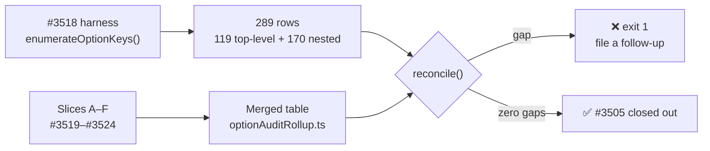

# PR summary — #3505 option-audit roll-up

## Summary

Final roll-up of the #3505 option-removal audit: merges the six slice
classification tables (#3519–#3524) into one, reconciles them **mechanically**
against the #3518 harness inventory, deduplicates the removal issues, and
sequences them. Closes #3525.

The audit's own failure-detection brief demanded the coverage check be a diff
against the harness rather than a reading of six issue comments, so the merged
table is committed as **data** (`scripts/lib/optionAuditRollup.ts`) and the diff
runs in CI on every build. A key the harness enumerates but the table does not
classify is a gap: the CLI exits **1** and names it, and the test fails. An
unclassified option can never read as a clean audit.

**Result: 289 classifications, zero unclassified keys, 15 issues, zero
duplicates.**

| Verdict                       | Classifications |
| ----------------------------- | --------------: |
| `IN USE`                      |              68 |
| `KEEP (load-bearing default)` |             121 |
| `QUALIFIES`                   |             100 |
| **Total**                     |         **289** |

Counted by _option_ rather than by row, 20 of 120 qualify — 10 proposed for
removal, 7 filed as decisions recommending KEEP, 3 already decided `NOT_PLANNED`
by a human on #1943. `KEEP` outnumbers `IN USE` almost two to one: the defaults,
not the consumers, drive most of NEAT-AI's behaviour.

### The gap it found: `mutation`

`NeatArguments` has **119** top-level fields, not the 118 quoted in #3518 and
#3525. The original figure came from a grep that skipped
`readonly mutation: readonly MutationInterface[]` — the harness's own pinned
test already records the real 119. Every slice brief was written from the
118-key list, so **no slice classified `mutation`**.

Re-probed here with the slice method (`git grep`, exit code checked, both
controls run first): `mutation` is **`IN USE`** — GRQ sets it in four
`NeatOptions` literals from its `--mutation=ALL|FFW` operator flag. The gap
closed as a live option rather than a missed removal candidate, so no follow-up
issue was needed.

`seed` is recorded as a second, previously unnoticed exclusion: slice E flagged
it as absent from slice A's table, but it is not a `NeatArguments` field at all
— it is input-only on `NeatOptions` and resolves into `rng`, which _is_
enumerated and classified `KEEP`.

### Unrelated CI fix

`docs/archive/pr-summaries/pr-summary-3524.md` (merged with slice F) carried a
private-repo issue slug and was failing
`test/docs/ArchiveDocsNoPrivateRepoSlugs.ts` on the milestone branch. Reworded
to concept level as that gate's own message instructs. Without this the branch
cannot go green.

## Evidence

No web interface to screenshot — this is a scripts/docs change. The evidence is
the reconciliation run itself, which is reproducible:

```
$ deno run --allow-read scripts/option-audit-rollup.ts
🔎 289 enumerated rows (119 top-level, 170 nested) · 289 classified
✅ zero coverage gaps — every option key is classified
```



Deduplication was run per key rather than asserted —
`gh issue list --search
"<key>" --state all` across the three named overlap
pairs (`dnaSharingMode`/`DnaSharingPreset`, `seed`/`rng`,
`discoveryCache`/`discoveryDiskSpace`) and against #3446–#3449 / #3509–#3512.
Every option key maps to exactly one issue; #3509–#3512 have all closed since
the slices ran and touch no option key.

The consolidated result is posted on
[#3505](https://github.com/stSoftwareAU/NEAT-AI/issues/3505#issuecomment-5129844109),
which stays the audit trail after closure. Full write-up:
[`docs/OPTION_AUDIT_CONSOLIDATED.md`](../../OPTION_AUDIT_CONSOLIDATED.md).

### Removal ordering

All 14 removals edit `NeatConfig.ts` / `NeatArguments.ts` / `NeatOptions.ts`, so
they conflict there by construction — a trivial rebase. The chains that touch
the same non-config code or doc block, and so must be sequenced:

| Order | Chain                         | Shared path                                                                               |
| ----- | ----------------------------- | ----------------------------------------------------------------------------------------- |
| 1     | #3558 → #3562                 | `src/presets/Presets.ts` (both delete a `LARGE_NETWORK_PRESET` entry) + three shared docs |
| 2     | #3552 → #3559 → #3569 → #3570 | `src/NEAT/Mutator.ts`, `src/breed/Breed.ts`, `ParallelBreeding.ts`                        |
| 3     | #3559 → #3560 → #3570         | `src/NEAT/Neat.ts`, `NeatEvolution.ts`, `NeatConfigValidation.ts`                         |
| 4     | #3565 → #3566                 | `src/config/parsers/RuntimeParsers.ts`                                                    |

## Test Plan

New: `test/scripts/OptionAuditRollup.ts` — 10 tests calling the real
`enumerateOptionKeys()` and `reconcile()` against the live source tree, not
greps over markdown:

- `reconcile - every enumerated option key is classified` — the gate. Fails with
  the offending key names if a config change outruns the roll-up.
- `reconcile - classifies the whole enumerated surface` /
  `top-level coverage
  matches NeatArguments exactly` — asserts all 289 rows
  resolve, and pins the `mutation` gap key so the 118-vs-119 fault cannot
  silently return.
- `reconcile - no roll-up entry describes a key that no longer exists` — catches
  drift in the other direction, when a key is deleted from source.
- `rollup - every QUALIFIES verdict carries a removal issue` — no orphan removal
  candidate.
- `rollup - no option key is claimed by two removal issues` and
  `the named
  cross-slice overlaps resolve to one issue each` — the duplicate
  tripwire.
- `toConsolidatedMarkdown - reports a gap loudly when one exists` — injects a
  synthetic unclassified key and asserts it is reported rather than dropped,
  which is the fail-loud behaviour the whole roll-up rests on.

`./quality.sh --skip-discovery --skip-wasm < /dev/null` passes: **8088 passed (5
steps) | 0 failed | 4 ignored (8m33s)**, with `deno fmt`, `deno lint`, the
bash-syntax gate and `deno check` clean.

### Security self-check

Scripts are read-only over the repo's own `src/config/` (`--allow-read`;
`--allow-write` only for the optional `--out` path). No network, no subprocess,
no external input, no secrets staged. Markdown cells escape `|` so a key name
cannot break out of the rendered table.
