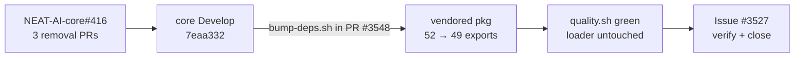

# Verify vendored `wasm_activation/pkg` dropped the four dead NEAT-AI-core exports

## Summary

Verification-only change. The four dead WASM exports tracked by
stSoftwareAU/NEAT-AI-core#416 (`derivative_batch_4way`,
`calculate_error_batch_4way`, `get_training_state_num_neurons`,
`get_training_state_num_synapses`) are **already gone** from this repo's
vendored bundle — the routine internal bump in PR #3548 advanced
`neatCore.rev` past the removal commits, so no re-vendor was required.

This PR records the verification evidence; no source, test, or vendored file
changed. Closes #3527.

## Evidence

Backend/CLI verification only — there is no web interface to screenshot.

**1. `neatCore.rev` includes all three #416 removals.** `deno.json` pins
`7eaa332270fc119f59080b04a267097ab83a5b7a`, which the GitHub compare API
reports as `identical` to NEAT-AI-core `Develop`; core issue #416 is closed.

**2. The four dead exports are gone, live siblings remain.**

```
$ grep -c '^export function' wasm_activation/pkg/wasm_activation.d.ts
49
$ grep -n 'derivative_batch_4way\|calculate_error_batch_4way\|get_training_state_num' \
    wasm_activation/pkg/wasm_activation.d.ts
(no matches)
$ grep -rn 'derivative_batch_4way\|calculate_error_batch_4way\|get_training_state_num_neurons\|get_training_state_num_synapses' src test
(no matches)
```

The count is **49**, not the 48 the issue predicted: core removed the four dead
exports and added one new live export in the same span. The diff of the
vendored `.d.ts` at the bump commit (`aac95bdc`) shows exactly that:

```
- export function calculate_error_batch_4way(...)
- export function derivative_batch_4way(...)
- export function get_training_state_num_neurons(): number;
- export function get_training_state_num_synapses(): number;
+ export function categorical_error_sum_batch_packed(...)
```

52 − 4 + 1 = 49. All live siblings named in the issue are still declared:
`accumulate_bias_batch_4way` (`:179`), `accumulate_weight_batch_4way` (`:233`),
`calculate_bias_batch_4way` (`:312`), `calculate_weight_batch_4way` (`:369`).

**3. `./build.sh` is a no-op at the current pin** — quality-gate step 7 reports
`Skipping build: wasm_activation/pkg already matches
stSoftwareAU/NEAT-AI-core@7eaa332270fc119f59080b04a267097ab83a5b7a`, so
`content-manifest.sha256`, `build-fingerprint` and `neat_core_rev.txt` are
already consistent with the pin.



## Test Plan

No tests added or modified — the vendored bundle already carries the change and
the existing manifest/fingerprint harnesses cover it.

`./quality.sh` run in full and green, including the harnesses that assert over
the vendored manifest and fingerprint:

- `test/wasm/WasmBinaryValidatorParity.ts`
- `test/scripts/BuildScript.ts`
- `test/scripts/BuildFingerprint.ts`
- `test/scripts/BuildScriptContentHash.ts`
