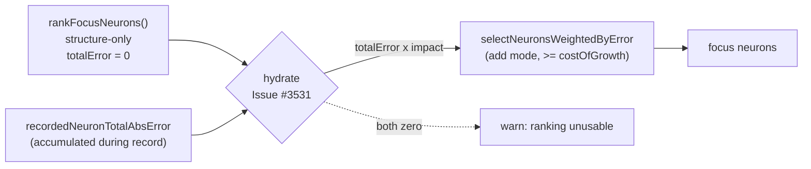

# Discovery focus selection returned zero neurons (Issue #3531)

## Summary

Four `ErrorGuidedStructuralEvolution` discovery-selection tests failed because
the discovery focus path selected **zero** neurons for `add` mode. The root
cause is a stale assumption about the NEAT-AI-Discovery contract, not the tests:

`rankFocusNeurons()` is now deliberately **structure-only** — it never opens the
discovery Parquet, so every ranked neuron comes back with `totalError: 0` and a
purely structural `impact`. NEAT-AI still weights focus selection by
`totalError × impact`, so every candidate scored `0`, fell below `costOfGrowth`
(`1e-7`), and was filtered out. Discovery could therefore never propose a
structural addition while Rust ranking was enabled, and the only symptom was a
warning that looked like an ordinary "nothing worth growing" outcome.

`listViableNeurons` now hydrates each ranked neuron's `totalError` from the
per-neuron absolute error NEAT-AI already accumulates locally during recording
(`recordedNeuronTotalAbsError`) — the same quantity the ranking used to return.
A non-zero value from the ranking always wins, so a future ranking that carries
record-derived error needs no further change. When the ranking reports zero and
no recorded error exists either, the path warns loudly instead of passing an
unusable all-zero ranking downstream in silence.

Closes #3531.

## Evidence

Backend/CLI change — no web interface to screenshot. Verified by test runs
(below) plus FFI probes confirming the Parquet held non-zero errors
(`errors: [-0.279…]` per record) while `rank_focus_neurons` returned
`totalError: 0` for every neuron.



Before (unmodified checkout):

```text
FAILED | 7 passed | 4 failed
  AssertionError: Should select at least some neurons
  AssertionError: Should select at least one neuron (x2)
  AssertionError: Should select exactly 3 neurons when only 3 exist, got 0
```

After:

```text
ok | 13 passed | 0 failed   # the 3 previously failing specs + FocusCostOfGrowthFilter
ok |  3 passed | 0 failed   # new FocusRankingRecordedError specs
```

## Test Plan

New unit tests —
`test/ErrorGuidedStructuralEvolution/FocusRankingRecordedError.ts` (stubbed FFI
surface, so no Rust library or Parquet file needed):

- `Focus ranking hydrates structure-only totalError from recorded errors` —
  regression test for the defect: fails against the unfixed code (every neuron
  keeps `totalError: 0`), passes after the fix, and asserts the structural
  `impact` is left untouched.
- `Focus ranking keeps a non-zero ranking totalError over the recorded error` —
  the ranking wins when it does report record-derived error.
- `Focus ranking leaves totalError at zero when nothing was recorded` — no error
  value is fabricated when there is nothing to hydrate from.

Existing specs that now pass (previously failing on the milestone branch):

- `test/ErrorGuidedStructuralEvolution/DiscoveryRobustness.ts` — weighted
  selection completes within max iterations.
- `test/ErrorGuidedStructuralEvolution/InvalidDataDetection.ts` — finite error
  values; graceful fallback on invalid `totalErrorSum`.
- `test/ErrorGuidedStructuralEvolution/MinimalCreature.ts` — selection respects
  the neuron count limit.
- `test/discovery/FocusCostOfGrowthFilter.ts` — still filters candidates below
  `costOfGrowth` (and still returns empty at an unreachable threshold), now
  against genuinely non-zero error values.

Docs: `docs/DISCOVERY_ARCHITECTURE.md` records the structure-only ranking
contract and where each term of `totalError × impact` comes from.

## Security Self-Check

- No new external input, endpoints, dependencies, or credentials. The change
  reads an in-process `Map<number, number>` and guards every value with
  `Number.isFinite` and a positivity check before use.
