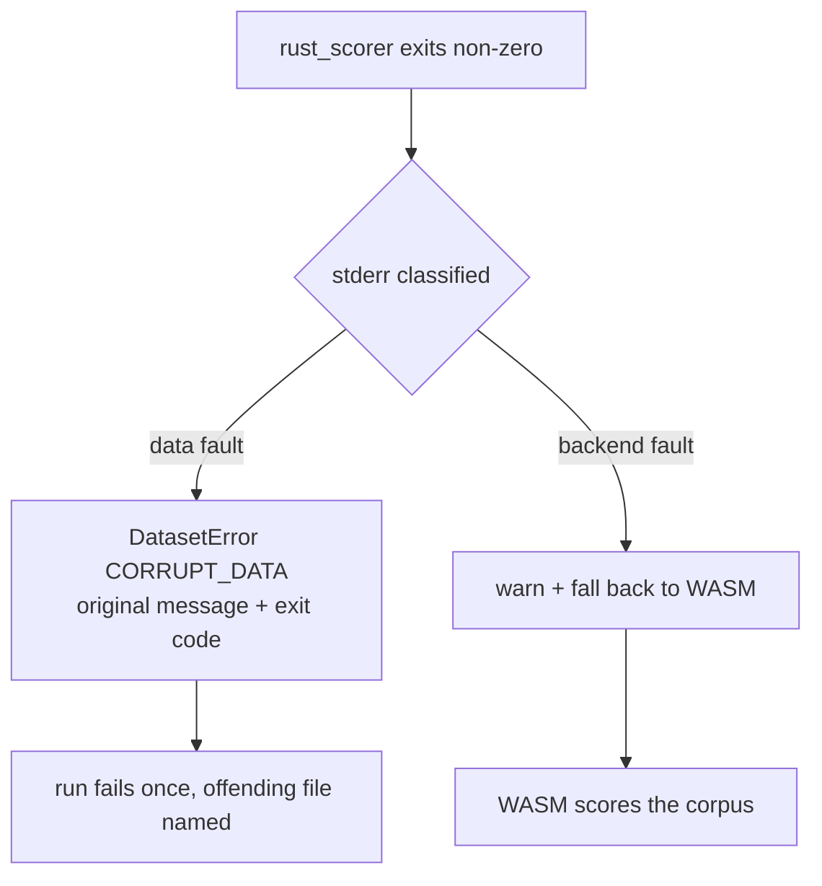

## Summary

The WASM path is a fallback for _backend_ failures, never for corrupt training
data. `tryScoreWithRustScorer` treated every non-zero exit as backend-specific,
so a rejected dataset logged the scorer's genuinely diagnostic
`Trailing N bytes (incomplete record)` as a warning and then died on the WASM
re-read of the same bytes with a bare
`AssertionError: Invalid number of bytes read` — naming neither the file nor any
byte count. Closes #3541.

- **New `src/score/ScorerFailureClassification.ts`** — `isCorruptDatasetFailure`
  matches the scorer's data-fault stderr shapes; `assertNotCorruptDataset`
  raises a `DatasetError` preserving the original message and exit code.
  Classification is conservative: anything unrecognised stays retryable, so the
  legitimate fallback is untouched.
- **`DatasetError`** gained the `CORRUPT_DATA` reason.
- **`RustScorerBridge`** classifies before falling back and no longer absorbs a
  `DatasetError` into its "scorer unavailable" catch;
  **`BatchRustScorerBridge`** classifies before raising a retryable
  `BatchScorerError`; **`Fitness.calculate`** re-throws a `DatasetError` instead
  of retrying the per-creature path on the same corrupt bytes.
- **`assertWholeRecordRead`** (`src/architecture/DatasetIO.ts`) replaces the two
  bare `assert(..., "Invalid number of bytes read")` pairs in `evaluateDir` and
  the training reader, reporting the file, bytes read, record size, and trailing
  byte count.

## Evidence

Library change with no web interface. Verified by the tests below plus the
existing score/creature/architecture/data/multithreading suites (`591 passed`,
`618 passed`, `0 failed`, WASM scorer mode).

## Test Plan

`test/score/ScorerDataFailureClassification.ts` (new):

- `isCorruptDatasetFailure` recognises trailing-bytes / incomplete-record /
  truncated-data / record-size stderr.
- `isCorruptDatasetFailure` leaves backend stderr (missing binary, GPU init,
  segfault, empty) retryable.
- A failing scorer with trailing-bytes stderr rejects with a `DatasetError`
  (`reason: CORRUPT_DATA`) preserving the message, `exit 1`, and the dataset
  directory — no WASM attempt.
- A failing scorer with `os error 2` stderr still falls back and returns a
  finite error.
- `evaluateDir` on a `.bin` with a 4-byte partial record throws a `DatasetError`
  naming the file, `Trailing 4 bytes (incomplete record)`, and
  `12 bytes/record`.
