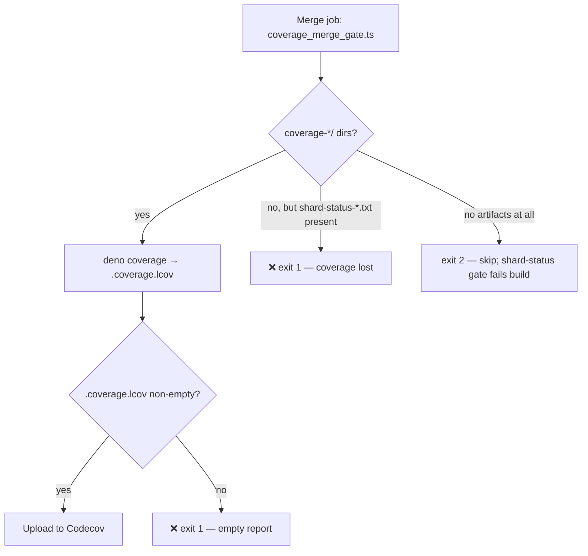

# Coverage merge silently skipped: shard dirs were hidden and never uploaded

## Summary

The sharded coverage workflow wrote each shard's partial coverage into
`.coverage-<shard>/`. `actions/upload-artifact` defaults to
`include-hidden-files: false`, so that dot-prefixed directory was dropped from
the artifact — the merge job's glob came back empty, printed
`No shard coverage directories found; skipping coverage report`, and exited 0.
Coverage was silently lost while the run stayed green.

This PR removes the footgun rather than working around it (option 1 in the
issue) and adds the loud-failure guard:

- Shards now write **non-hidden** `coverage-<shard>/` dirs and upload that path.
- New unit-tested gate
  [`scripts/coverage_merge_gate.ts`](../../../scripts/coverage_merge_gate.ts):
  if any shard uploaded a `shard-status-<n>.txt` marker it ran tests, so at
  least one `coverage-<shard>/` dir MUST exist — an empty glob exits **1**. Only
  when nothing at all was uploaded does it exit **2** (skip), because the
  existing shard-status gate already fails that build.
- The merge step also asserts `.coverage.lcov` is non-empty, so a merge that
  produced no report fails instead of silently skipping the Codecov upload
  (whose `hashFiles` guard hid the problem).
- `.gitignore` ignores `coverage-*/` so the now-visible local dirs are never
  committed.

Closes #3550.

## Evidence

Backend/CI change — no web interface to screenshot.



CLI behaviour of the new gate, run against a scratch directory:

```text
$ echo passed > shard-status-0.txt && deno run --allow-read scripts/coverage_merge_gate.ts
❌ 1 shard(s) uploaded a shard-status marker but no coverage-<shard>/ directory
   reached the merge job. Coverage would be silently lost — ...
exit=1

$ mkdir coverage-0 && deno run --allow-read scripts/coverage_merge_gate.ts
Merging coverage from: coverage-0
exit=0

$ rm -r coverage-0 shard-status-0.txt && deno run --allow-read scripts/coverage_merge_gate.ts
No shard artifacts of any kind were uploaded; the shard-status gate reports this
failure. Skipping the coverage report.
exit=2
```

`actionlint .github/workflows/coverage.yaml` passes with no findings.

Docs: the shard/merge flow in
[`docs/troubleshooting/CI.md`](../../troubleshooting/CI.md) is updated with a
new "Coverage must never go missing silently" section explaining the hidden-file
footgun and both guards.

## Test Plan

New — `test/ci/CoverageMergeGate.ts` (calls the real gate functions):

- merges when shards reported status and coverage arrived
- **fails loud** when shards reported status but no coverage arrived (the
  regression: this is exactly the PR #3549 scenario, and it fails against the
  old skip-and-exit-0 behaviour)
- fails loud for a single status-without-coverage shard
- skips only when nothing at all was uploaded
- merges coverage that arrived without a status file
- reports the directories being merged
- `isCoverageShardDir` rejects hidden `.coverage-0` and non-shard names
- `isShardStatusFile` recognises `shard-status-<n>.txt` only
- scanning a real temp directory: a hidden `.coverage-0` is not counted (gate
  fails), a real `coverage-0` is (gate merges)

New — `test/ci/CoverageShardArtifactPaths.ts` (parses the committed workflow):

- shard artifact upload lists no hidden paths and includes `coverage-${{ matrix.shard }}/`
- `COV_DIR` is not dot-prefixed
- merge job invokes the gate before `deno coverage`, does not swallow it with
  `|| true`, and globs `coverage-*/`
- merge job asserts a non-empty `.coverage.lcov`

Existing `test/ci/*` workflow tests (shard matrix parity, OOM retry, job
timeouts, actionlint) continue to pass; `./quality.sh` was run over the full
suite.
