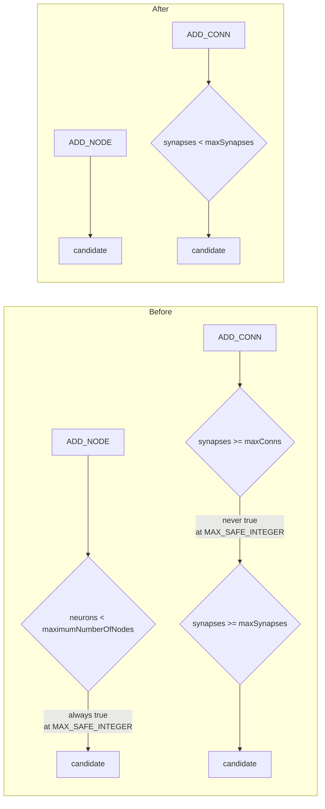

# Remove the unused `maxConns` / `maximumNumberOfNodes` growth-cap options

## Summary

Removes the `maxConns` and `maximumNumberOfNodes` options — slice A's two
`QUALIFIES` verdicts from the [#3505](https://github.com/stSoftwareAU/NEAT-AI/issues/3505)
option audit ([slice A brief](../../OPTION_AUDIT_SLICE_A.md), #3519). Follows the
#3502 / #3556 removal pattern. Closes #3552.

Both keys are filed together because they share one code path — the `Mutator`
mutation-candidate filter — and both defaulted to `Number.MAX_SAFE_INTEGER`, the
no-cap sentinel:

- `ADD_CONN` guard `creature.synapses.length >= config.maxConns` could never be
  true at the default. The adjacent `maxSynapses` bound is what actually caps
  connection growth, and it stays.
- `ADD_NODE` guard `creature.neurons.length < config.maximumNumberOfNodes` was
  always true at the default, so the case fell through to `return true`.

Neither key is set by any consumer (verified per-repo across GRQ and
NEAT-AI-Examples in the issue, with `populationSize` as the positive control).

**Breaking for embedders that set them.** Both keys are gone from
`NeatArguments` / `NeatOptions`, so setting either is now a `deno check` error
rather than a silent no-op — the failure is loud, exactly as the audit intended.
There is no config cap on neuron or synapse count any more; `costOfGrowth`
remains the lever for discouraging topology growth.



### What was deleted

| Area      | Change                                                                                                        |
| --------- | ------------------------------------------------------------------------------------------------------------- |
| Options   | `src/config/NeatArguments.ts` (both fields), `src/config/NeatOptions.ts` (both `NumericOptionKeys` entries)     |
| Parsing   | `src/config/NeatConfig.ts` — both `parseNumber` blocks                                                          |
| Plumbing  | `src/NEAT/Mutator.ts` — the `ADD_NODE` case and the `maxConns` half of the `ADD_CONN` case                       |
| Docs      | `docs/api/CONFIGURATION.md`, `docs/config/CORE_EVOLUTION.md`, `docs/config/RECIPES.md`, `docs/troubleshooting/MEMORY.md` |
| Audit     | `scripts/lib/optionAuditRollup.ts` entries, `docs/OPTION_AUDIT_CONSOLIDATED.md` counts, pinned key count       |

`bench/` referenced neither key.

`docs/troubleshooting/MEMORY.md` documented the pair as a memory-safety lever.
Since the caps are gone, that step now points at `costOfGrowth` — a real,
`IN USE` lever — rather than at two knobs that no longer exist.

### Audit book-keeping

A landed removal takes its key out of `NeatArguments`, so the harness stops
enumerating it and its roll-up entry must go too — a retained entry is an orphan
and fails `test/scripts/OptionAuditRollup.ts`. The pinned top-level count moves
117 → **115**.

Regenerating `docs/OPTION_AUDIT_CONSOLIDATED.md` also picked up pre-existing
drift: #3558 (`ensembleDiversity` + its 10 nested fields) had removed its
roll-up entries without updating the document, so the headline still read 288
rows. The document now matches the script's actual output — **275 rows (115
top-level, 160 nested)** — and the "Executed removals" table lists #3556, #3558
and #3552.

## Evidence

Backend/CLI change with no web interface, so there is no screenshot. Evidence is
the quality gate:

```
$ ./quality.sh < /dev/null
ok | 8099 passed (5 steps) | 0 failed | 4 ignored (8m54s)
```

The removal is verified by the new regression guards plus the reconciliation
script, which exits non-zero on an orphaned entry:

```
$ deno run --allow-read scripts/option-audit-rollup.ts
🔎 275 enumerated rows (115 top-level, 160 nested) · 275 classified
✅ zero coverage gaps — every option key is classified
```

## Test Plan

**Added**

- `test/config/NeatConfigParseOptions.ts::NeatConfigParseOptions - growth-cap
  options are not config keys` — asserts the parsed config carries neither key,
  guarding against reintroduction (mirrors the #3502 and #3556 guards).
- `test/docs/ApiConfigurationDefaults.ts::CONFIGURATION.md - removed growth-cap
  options are not documented` — asserts the doc table no longer has a row for
  either key.

**Modified**

- `test/scripts/AuditOptionUsage.ts` — pinned `NeatArguments` top-level count
  117 → 115.
- `test/NEAT/MutatorComputeMutationCandidates.ts` — **one test removed**:
  `filters ADD_NODE when at maximum nodes` asserted a cap that no longer exists,
  so it could not be rewritten to pass. Its sibling `allows ADD_NODE when below
  maximum` is retained, renamed `allows ADD_NODE regardless of neuron count`,
  and now covers the new behaviour: ADD_NODE stays a candidate at any creature
  size.
- `test/NEAT/MutatorCacheValidMutations.ts` — dropped the two removed keys from
  two configs. Neither test asserted on the caps; the per-creature cache test
  still exercises distinct cache keys via differing neuron counts.
- `test/NEAT/FocusCachePreservation.ts` — dropped the two removed keys from an
  otherwise unrelated config.
- `test/docs/ApiConfigurationDefaults.ts` — removed the two doc-table tests and
  the two default assertions for the deleted keys.

## Security self-check

No new input surface, dependencies, endpoints, or external calls — this PR only
deletes configuration. Removing the keys narrows the accepted input surface, and
a consumer that still sets one now fails `deno check` rather than being silently
ignored.
