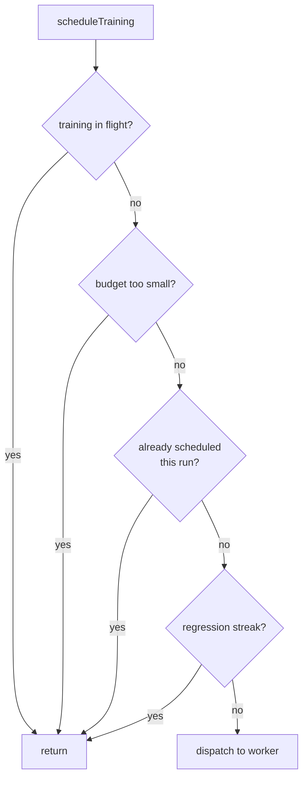

# chore: remove unused `enableRepetitiveTraining` flag (#3553)

## Summary

Removes the `enableRepetitiveTraining` option — slice A of the
[#3505](https://github.com/stSoftwareAU/NEAT-AI/issues/3505) option audit
(#3519), following the #3502 / #3552 pattern. Closes #3553.

No consumer sets it (GRQ and NEAT-AI-Examples both return zero hits through
`git grep` and `gh search code`, with `populationSize` as the positive control),
and it defaulted to `false`. Its sole reader was the repeat-scheduling guard in
`scheduleTraining()`:

```ts
if (neat.alreadyScheduledMap.has(uuid)) {
  if (!neat.config.enableRepetitiveTraining) {
    return;
  }
}
```

At the default the inner branch always returned, so collapsing it to an
unconditional `return` preserves production behaviour exactly.

Removed:

- **Option surface** — `NeatArguments.enableRepetitiveTraining` and the
  `createNeatConfig()` assignment. `NeatOptions` derives from
  `Partial<NeatArguments>`, so it drops the key automatically; nothing in
  `NeatOptions.ts` needed editing.
- **Plumbing** — the nested guard in `src/NEAT/NeatScheduling.ts`, now a single
  unconditional early return.
- **Test option literals** — the three sites that set the flag `true`
  (`test/NEAT/Ratios.ts`, `test/NEAT/Evolve.ts`, and the commented-out
  `NARX Sequence` block in `test/creature/CreatureTrainEvolve.ts`).
- **Audit book-keeping** — the `SLICE_A` roll-up entry (a retained entry would
  be reported as an orphan by `reconcile()`), the pinned `NeatArguments`
  top-level count (115 → 114), and the counts in
  `docs/OPTION_AUDIT_CONSOLIDATED.md`.

### Reviewer caveat resolved

The issue flagged the three flag-setting tests as needing a rewrite because they
"exercise the repeat-scheduling path". On inspection they do not: all three set
the flag as one entry in a `NeatOptions` literal for a retry-looped evolution
test and assert only on the final error rate — none asserts anything about
re-scheduling. Deleting the line leaves their assertions intact (the full suite
is green), and `test/NEAT/SchedulingRepeatGuard.ts` now covers the guard
directly, which none of them did.

### Scheduling path after removal



The `already scheduled` node was previously a two-level branch whose inner test
read the flag; it is now a plain guard.

## Evidence

Backend/library change with no web interface, so there is no screenshot to
capture. Evidence is the quality gate and the new tests:

- `./quality.sh` — **8102 passed, 0 failed, 4 ignored** (2m32s); `deno fmt`
  clean (2300 files), `deno lint` clean (1887 files), `deno check` clean.
- `deno check` is the substantive signal here: deleting the key from
  `NeatArguments` makes any consumer that still sets it a compile error rather
  than a silent no-op. The downstream signal is the next `@stsoftware/neat-ai`
  pin bump in GRQ and NEAT-AI-Examples.
- `deno run --allow-read scripts/option-audit-rollup.ts` —
  `274 enumerated rows (114 top-level, 160 nested) · 274 classified`, zero
  coverage gaps.
- Post-removal grep for `enableRepetitiveTraining` across `src/`, `test/`,
  `scripts/` and `bench/` returns only the explanatory comments in
  `NeatScheduling.ts` and the two regression-guard tests.

## Test Plan

Added `test/NEAT/SchedulingRepeatGuard.ts` — calls the real `scheduleTraining()`
against a stub `Neat` with a counting stub worker:

- `scheduleTraining dispatches a creature seen for the first time` — control;
  asserts one dispatch and that the uuid is recorded in `alreadyScheduledMap`.
- `scheduleTraining skips a creature already scheduled this run` — the behaviour
  the removed flag used to gate; asserts zero dispatches when the uuid is
  pre-seeded into `alreadyScheduledMap`.

Added to `test/config/NeatOptions.ts`, alongside the equivalent #3558
`ensembleDiversity` guard:

- `NeatOptions - enableRepetitiveTraining is not a config key` — fails against
  the unfixed code and passes after the removal; guards against reintroduction.

Modified:

- `test/scripts/AuditOptionUsage.ts` — pinned top-level key count 115 → 114,
  with the reason appended to the existing comment chain.
- `test/NEAT/Ratios.ts`, `test/NEAT/Evolve.ts`,
  `test/creature/CreatureTrainEvolve.ts` — dropped the now-invalid option key;
  all assertions unchanged.
