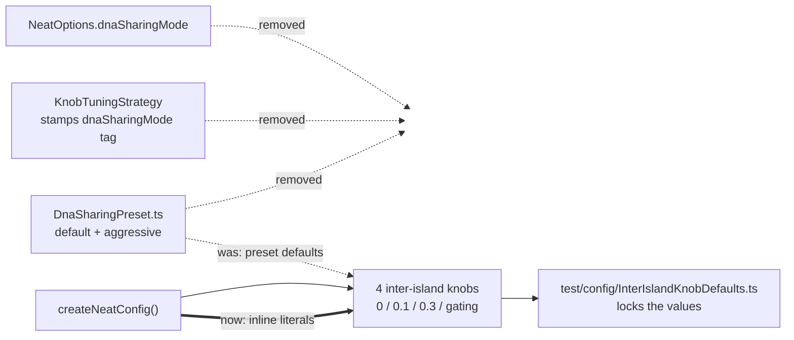

# Retire the `dnaSharingMode` knob preset and `KnobTuningStrategy` (#3505 slice A)

## Summary

Removed the `dnaSharingMode` option, the `DnaSharingPreset` layer behind it, and
the `KnobTuningStrategy` primitive that was its only writer. Closes #3554.

The evidence for "inert" held up on re-verification:

- **Nobody sets it.** `git grep -F dnaSharingMode` returns 0 files in
  `stSoftwareAU/NEAT-AI-Examples`, and `gh search code` returns 0 hits in
  `stSoftwareAU/GRQ` and `stSoftwareAU/NEAT-AI-Examples`.
- **The default was inert by construction.** `DEFAULT_DNA_SHARING_PRESET` was
  defined to equal the per-knob defaults `createNeatConfig()` already applied,
  so with nobody setting the option the preset resolved to the values that
  applied without it. Those literals are now inline.
- **The one non-default value is measured dead.** `KnobTuning(aggressive)`
  produced **zero lift on all three seeds** in the #2496 bake-off, which is why
  the knob was never flipped.

This deletes a shipped, exported feature, so the strategy went with the option —
`KnobTuningStrategy` only ever stamped a `dnaSharingMode` tag for the next
`Neat` run to read, which nothing now reads.

### Behaviour is unchanged

The four knobs the preset supplied defaults for keep their exact values, now as
inline literals in `createNeatConfig()`:

| Knob                             | Default                                      |
| -------------------------------- | -------------------------------------------- |
| `diversityBreedingRate`          | `0`                                          |
| `interSpeciesCrossoverThreshold` | `0.1`                                        |
| `geneticCompatibilityThreshold`  | `0.3`                                        |
| `compatibilityGating`            | `{ enabled: true, power: 1.5, maxDraws: 3 }` |

`mergeCompatibilityGatingDefaults()` went with the preset: it existed only to
inject preset defaults ahead of `parseCompatibilityGating`, which already
applies the identical `DEFAULT_COMPATIBILITY_GATING_CONFIG`, so the helper had
become a no-op wrapper.

### Negative control replaced (caveat 2)

`dnaSharingMode` was the standing negative control of
`scripts/audit-option-usage.ts` — the detector for "a probe has started matching
everything". It is replaced **in this PR** by `syntheticAlignmentThreshold`: a
slice-A `KEEP` key (load-bearing default `0.2`, #2614) that stays in the
enumerated surface, verified as unset in both consumers by the same two probes.

### Failure detection

Deleting the key from `NeatArguments` (and therefore `NeatOptions`, which
derives from `Partial<NeatArguments>`) makes any consumer that still sets it a
`deno check` error — a loud failure, not a silent one. The downstream signal is
the next `@stsoftware/neat-ai` pin bump in GRQ and NEAT-AI-Examples.

## Evidence

Backend/library change — no web interface to screenshot. Verified by tests and
by the audit harness's own reconciliation.



Audit roll-up reconciles cleanly after the removal:

```
$ deno run --allow-read scripts/option-audit-rollup.ts
🔎 266 enumerated rows (112 top-level, 154 nested) · 266 classified
✅ zero coverage gaps — every option key is classified
```

`./quality.sh` is clean apart from one **pre-existing, unrelated** flake:
`test/wasm/ProducerGateDiagnosticDumps.ts` reads a diagnostic dump written by
`test/wasm/ProducerCompileGateWiring.ts` when the two run in parallel. It
reproduces identically on an unmodified tree (`git stash` → same failure), and
this PR touches neither `Mutator` nor WASM. Filed as
[#3583](https://github.com/stSoftwareAU/NEAT-AI/issues/3583) rather than folded
in here.

## Test Plan

**Added**

- `test/config/InterIslandKnobDefaults.ts` — carries over the assertions that
  previously guarded `DEFAULT_DNA_SHARING_PRESET == per-knob defaults`, so
  inlining cannot silently shift behaviour:
  - defaults unchanged, plus the
    `interSpeciesCrossoverThreshold <= geneticCompatibilityThreshold` invariant;
  - explicit user values still win over the defaults;
  - a non-boolean `compatibilityGating.enabled` still falls back to the default
    (the one edge case the deleted merge helper handled differently).
- `test/config/NeatOptions.ts` — `dnaSharingMode is not a config key` regression
  guard against reintroduction (fails against the unfixed tree).

**Modified**

- `test/transfer/RecommendedDnaSharingStrategy.ts` — dropped the
  `cfg.dnaSharingMode === "default"` assertion (the key no longer exists); the
  bake-off-winner pin is unchanged.
- `test/scripts/AuditOptionUsage.ts` — negative-control key swapped to
  `syntheticAlignmentThreshold`; pinned top-level count 113 → 112.
- `test/scripts/OptionAuditRollup.ts` — the A↔F overlap now resolves to no
  issue, since the removal landed.

**Removed**

- `test/transfer/KnobTuningStrategy.ts` — the whole file tested the deleted
  preset, strategy and tag helper. Its default-preset assertions are preserved
  in `test/config/InterIslandKnobDefaults.ts`; the aggressive-preset and
  tag-stamping assertions covered code that no longer exists.

## Docs

- `docs/dna-sharing-bake-off-results.md` — measured results kept verbatim; a new
  **Retirement of the knob-tuning arm** section records what was removed and
  why.
- `docs/OPTION_USAGE_AUDIT.md` — negative control documented as
  `syntheticAlignmentThreshold`.
- `docs/OPTION_AUDIT_CONSOLIDATED.md` — executed-removals row added, counts and
  the merged table updated.
- `docs/comparison/IMPLEMENTED.md`, `docs/comparison/FUTURE_WORK.md` —
  `KnobTuningStrategy` no longer listed as an available primitive.
- `CHANGELOG.md` — Removed entry naming every export that is now gone.

## Security self-check

No new input handling, no new dependency, no new endpoint, no secrets staged.
The change is a net deletion of configuration surface.
