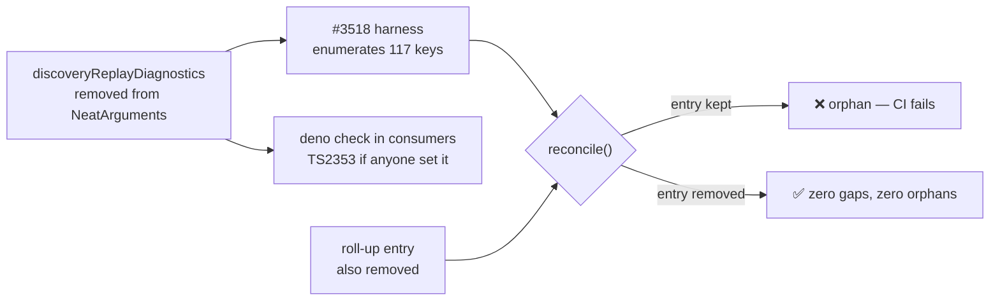

# Retire `discoveryReplayDiagnostics` and its replay timing payload

## Summary

Removed the `discoveryReplayDiagnostics` option and the replay timing
instrumentation it gated — slice B's one `QUALIFIES` verdict from the #3505
option audit, following the #3502 (`fitnessSampleRate`) pattern. Closes #3556.

The flag defaulted to `false` and no consumer set it, so every
`performance.now()` site in `DiscoveryReplayRunner` short-circuited, `timingsMS`
stayed `undefined` and `result.diagnostics` was never assigned. Nothing in
`src/` read the payload.

**This withdraws a public opt-in surface.** `NeatOptions` inherits the key via
`Partial<NeatArguments>`, so an embedder could set it and read the timings from
`Creature.discoveryReplayDir()`. Removal therefore also deletes the
`DiscoveryReplayDiagnostics` type and the optional `diagnostics` field on
`DiscoveryReplayDirResult`, which the CHANGELOG records as breaking for anyone
who opted in.

### What was deleted

| Surface  | Change                                                                                                                          |
| -------- | ------------------------------------------------------------------------------------------------------------------------------- |
| Option   | `NeatArguments.discoveryReplayDiagnostics` and its `?? false` resolution in `NeatConfig`                                        |
| Plumbing | `diagnosticsEnabled`, `totalStart`, `timingsMS`, `resultToReturn`, the 8 `*Start` locals, the 8 `if (timingsMS)` blocks         |
| Types    | `DiscoveryReplayDiagnostics` plus the `diagnostics?:` field, its import and its re-export                                       |
| Docs     | The `docs/config/DISCOVERY.md` option-table row                                                                                 |
| Audit    | The roll-up entry in `scripts/lib/optionAuditRollup.ts` and the corresponding row/counts in `docs/OPTION_AUDIT_CONSOLIDATED.md` |

The `finally` block keeps `worker.terminate()`; only the timing writes were
dropped.

## Evidence

Backend/library change — no web interface to screenshot.

**Consumer re-check (the issue's failure-detection step).** Re-verified on
`origin/Develop` immediately before this PR, in camelCase and the five
non-camelCase forms (`replayDiagnostics`, `discovery_replay_diagnostics`,
`replay_diagnostics`, `DISCOVERY_REPLAY_DIAGNOSTICS`, `REPLAY_DIAGNOSTICS`) —
zero hits in GRQ and NEAT-AI-Examples via `git grep`, and zero via
`gh search code` in GRQ, NEAT-AI-Examples and NEAT-AI-Discovery. Removing the
key from `NeatArguments` removes it from `NeatOptions`, so any consumer that
started setting it would fail `deno check` with TS2353 on its next
`@stsoftware/neat-ai` pin bump.

**Audit book-keeping.** A landed removal takes its key out of `NeatArguments`,
so the #3518 harness stops enumerating it and its roll-up entry becomes an
orphan — which `test/scripts/OptionAuditRollup.ts` already fails on. The entry
is therefore deleted with the key, the pinned top-level count moves 118 → 117,
and the consolidated table is regenerated (289 → 288 rows, 100 → 99
`QUALIFIES`). A new **Executed removals** section records why the numbers
shrink.

`./quality.sh` passes.

## Test Plan

- **Modified** `test/discovery/DiscoveryReplayRunnerVerifyScores.ts` — the only
  test that set the flag. Per the issue, the verify-scores coverage is kept and
  only the diagnostics assertions are dropped: the case now asserts the
  baseline-only result (`original`, `evaluatedSingles`, `evaluatedCombos`,
  `pruned`, no improvement) and the `baselineRescore` drift check.
- **Modified** `test/config/ConfigurationGuideDefaults.ts` — dropped the
  `assertEquals(config.discoveryReplayDiagnostics, false)` default assertion.
- **Added**
  `test/config/NeatConfigParseOptions.ts::NeatConfigParseOptions - discoveryReplayDiagnostics is not a config key`
  — regression guard (mirroring the #3502 guard) asserting the parsed config no
  longer carries the key.
- **Modified** `test/scripts/AuditOptionUsage.ts` — the pinned `NeatArguments`
  top-level count moves 118 → 117. This is the audit's own designed tripwire
  firing on an intended removal.
- **Unchanged and passing:** `test/scripts/OptionAuditRollup.ts` (zero gaps,
  zero orphans) and `test/docs/*` doc-defaults gates.
