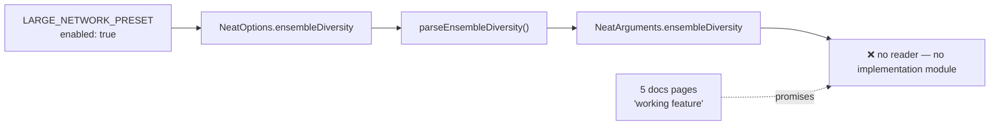

# Remove `ensembleDiversity` — a 10-field config that was parsed but never read

## Summary

`ensembleDiversity` was parsed into `RequiredEnsembleDiversityConfig` and then
never read by any code path. Unlike its siblings (`AdaptivePopulationSizer.ts`,
`NoveltySearch.ts`, `RandomImmigrants.ts`), no `EnsembleDiversity*`
implementation module ever existed, so setting `enabled: true` was a silent
no-op. Worse, two shipped surfaces advertised behaviour that never happened:
`LARGE_NETWORK_PRESET` set `ensembleDiversity: { enabled: true }` with a
"Encourage species diversity" rationale, and five docs pages described it as a
working feature — including a troubleshooting step users would follow to fix a
diversity problem.

Neither confirmed consumer (`stSoftwareAU/GRQ`, `stSoftwareAU/NEAT-AI-Examples`)
sets the key or uses `LARGE_NETWORK_PRESET`, so nothing downstream changes.
Behaviour cannot regress here because no behaviour was ever attached.

Closes #3558.

### What was removed

| Layer          | Change                                                                                                                                                                                                                               |
| -------------- | ------------------------------------------------------------------------------------------------------------------------------------------------------------------------------------------------------------------------------------ |
| Option surface | Deleted `src/config/EnsembleDiversityConfig.ts`; dropped the field from `NeatArguments` and both `NeatOptions` `Omit` lists                                                                                                          |
| Parsing        | Removed `parseEnsembleDiversity` from `PopulationParsers.ts`, its re-export from `NeatConfigParsers.ts`, and the `NeatConfig` call                                                                                                   |
| Presets        | Removed the `ensembleDiversity` block from `LARGE_NETWORK_PRESET` and its misleading doc-comment rationale line                                                                                                                      |
| Docs           | Removed the sections in `api/CONFIGURATION.md`, `config/REGULARISATION.md`, `config/RECIPES.md`, `troubleshooting/TRAINING.md`, `PERFORMANCE_TUNING.md`, `comparison/IMPLEMENTED.md`, plus the index references that pointed at them |
| Audit roll-up  | Dropped the slice-C entry from `scripts/lib/optionAuditRollup.ts` — a roll-up entry for a key the source no longer has is an orphan and fails CI                                                                                     |

`bench/` needed no change; nothing there referenced the option.

## Evidence

This is a library/config change with no web interface, so there is no screenshot
to capture. The evidence is the quality gate: `./quality.sh` passes with **8093
tests, 0 failed**, including the type-check that would flag any remaining
in-repo setter of the removed key.

Two pre-existing mechanical gates confirm the removal is complete rather than
merely hidden:

- `test/scripts/AuditOptionUsage.ts` enumerates the real `NeatArguments`
  top-level surface and pins the count. It failed at `119 != 118` before the pin
  was updated — proof the field genuinely left the parsed surface.
- `test/scripts/OptionAuditRollup.ts` reconciles the #3505 roll-up table against
  that live inventory and reports any entry describing a key the source no
  longer has as an orphan.

Every arrow above is deleted by this PR: the config, the parser, the preset
block, and the documentation that promised behaviour behind it.

## Test Plan

**Added**

- `test/config/NeatOptions.ts::NeatOptions - ensembleDiversity is not a config key`
  — regression guard asserting the parsed config no longer carries the key, so
  reintroducing it silently is not possible. Follows the #3502 precedent.

**Modified**

- `test/scripts/AuditOptionUsage.ts` — repinned the `NeatArguments` top-level
  key count from 119 to 118.
- `test/config/parsers/PopulationParsers.ts` — dropped the three
  `parseEnsembleDiversity` cases (the parser no longer exists).
- `test/config/NeatOptions.ts` — dropped the key from the partial-override case.
- `test/config/ComparisonDocumentedFeatures.ts` — dropped the "config is
  accessible" case and the defaults assertion.
- `test/config/ConfigurationGuideDefaults.ts` — dropped the defaults-match-code
  case.

**Deleted**

- `test/config/EnsembleDiversityConfig.ts` — the whole file tested only the
  removed config's defaults and shape.

No test was commented out or weakened: every deletion removes coverage of code
that no longer exists, and the doc-consistency gates
(`ComparisonDocumentedFeatures`, `ConfigurationGuideDefaults`, `test/docs/*`)
still pass against the updated documentation.

## Security self-check

- No new input surface, dependency, endpoint, or external call — this PR only
  deletes code and documentation.
- No secrets or hidden files staged (`git diff --cached --name-only` shows no
  dot-prefixed paths).
