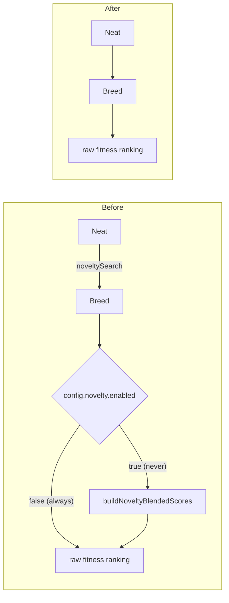

## Summary

Resolved the `novelty` keep-or-remove decision from the #3505 option-removal
audit (slice C, #3521) as **remove**, and executed the removal. Closes #3559.

Unlike its slice-C sibling #3558 (`ensembleDiversity`, which was parsed and
never read), `novelty` was a **complete, working, benchmarked and documented
feature**. It still met the audit's `QUALIFIES` test — the flag defaults off and
no consumer turns it on — and the decision went to remove because:

- **No adopter in seven weeks.** #2932 delivered it on 2026-06-12. Neither GRQ
  nor NEAT-AI-Examples ever constructed a `novelty: {...}` object, and neither
  supplies the behaviour-descriptor tag the feature requires to do anything at
  all. Every `git grep` hit in GRQ was a false positive.
- **An opt-in lever nobody sets is not free.** It costs type surface,
  documentation and maintenance on every config change — the audit's premise.
- **Adoption was not imminent.** It is blocked on a consumer-side behaviour
  descriptor that GRQ has not defined for its scoring problems.

**Behaviour is unchanged.** `DEFAULT_NOVELTY_CONFIG.enabled` was `false`, so
ranking already used raw fitness in every production run. **Breaking only for
embedders that opted in:** setting `novelty` is now a `deno check` error.

The unrelated `noveltyEscalationActive` Discovery drought signal (#3072) is
deliberately untouched — despite the name it is a different mechanism in a
different subsystem and is live in GRQ.

### What was removed

| Layer          | Removed                                                                                                        |
| -------------- | -------------------------------------------------------------------------------------------------------------- |
| Option surface | `src/config/NoveltyConfig.ts`; `RequiredNoveltyConfig` from `NeatArguments`; both `NeatOptions` `Omit` entries |
| Parsing        | `parseNovelty` in `PopulationParsers.ts`, its `NeatConfig` wiring and `NeatConfigParsers` re-export            |
| Implementation | `src/NEAT/NoveltySearch.ts` (engine, archive, `blendScores`); `Neat.noveltySearch`; the `Breed` argument       |
| Benchmark      | `bench/NoveltyDeceptiveEscape.ts` (and its `deno.json` entry)                                                  |
| Docs           | `docs/NOVELTY_SEARCH.md`, de-indexed from `README.md`, `docs/README.md`, `docs/GLOSSARY.md`                    |
| Audit tooling  | Roll-up entry; pinned `NeatArguments` key count `114 → 113`                                                    |

### Plumbing removed from the breeding path

## Evidence

Backend/library change — there is no web interface to screenshot, so no
Playwright evidence applies.

**Quality gate:** `./quality.sh < /dev/null` passes cleanly — **8079 passed | 0
failed | 4 ignored**. That covers `deno fmt`, `deno lint`, bash syntax,
`deno check`, the WASM sync and the full test suite.

**No incidental behaviour change:** the feature flag was off by default and
additionally gated on a problem-supplied behaviour descriptor that no consumer
provides, so the blended-score path was unreachable in production. The
`Breed`/`Neat` diff removes a branch that always evaluated false; ranking falls
through to the same `FitnessRanking` construction as before.

**Audit tooling stays reconciled:** `scripts/lib/optionAuditRollup.ts` fails
`test/scripts/OptionAuditRollup.ts` if a roll-up entry names a key the source no
longer has, so dropping the `novelty` entry alongside the option is verified,
not assumed. `docs/OPTION_AUDIT_CONSOLIDATED.md` counts were regenerated (274 →
267 rows; 114 → 113 top-level; slice C 45 → 38).

## Test Plan

**Added**

- `test/config/NeatOptions.ts::NeatOptions - novelty is not a config key` —
  regression guard asserting the parsed config no longer carries the key.
  Written first (TDD); it failed against the unremoved code and passes after the
  removal.

**Modified**

- `test/scripts/AuditOptionUsage.ts` — repinned the real `NeatArguments`
  top-level count `114 → 113`, and swapped the two `NoveltyConfig` enumeration
  assertions/fixtures onto the surviving `RandomImmigrantsConfig`.

**Deleted** (their subject no longer exists — documented per the "do not remove
existing tests" rule, as the business logic itself is withdrawn)

- `test/NEAT/NoveltySearch.ts`, `test/NEAT/NoveltySearchDeceptive.ts`,
  `test/breed/BreedNovelty.ts`, `test/config/NoveltyConfig.ts`.

## Pre-PR Security Self-Check

- **Input validation** — no new functions accepting external input; this change
  only deletes a parser and its option surface.
- **Secrets** — none staged; `git diff --cached` contains no hidden paths.
- **Injection surface / output encoding / auth** — unchanged; no SQL, shell,
  filesystem or HTTP call is added or altered.
- **Error handling** — no failure path is swallowed; removing `parseNovelty`
  removes validation for an option that can no longer be set (setting it is now
  a compile-time error, which is louder than the previous runtime coercion).
- **Dependencies** — none added.
