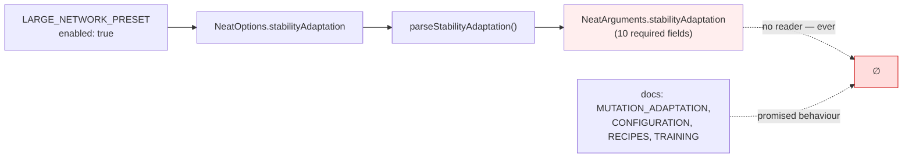

# Remove `stabilityAdaptation` — 10-field config that is parsed but never read

## Summary

`stabilityAdaptation` was not a knob with an inert default — it had **no
implementation at all**. `createNeatConfig()` parsed it into
`RequiredStabilityAdaptationConfig`, stored it on `NeatArguments`, and no code
path ever read it. Setting `enabled: true` changed nothing.

Worse than dead: three shipped surfaces advertised behaviour that never
happened. `LARGE_NETWORK_PRESET` set `stabilityAdaptation: { enabled: true }`
with a rationale line claiming "Adapt mutation to stability";
`docs/config/MUTATION_ADAPTATION.md` documented it as a working lever; and
`docs/troubleshooting/TRAINING.md` twice told users with a brittleness problem
to enable it, handing them a silent no-op.

This is slice D of the #3505 option-removal audit (#3522) and the direct sibling
of #3558 (`ensembleDiversity`), which had the identical defect in the same
preset. It also unbundles the `StabilityAdaptation` third of #1942, which was
closed `NOT_PLANNED` because it bundled two dead configs with one genuinely live
one (`adaptivePopulation`, explicitly **not** in scope here).

Neither confirmed consumer sets the key — `git grep -F stabilityAdaptation` and
repo-scoped `gh search code` both return zero hits in `stSoftwareAU/GRQ` and
`stSoftwareAU/NEAT-AI-Examples`, and neither uses `LARGE_NETWORK_PRESET` either.
The option is not exported from `mod.ts`, so no consumer can hold a reference to
the type.

Closes #3562.

## What was removed



- **Option surface** — deleted `src/config/StabilityAdaptationConfig.ts`;
  dropped `RequiredStabilityAdaptationConfig` and its doc block from
  `NeatArguments.ts`; dropped the key from `NeatOptions.ts` (import, both `Omit`
  lists, both override fields, and the type doc comment).
- **Parsing** — removed `parseStabilityAdaptation` from
  `src/config/parsers/MutationParsers.ts`, its re-export from
  `NeatConfigParsers.ts`, and the call site in `NeatConfig.ts`.
- **Presets** — removed the `stabilityAdaptation` block from
  `LARGE_NETWORK_PRESET` and its misleading rationale line.
- **Docs** — removed the section in `docs/api/CONFIGURATION.md`, the
  stability-adaptation example and option table in
  `docs/config/MUTATION_ADAPTATION.md`, the recipe snippet in
  `docs/config/RECIPES.md`, both troubleshooting snippets in
  `docs/troubleshooting/TRAINING.md`, the `FUTURE_WORK.md` entry, and prose
  mentions in `docs/CONFIGURATION_GUIDE.md`, `docs/TROUBLESHOOTING.md`,
  `docs/config/PRESETS.md`, and `docs/comparison/PROS_AND_CONS.md`. These
  described a feature that does not exist, so they go with it rather than being
  repointed.
- **Audit rollup** — dropped the `stabilityAdaptation` entry from
  `scripts/lib/optionAuditRollup.ts` (no source key left to classify), mirroring
  what #3558 did for slice C.
- **`bench/` / `mod.ts`** — nothing to do; no bench referenced it and it was
  never exported.

The historical `docs/OPTION_AUDIT_*.md` records and prior PR summaries are left
untouched — they are the audit's permanent record of _why_ this was removed.

## Evidence

Backend/library change with no web interface, so no screenshot applies. The
proof for this key is a green typecheck plus the full suite: `NeatOptions` is
typed, so any in-repo test, bench or example still setting the key would fail
`deno check`.

`./quality.sh --skip-wasm --skip-discovery < /dev/null` — fmt, lint, bash
syntax, `deno check`, and the full parallel test run with leak detection:

```
ok | 8140 passed (5 steps) | 0 failed | 4 ignored (4m46s)
```

## Test Plan

**Added**

- `test/config/NeatOptions.ts::NeatOptions - stabilityAdaptation is not a config key`
  — regression guard asserting `createNeatConfig({})` no longer carries the key,
  so a future reintroduction fails loudly. Mirrors the #3558 guard directly
  below it.

**Modified**

- `test/scripts/AuditOptionUsage.ts` — repinned the `NeatArguments` top-level
  key count from 112 to 111 and recorded #3562 in the running provenance
  comment.
- `test/config/NeatOptions.ts` — dropped `stabilityAdaptation` from the
  partial-override case (the removed key can no longer be passed).
- `test/config/ComparisonDocumentedFeatures.ts` — removed the "stability
  adaptation config is accessible" test and the
  `config.stabilityAdaptation !== undefined` assertion; both asserted a
  documented feature that no longer exists.
- `test/config/ConfigurationGuideDefaults.ts` — removed the "stability
  adaptation defaults match code" doc-consistency test, in step with the doc
  sections deleted here.
- `test/config/parsers/MutationParsers.ts` — removed the three
  `parseStabilityAdaptation` tests along with the parser.

**Deleted**

- `test/config/StabilityAdaptationConfig.ts` — five tests covering only the
  deleted config module's defaults and parsing.

No test was commented out or weakened to pass. Every removal above is a test
whose subject — a config key, parser, default set, or documented section — was
itself deleted in this PR; there is no remaining behaviour for them to cover.
