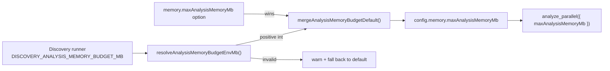

# Wire up `memory.maxAnalysisMemoryMb`; remove `memory.proactiveGc` (#3565)

## Summary

Slice E (#3523) of the #3505 option-removal audit flagged both `memory` fields
as inert defaults. This PR carries out the decision recorded on the issue:

- **`memory.maxAnalysisMemoryMb` — wired up.** It is the only in-flight brake on
  `analyze_parallel` growing RSS until the host OOMs (the FFI call is blocking,
  so no JS timer or heap sample runs while Rust allocates), yet its `0` default
  meant no Rust-side budget was ever sent. `createNeatConfig` now seeds it from
  `DISCOVERY_ANALYSIS_MEMORY_BUDGET_MB`, mirroring the `workerThreadCap` /
  `DISCOVERY_WORKER_ENVELOPE_MB` precedent. An explicitly supplied option always
  wins (including an explicit `0`); an invalid value is ignored **loudly** —
  warn and fall back to the default — and with the variable unset behaviour is
  unchanged. The downstream production repo exports the runner-side value.
- **`memory.proactiveGc` — removed.** `attemptProactiveGc()` is a no-op unless
  the runtime was started with `--v8-flags=--expose-gc`, which no launcher
  passes. The option, its default, its parser entry, the `MemoryMonitor`
  critical-response gate, `attemptProactiveGc()` itself, and the `attemptGc`
  plumbing through `releaseRecordingRetainers()` are all gone.

Closes #3565.

## Evidence

Backend/config change — no web interface to screenshot. Verified by the tests
below and a clean `./quality.sh` run.

## Test Plan

New — `test/config/AnalysisMemoryBudgetEnv.ts`:

- `resolveAnalysisMemoryBudgetEnvMb` — unset, positive integer, whitespace-only
  (unconfigured, no warning), and invalid (`0`, negative, non-numeric,
  fractional, `Infinity`) values each warn once and fall back.
- `mergeAnalysisMemoryBudgetDefault` — env seeds an unset budget, leaves other
  overrides intact, and never overrides an explicit option (including `0`).
- End-to-end through `createNeatConfig`, run in a **child process** so the
  environment stays hermetic (`deno test --parallel` shares one process
  environment across files): env `4096` → `memory.maxAnalysisMemoryMb === 4096`,
  explicit `512` wins over the env value, and env unset → `0`.

Modified (documented business-logic change — `memory.proactiveGc` no longer
exists):

- `test/NEAT/MemoryMonitor.ts` — removed the three `proactiveGc` /
  `attemptProactiveGc` tests along with the API they covered.
- `test/config/parsers/RuntimeParsers.ts` — the defaults assertion now checks
  `maxAnalysisMemoryMb` instead of the removed `proactiveGc`.

## Docs

- `docs/DISCOVERY_ARCHITECTURE.md` — new "Seeding the budget from the runner"
  section documenting the env variable, precedence, and loud-fallback rule.
- `docs/troubleshooting/MEMORY.md` — dropped the `memory.proactiveGc` mention.
- `scripts/lib/optionAuditRollup.ts` — `maxAnalysisMemoryMb` is now `IN USE`;
  the `proactiveGc` entry is gone with the field.
