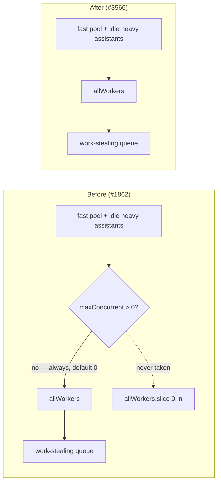

# Remove `parallelEvaluation.maxConcurrentEvaluations` (Issue #3566)

## Summary

Removed the `parallelEvaluation.maxConcurrentEvaluations` option — slice E of
the #3505 option-removal audit, following the #3502 / #3562 removal pattern.
Closes #3566.

The field defaulted to `0`, and with `0` the only branch that read it took the
un-sliced `allWorkers` path, so it never changed behaviour in any run. Its
original purpose (#1862 — reserve workers for training and discovery while
evaluation runs) was superseded by the #2245 fast/heavy worker-pool split:
evaluation now receives only fast-pool workers, which never run discovery or
training. Callers who genuinely want to reserve capacity size the heavy pool
with `heavyTaskWorkerCount`. The same #2245 change removed the sibling
`busyWorkerWaitMs` for exactly this reason.

`parallelEvaluation.topologyGrouping` and the parent `parallelEvaluation` key
are untouched — `topologyGrouping` defaults to `true` and drives
`EvaluationScheduling` on every generation.

**Breaking for embedders that set it:** passing
`parallelEvaluation.maxConcurrentEvaluations` is now a `deno check` error. No
consumer sets it (verified in the issue's cross-repo sweep — zero camelCase,
env-var, and code-search hits in both downstream repos), so the runtime
behaviour of every existing configuration is unchanged.

### Removal surface

| Area         | Change                                                                                                        |
| ------------ | ------------------------------------------------------------------------------------------------------------- |
| Option       | `src/config/ParallelEvaluationConfig.ts` — interface field and `DEFAULT_PARALLEL_EVALUATION_CONFIG` entry     |
| Parsing      | `src/config/parsers/RuntimeParsers.ts` — the `parseParallelEvaluation` `parseNumber` block                    |
| Plumbing     | `src/architecture/Fitness.ts` — the `maxConcurrent` ternary; `activeWorkers` collapses into `allWorkers`      |
| Bench        | `bench/ParallelEvaluation.ts` (4 lines), `bench/ScorerBatchThroughput.ts` (1 line) — all inert `: 0` literals |
| Tests        | Config, parser, and Fitness suites (see Test Plan)                                                            |
| Docs         | `docs/config/WORKERS.md`, `docs/comparison/FUTURE_WORK.md`, `docs/api/CONFIGURATION.md`, `CHANGELOG.md`       |
| Option audit | `scripts/lib/optionAuditRollup.ts` — the stale `QUALIFIES` field override on the `parallelEvaluation` entry   |

## Evidence

Backend/library change with no web interface — no screenshot applies. The
evidence is the quality gate and the behaviour-equivalence argument below.

### Why the removal is behaviour-preserving



The dead branch is the whole change: with the default of `0` the ternary always
resolved to `allWorkers`, which is now the only expression.

### Quality gate

`./quality.sh < /dev/null` passes cleanly:

```
ok | 8136 passed (5 steps) | 0 failed | 4 ignored (5m8s)
```

## Test Plan

**Added regression guards** (both fail if the option is reintroduced):

- `test/config/ParallelEvaluationConfig.ts::ParallelEvaluationConfig -
  maxConcurrentEvaluations is gone (Issue #3566)`
  — asserts the key is absent from `DEFAULT_PARALLEL_EVALUATION_CONFIG` and that
  an override naming it is not carried into the parsed config.
- `test/config/parsers/RuntimeParsers.ts::parseParallelEvaluation - drops
  removed maxConcurrentEvaluations (#3566)`
  — asserts `parseParallelEvaluation` does not parse the key back in.

**Rewritten:**

- `test/architecture/BatchCreatureEvaluation.ts` —
  `Fitness -
  maxConcurrentEvaluations 0 uses all workers` renamed to
  `Fitness - every
  supplied worker is available for evaluation`; it covered
  the surviving behaviour already, so its assertions are unchanged.
- `test/config/ParallelEvaluationConfig.ts` — the default, override, partial
  merge, and frozen-config tests now exercise `topologyGrouping`. The
  CLI-coercion and `>= 0` validation tests went with the only numeric field.

**Removed (documented business-logic change — the behaviour they asserted no
longer exists; each file records why in its header comment):**

- `test/architecture/BatchCreatureEvaluation.ts::Fitness -
  maxConcurrentEvaluations limits active workers`
- `test/architecture/FitnessBusyWorkerWait.ts::Fitness maxConcurrentEvaluations
  still caps fast-pool worker usage`
- `test/architecture/FitnessDynamicPool.ts::Fitness.calculate with additional
  workers respects maxConcurrentEvaluations`

**Unchanged and still passing** (inert `maxConcurrentEvaluations: 0` literals
dropped from their fixtures): `FitnessScorerTelemetry.ts`,
`FitnessTopologyGrouping.ts`, `test/scripts/OptionAuditRollup.ts` — the last of
which mechanically re-reconciles the audit roll-up against the live config
surface, so a stale roll-up entry would fail CI.

## Security self-check

No new input handling, no new dependency, no new endpoint or privileged
operation. The change deletes a configuration field and one branch; the
validation removed with it (`min: 0`) guarded only that deleted field.
