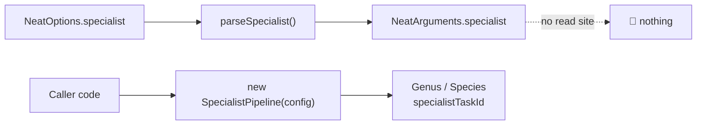
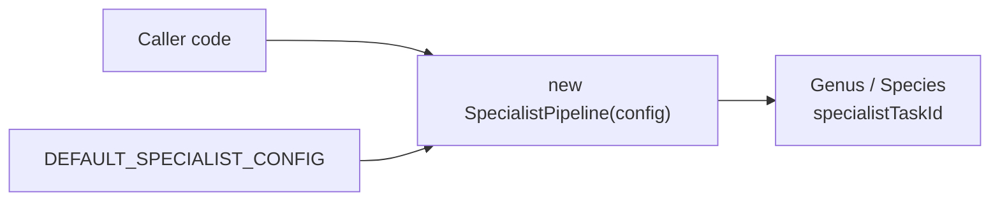

# Remove the `specialist` option surface (Issue #3568)

## Summary

`NeatOptions.specialist` was declared, parsed by `parseSpecialist` and stored on
`NeatArguments` — and then never read. Neither `Neat` nor `NeatEvolution` ever
constructed a `SpecialistPipeline` from it, so `config.specialist` had no read
site anywhere in `src/`. That made the key inert at **every** value, not just at
its `mode: "off"` default: setting
`specialist: { mode: "auto", subTaskIds: ["a", "b"] }` silently did nothing —
exactly the fail-silently shape the project forbids.

This removes the dead config plumbing only. **The feature is untouched:**
`SpecialistPipeline` still takes its own `Partial<RequiredSpecialistConfig>`
constructor argument, `src/config/SpecialistConfig.ts` stays, and
`SpecialistConfig` / `RequiredSpecialistConfig` / `SpecialistMode` /
`DEFAULT_SPECIALIST_CONFIG` are still exported from `mod.ts`.

Closes #3568.

## Evidence

This is a backend/library change with no web interface, so there is no
screenshot. Verification is the test suite plus `./quality.sh`.

Before — the key was plumbed to nowhere:

After — one honest path, the constructor:

Removed:

- `src/config/NeatOptions.ts` — the `specialist?: SpecialistConfig` field, the
  `CoerceNumeric` mirror, `"specialist"` from both `keyof` `Omit` unions, and the
  now-unused import.
- `src/config/NeatArguments.ts` — the `specialist: RequiredSpecialistConfig`
  field and its import.
- `src/config/NeatConfig.ts` — the `parseSpecialist(...)` wiring.
- `src/config/parsers/MutationParsers.ts` — `parseSpecialist` and its
  `SpecialistConfig` imports; `src/config/NeatConfigParsers.ts` — its re-export.
- `docs/api/CONFIGURATION.md` — the `specialist` sub-config section and its
  export-list entry; `docs/API_REFERENCE.md` — the `specialist` mention in the
  Configuration row. `docs/api/EVOLUTION.md` now states that `SpecialistConfig`
  goes to the pipeline constructor, not to `NeatOptions`.
- `scripts/lib/optionAuditRollup.ts` — the `qualifies("specialist", …)` entry,
  replaced with an `internal: true` `KEEP` entry for `SpecialistConfig` (the
  interface still exists and the harness still enumerates its fields, exactly as
  `RustScorerConfig` is handled).

Kept, as the issue requires: `src/config/SpecialistConfig.ts`,
`src/NEAT/SpecialistPipeline.ts`, `bench/SpecialistVsMixed.ts`,
`test/NEAT/SpecialistPipeline.ts`, `Genus.addCreatureToSpecies(specialistTaskId)`
and `Species.specialistTaskId`. `docs/archive/` is untouched.

## Test Plan

- **Added** `test/config/NeatOptions.ts::"NeatOptions - specialist is not a
  config key"` — a regression guard asserting the parsed config no longer carries
  the key, matching the #3562 / #3558 precedent.
- **Modified**
  `test/docs/DeepseekPapersIndex.ts::"deepseek-papers-index — specialist pipeline
  defaults to off (#2530)"` — now asserts `DEFAULT_SPECIALIST_CONFIG.mode` (the
  pipeline's own default, the only remaining opt-in switch) instead of the
  removed `config.specialist.mode`. Same behavioural claim, live source.
- **Modified** `test/scripts/AuditOptionUsage.ts` — the pinned `NeatArguments`
  top-level key count moves 111 → 110.
- **Modified** `test/scripts/OptionAuditRollup.ts` — the rendered-table probe uses
  `opd` / `#3570` in place of the now-removed `specialist` / `#3568` row.
- **Unchanged and still green:** all 10 `test/NEAT/SpecialistPipeline.ts` tests,
  including `DEFAULT_SPECIALIST_CONFIG matches Issue #2530 defaults`.
- `./quality.sh` (fmt, lint, bash syntax, `deno check`, WASM sync, full parallel
  test suite) passes.

**Breaking for embedders that set the key:** `NeatOptions.specialist` is now a
`deno check` error and `parseSpecialist` is no longer exported. No confirmed
consumer sets it — the issue's fresh-clone greps found zero hits in either
downstream repo — so no consumer is expected to move.
