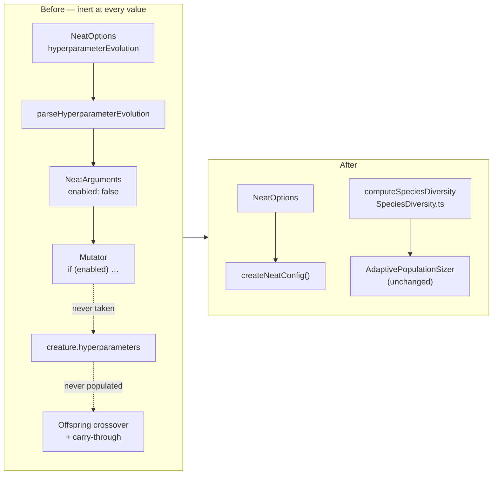

# Remove `hyperparameterEvolution` (Issue #3569)

## Summary

Removed per-creature evolvable hyperparameters (Issue #1863) — a 13-field
research config that was fully implemented, fully tested and **never switched
on**. Closes #3569.

`hyperparameterEvolution.enabled` defaulted to `false` and no consumer set it,
so `Mutator` never created a hyperparameter block. That made the whole feature
inert end to end: no creature ever carried a `hyperparameters` genome field, so
both `Offspring` branches — the crossover path _and_ the "preserve when
disabled" carry-through path that exists to protect creatures evolved with the
flag on — were unreachable. This is the fail-silently shape the project forbids:
setting the option changed nothing and reported nothing.

Removed:

| Surface        | What went                                                                                                                                                        |
| -------------- | ---------------------------------------------------------------------------------------------------------------------------------------------------------------- |
| Option         | `NeatOptions.hyperparameterEvolution`, its `CoerceNumeric` mirror, both `keyof` unions, the `NeatArguments` field, the `NeatConfig` wiring                       |
| Parser         | `parseHyperparameterEvolution` in `TrainingParsers.ts` and its `NeatConfigParsers.ts` re-export                                                                  |
| Implementation | `src/config/HyperparameterConfig.ts` and `src/NEAT/HyperparameterEvolution.ts` (whole files)                                                                     |
| Genome         | `Creature.hyperparameters` / `CreatureCommon.hyperparameters` and the export / import / clone plumbing in `CreatureExportBuilder.ts`, `CreatureSerialization.ts` |
| Read sites     | `Mutator.ts`, `Offspring.ts` (both crossover paths), `Breed.ts`, `ParallelBreeding.ts`                                                                           |
| Public API     | the four `mod.ts` type exports plus `DEFAULT_EVOLVABLE_HYPERPARAMETERS` and `DEFAULT_HYPERPARAMETER_EVOLUTION_CONFIG`                                            |
| Schema         | the `hyperparameters` property and `$defs` entry in `docs/snapshot-schema.json`                                                                                  |
| Bench          | the `hyperparameterEvolution` row of the `EvolutionPaceLeverComparison.ts` lever matrix                                                                          |

**Kept, relocated:** `computeSpeciesDiversity` lived in the deleted
`HyperparameterEvolution.ts` but is a genuine live dependency of
`AdaptivePopulationSizer.ts`. It moved verbatim to
`src/NEAT/SpeciesDiversity.ts` with its four tests; adaptive population sizing
behaves identically.

### Migration

Breaking for embedders. `NeatOptions.hyperparameterEvolution` is now a
`deno check` error and the six symbols above are no longer exported. There is no
data migration: existing creature JSON that happens to carry a `hyperparameters`
field still loads — the field is simply ignored and dropped on the next export.



## Evidence

Backend/library change with no web interface — no screenshot applies.

**Quality gate green:**

```
ok | 8113 passed (5 steps) | 0 failed | 4 ignored (4m3s)
```

**Bench re-run** (`bench/EvolutionPaceLeverComparison.ts`, population 24, 60
generations, 48-sample dataset, `targetError = 0.05`, seed 2931). Because the
lever matrix changed, `docs/PERFORMANCE_RESEARCH.md` was re-measured rather than
left asserting a result the harness can no longer produce:

| config             | generations-to-target | wall-clock ms | best error |
| ------------------ | --------------------- | ------------- | ---------- |
| baseline           | 18                    | 589.6         | 0.049757   |
| plateauDetection   | 14                    | 376.9         | 0.049974   |
| adaptivePopulation | 20                    | 601.6         | 0.047773   |
| mcmc               | 14                    | 385.7         | 0.044555   |
| fast (combined)    | 15                    | 419.3         | 0.048206   |

The four surviving levers reproduce their prior generations-to-target exactly
(18 / 14 / 20 / 14), confirming the removal did not perturb the shared seeded
problem. Only `fast (combined)` moves — 11 → 15 generations — because it is now
`plateauDetection + mcmc` rather than
`plateauDetection + mcmc +
hyperparameterEvolution`. The tightened-target claim
was re-measured too (`targetError = 0.04`: baseline 24, `mcmc` 16,
`plateauDetection` 18, `adaptivePopulation` 24) and the doc's recommendation
section rewritten around `mcmc` as the strongest surviving single lever.

## Test Plan

**Added**

- `test/config/NeatOptions.ts::NeatOptions - hyperparameterEvolution is not a
  config key`
  — regression guard asserting `createNeatConfig({})` no longer produces the
  key, so the option cannot be silently reintroduced.
- `test/NEAT/SpeciesDiversity.ts` — the four `computeSpeciesDiversity` cases
  (single species, all-unique, population of 1, more species than population)
  moved from the deleted `test/NEAT/HyperparameterEvolution.ts` so the surviving
  function keeps its coverage.

**Modified**

- `test/scripts/AuditOptionUsage.ts` — `NeatArguments` top-level count repinned
  110 → 109.
- `test/bench/EvolutionPaceLeverComparison.ts` — matrix size 6 → 5; the
  RNG-restoration test now drives the `mcmc` config instead of the removed one.
- `test/validate/SnapshotSchema.ts` — dropped the two `hyperparameters` schema
  tests along with the schema property they assert on.
- `test/config/parsers/TrainingParsers.ts` — dropped the three
  `parseHyperparameterEvolution` tests with the parser.
- `test/scripts/OptionAuditRollup.ts` unchanged; the roll-up entry for the key
  was removed from `scripts/lib/optionAuditRollup.ts` (same pattern #3568 used
  for `specialist`).

**Deleted** (business-logic removal, documented per the no-silent-test-removal
rule): `test/config/HyperparameterConfig.ts`,
`test/NEAT/HyperparameterEvolution.ts`,
`test/NEAT/HyperparameterSerialisation.ts` — all three tested only the removed
feature.

## Docs

`CHANGELOG.md` records the `mod.ts` export removals under Unreleased → Removed.
Feature claims were corrected wherever they described this as a working lever:
`README.md` (feature 17 dropped, list renumbered), `docs/API_REFERENCE.md`,
`docs/api/CONFIGURATION.md`, `docs/CONFIGURATION_GUIDE.md`,
`docs/config/{MUTATION_ADAPTATION,RECIPES,CORE_EVOLUTION,REGULARISATION,TRAINING}.md`,
`docs/TROUBLESHOOTING.md`, `docs/troubleshooting/TRAINING.md`,
`docs/PERFORMANCE_RESEARCH.md`, and
`docs/comparison/{IMPLEMENTED,PROS_AND_CONS,FUTURE_WORK}.md`. `FUTURE_WORK.md`
now records the withdrawal explicitly, so a future revival lands with a consumer
that enables it. `docs/archive/` and the `OPTION_AUDIT_*` records were left
untouched — they are the audit's historical record.
