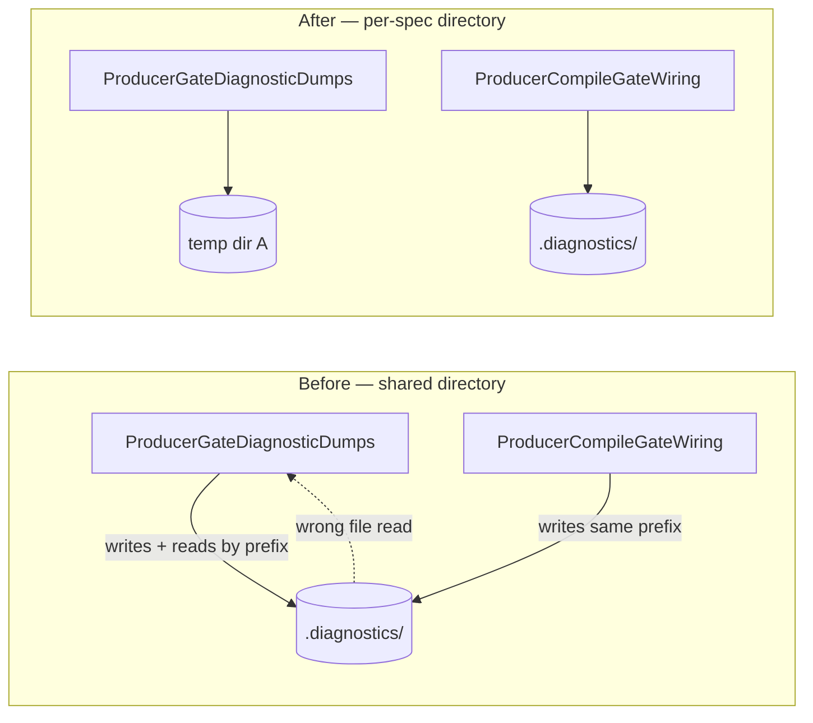

## Summary

`ProducerGateDiagnosticDumps.ts` intermittently failed under `./quality.sh`
because it resolved "its" diagnostic dump by file-name prefix out of the shared
`.diagnostics/` directory. `ProducerCompileGateWiring.ts` (and
`MutatorDiagnosticSnapshotGate.ts`) write dumps with the same
`mutator-wasm-compile-trap-<mutationName>-` prefix, so a dump from another spec
running in parallel could be read as this spec's own.

Diagnostic dumps are now written to a directory resolved at write time
(`getDiagnosticsDir()`), with `setDiagnosticsDir()` to redirect it. Each spec
that resolves dumps by prefix takes its own temporary directory via the new
`test/_diagnosticsDir.ts` helper, so dump resolution cannot cross spec
boundaries. Default behaviour is unchanged: dumps still land in `.diagnostics/`.

Closes #3583.

## Evidence

Backend/CLI change — no web interface to screenshot. Evidence is the
reproduction from the issue, before and after.

Before (deterministic failure):

```
$ deno test --allow-all --parallel \
    test/wasm/ProducerGateDiagnosticDumps.ts test/wasm/ProducerCompileGateWiring.ts
error: AssertionError: Values are not equal: context.prngSeed must record the active PRNG seed
-   "n/a (unseeded RNG)"
+   20260516
FAILED | 8 passed | 1 failed (174ms)
```

After (3 consecutive runs, plus the third spec sharing the prefix):

```
$ deno test --allow-all --parallel test/wasm/ProducerGateDiagnosticDumps.ts \
    test/wasm/ProducerCompileGateWiring.ts test/NEAT/MutatorDiagnosticSnapshotGate.ts
ok | 11 passed | 0 failed (177ms)
ok | 11 passed | 0 failed (203ms)
ok | 11 passed | 0 failed (149ms)
```



## Test Plan

- Added `test/utils/DiagnosticsDir.ts`:
  - `writeDiagnostics` honours the configured directory and writes nothing under
    that prefix into the default directory.
  - `setDiagnosticsDir()` with no argument restores `.diagnostics`.
  - `setDiagnosticsDir("   ")` fails loud and leaves the active directory
    unchanged.
- Added `test/_diagnosticsDir.ts` — `useIsolatedDiagnosticsDir(label)` gives a
  spec its own temporary dump directory and restores the default on dispose.
- Updated `test/wasm/ProducerGateDiagnosticDumps.ts` and
  `test/NEAT/MutatorDiagnosticSnapshotGate.ts` to use it. Both dropped the
  now-redundant snapshot/cleanup-by-prefix machinery; all existing assertions
  are retained.
- Full `./quality.sh` passes.
