# Consolidate the near-duplicate private-repo guard tests (Issue #3604)

## Summary

Seven test files re-implemented the same two private-repo-reference contracts
(#3455 archived docs, #3458 dependency-bump automation) with six near-identical
scanner helpers. The copies had already drifted — the patterns disagreed about
what was forbidden — so any future change had to be applied by hand in up to
four places. The detection contract now lives in one module and each family
keeps one guard. **Closes #3604.**

| Family                      | Before                                                                                                              | After                                                     |
| --------------------------- | ------------------------------------------------------------------------------------------------------------------- | --------------------------------------------------------- |
| Scanner                     | 6 copies of `findPrivateRepoRefs` / `findPrivateRepoReferences`                                                     | `test/_privateRepoRefs.ts` (one pattern, one scanner)     |
| A — archived docs (#3455)   | `ArchiveDocsNoPrivateRepoSlugs.ts`, `ArchiveDocsNoPrivateRepoReference.ts`, `ArchivedDocsNoPrivateRepoReference.ts` | `test/docs/ArchiveDocsNoPrivateRepoSlugs.ts` (whole tree) |
| B — bump automation (#3458) | 2 × `BumpDepsNoPrivateRepoReference.ts`, `BumpDepsNoPrivateRepoRefs.ts`, `AutomationNoPrivateRepoReference.ts`      | `test/scripts/BumpDepsNoPrivateRepoReference.ts`          |
| Scanner unit cases          | spread across all 7 files, overlapping                                                                              | `test/docs/PrivateRepoRefScanner.ts` (table-driven, 16)   |

**No coverage lost.** Family A's survivor already walks the whole `docs/archive`
tree, so it subsumes the two fixed-list files (all six of their docs live in
that tree). Family B's survivor keeps the widest scan scope (the same three
files) plus the two unique behavioural cases the other copies had: the static
revert-guidance check and the runtime test that executes `bump-deps.sh` with a
failing smoke gate and asserts its stderr. The scanner fixtures are the union of
the fixtures the seven files carried.

**Pattern.** The consolidated pattern is the union of the seven, minus one
deliberate carve-out: a bare downstream consumer repo name (no issue slug, no
link) stays allowed, because 11 archived docs legitimately name it and the
whole-tree walker has always permitted it. Everything a public reader could
click and fail to open — private issue-tracker slugs, org-qualified private repo
paths, and links into private repositories — is still forbidden, tree-wide.

## Evidence

Backend/test-only change; no web interface to screenshot. Verified by running
the guards, by a fault-injection check, and by the full quality gate.

Fault injection — an archived doc carrying a private issue slug and a private
repo link is caught by the consolidated guard:

```text
$ printf '...See <private slug> and <private repo link>...' \
    > docs/archive/investigations/_scratch-3604.md
$ deno test --allow-read test/docs/ArchiveDocsNoPrivateRepoSlugs.ts
docs/archive/investigations/_scratch-3604.md:3
FAILED | 0 passed | 1 failed
```

```mermaid
flowchart LR
    subgraph Before["Before — 7 files, 6 scanners"]
        A1[ArchiveDocsNoPrivateRepoSlugs]
        A2[ArchiveDocsNoPrivateRepoReference]
        A3[ArchivedDocsNoPrivateRepoReference]
        B1[scripts/BumpDepsNoPrivateRepoReference]
        B2[scripts/BumpDepsNoPrivateRepoRefs]
        B3[docs/BumpDepsNoPrivateRepoReference]
        B4[AutomationNoPrivateRepoReference]
    end
    subgraph After["After — 1 scanner, 2 guards, 1 unit suite"]
        H["test/_privateRepoRefs.ts<br/>PRIVATE_REPO_PATTERN"]
        S["PrivateRepoRefScanner<br/>16 table-driven cases"]
        GA["ArchiveDocsNoPrivateRepoSlugs<br/>walks docs/archive"]
        GB["BumpDepsNoPrivateRepoReference<br/>scans automation + docs"]
        H --> S
        H --> GA
        H --> GB
    end
    Before ==>|"consolidated (#3604)"| After
```



## Test Plan

- **Added** `test/_privateRepoRefs.ts` — shared `PRIVATE_REPO_PATTERN`,
  `findPrivateRepoRefs` and `scanForPrivateRepoRefs`.
- **Added** `test/docs/PrivateRepoRefScanner.ts` — 16 table-driven cases (9
  flagged, 7 clean) covering the union of the fixtures from all seven files:
  bare and org-qualified issue slugs for both private trackers, private repo
  paths, blob links, multi-line sources, the public repo, this repo's own issue
  numbers, host/log/preset mnemonics, the lower-case in-tree preset fixture,
  concept-level prose and empty input.
- **Kept and rewritten** `test/docs/ArchiveDocsNoPrivateRepoSlugs.ts` — walks
  the real `docs/archive` tree (minus the three audit-narrative summaries) via
  the shared scanner.
- **Kept and rewritten** `test/scripts/BumpDepsNoPrivateRepoReference.ts` —
  per-file guards for `bump-deps.sh`, `AGENTS.md` and
  `test/scripts/BumpDepsScript.ts`, plus the migrated revert-guidance and
  runtime smoke-gate-failure cases.
- **Deleted** the five duplicates:
  `test/docs/ArchiveDocsNoPrivateRepoReference.ts`,
  `test/docs/ArchivedDocsNoPrivateRepoReference.ts`,
  `test/docs/BumpDepsNoPrivateRepoReference.ts`,
  `test/docs/AutomationNoPrivateRepoReference.ts`,
  `test/scripts/BumpDepsNoPrivateRepoRefs.ts`.
- **Updated** `test/docs/NoPrivateGrqIssueSlugs.ts` — its detector allowlist now
  names the surviving guards, the shared scanner and its unit suite.
- `./quality.sh` passes.
