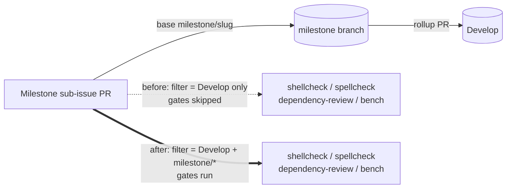

# Milestone PRs now run the shellcheck, spellcheck, dependency-review and bench gates

## Summary

Four PR quality gates restricted their `pull_request` trigger to `Develop` only,
so they never ran on milestone sub-issue PRs (which target a shared
`milestone/<slug>` branch). Added the single-level `milestone/*` glob to each
branch filter, matching the pattern already used by the five sibling workflows
fixed under Issues #3359–#3363. Closes #3606.

Workflows changed:

- `.github/workflows/shellcheck.yml`
- `.github/workflows/spellcheck.yaml`
- `.github/workflows/dependency-review.yml`
- `.github/workflows/bench.yaml` (keeps its existing `paths:` filters)

`update-package-version.yml` is deliberately left alone — the auto version bump
should only run on PRs targeting `Develop`.

## Evidence

Backend/CI-only change; there is no web interface to screenshot. Verified by the
new parsing tests (failing before the workflow edits, passing after) and by
`actionlint`, which reports no findings on the four edited workflows.



Test run after the fix:

```text
running 4 tests from ./test/ci/RemainingMilestoneBranchFilters.ts
.github/workflows/shellcheck.yml pull_request branch filter includes milestone/* ... ok
.github/workflows/spellcheck.yaml pull_request branch filter includes milestone/* ... ok
.github/workflows/dependency-review.yml pull_request branch filter includes milestone/* ... ok
.github/workflows/bench.yaml pull_request branch filter includes milestone/* ... ok
ok | 4 passed | 0 failed
```

## Test Plan

- Added `test/ci/RemainingMilestoneBranchFilters.ts` — parses each of the four
  committed workflow YAML files and asserts `on.pull_request.branches` contains
  both `milestone/*` and the pre-existing `Develop` entry. These are regression
  tests: all four failed against the unfixed workflows (`got: ["Develop"]`) and
  pass after the change.
- `./quality.sh` run clean.
