# Isolate the ACTIONS_PUSH PAT from PR-controlled code in quality.yml

## Summary

`.github/workflows/quality.yml` ran PR-controlled code (`build.sh`, plus
`deno check`/`fmt`/`lint`) in the same job that held the org-level
`ACTIONS_PUSH` PAT. `persist-credentials: false` (Issue #2727) kept the PAT out
of `.git/config`, but steps in one job share the workspace, `$GITHUB_ENV` and
`$GITHUB_PATH` — so a same-repo PR editing `build.sh` could plant a `git` shim
on `$GITHUB_PATH`, or write a repo-local git config/hook, and the later
`Push Changes` step would execute it with `GH_PAT` in scope.

Both fixes from the issue are applied:

1. **The checkout no longer fetches with the PAT.** The fetch only needs read
   access, which the default `GITHUB_TOKEN` (already `contents: read`) provides;
   the push supplies the PAT via the existing per-command
   `http.<url>.extraheader`.
2. **The job is split.** The `quality` job runs every PR-controlled step with no
   credential beyond the default token and uploads the fmt/lint diff as a patch
   artefact. A new `push-fixes` job checks out fresh, applies that patch as pure
   data, commits and pushes — and is the only place `secrets.ACTIONS_PUSH`
   appears.

`push-fixes` derives the target branch from the GitHub context and re-runs the
protected-branch guard locally; it never trusts the `quality` job's step
outputs, which PR-controlled code can write to freely. It also refuses a patch
whose file headers address paths under `.git/` before handing it to `git apply`
(defence in depth — `git apply` rejects these too).

Closes #3607.

## Evidence

Backend/CI change — no web interface to screenshot. The evidence is the workflow
topology and the tests below.

```mermaid
flowchart TD
    subgraph before["Before — one job"]
        B1[Checkout with ACTIONS_PUSH PAT] --> B2["build.sh / deno check / fmt / lint<br/>(PR-controlled code)"]
        B2 -->|"shared $GITHUB_PATH, $GITHUB_ENV, workspace"| B3[Push Changes with GH_PAT]
        B3 --> B4([PAT reachable by PR-controlled code])
    end

    subgraph after["After — split jobs"]
        A1["job: quality<br/>checkout with default GITHUB_TOKEN"] --> A2["build.sh / deno check / fmt / lint<br/>(PR-controlled code)"]
        A2 --> A3[Upload fmt/lint patch artefact]
        A3 -.->|artefact only| A4["job: push-fixes<br/>fresh checkout, no PR code executed"]
        A4 --> A5[Apply patch as data → commit → push with GH_PAT]
        A5 --> A6([PAT never shares a job with PR-controlled code])
    end
```

## Test Plan

New quality gate `test/ci/QualityWorkflowPatIsolation.ts` — four "what" tests
that parse the committed workflow YAML and assert on the resulting
job/credential topology:

- `no job both runs PR-controlled code and holds the ACTIONS_PUSH PAT` — the
  regression test for this issue; fails against the pre-fix workflow, naming the
  four offending steps.
- `no checkout fetches with the ACTIONS_PUSH PAT` — pins fix 1.
- `the PAT-holding job executes no checked-out repository code` — the PAT job
  may only use `actions/checkout` / `actions/download-artifact` and must run no
  command that executes the PR tree.
- `the PAT-holding job derives its push branch from the github context, not
  from the PR-code job`
  — no `needs.*` value reaches the push, and the protected-branch guard is
  re-run.

Existing workflow gates still pass unchanged, including
`WorkflowPersistCredentialsFalse.ts` (#2727),
`QualityWorkflowScriptInjection.ts` (#2709),
`QualityWorkflowDepBumpQuarantine.ts` (#2697), `WorkflowJobTimeoutMinutes.ts`
(#2841) and `WorkflowActionPinning.ts` (#2696).

Full gate: `./quality.sh` — 8031 passed, 0 failed, 4 ignored. `actionlint`
reports no findings on the edited workflow.

## Documentation

`docs/REPO_GOVERNANCE.md` — the privileged-workflow table now scopes
`secrets.ACTIONS_PUSH` to the `push-fixes` job, with a short note on why the
split exists.
